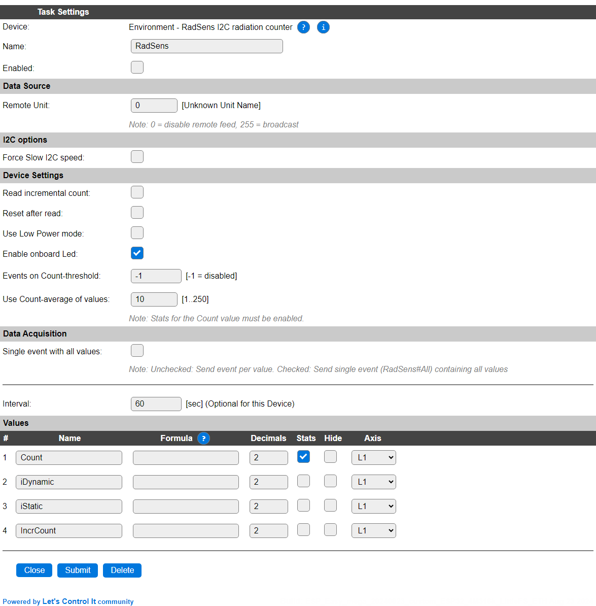

.. include:: ../Plugin/_plugin_substitutions_p16x.repl
.. _P163_page:

|P163_typename|
==================================================

|P163_shortinfo|

Plugin details
--------------

Type: |P163_type|

Name: |P163_name|

Status: |P163_status|

GitHub: |P163_github|_

Maintainer: |P163_maintainer|

Used libraries: |P163_usedlibraries|

Description
-----------

The RadSens and RadSens mini boards are radiation counters, that provide the counted values via the I2C interface.

.. warning:: These boards use fairly high voltages (400V or higher) to drive the geiger tube. When operated they should be installed electrically safe to protect the public and operator from harm.

Configuration
-------------

* **Name**: Required by ESPEasy, must be unique among the list of available devices/tasks.

* **Enabled**: The device can be disabled or enabled. When not enabled the device should not use any resources.

Dats Source
^^^^^^^^^^^

* **Remote Unit**: Shows the remote unit, by number and name, where the data originates if the ESPEasy P2P Network is used to transmit sensor data to this units. Remote Unit 0 is shown when no remote unit is configured, and the data is collected from a locally connected sensor (the standard/usual configuration).

I2C options
^^^^^^^^^^^

The available settings here depend on the build used. At least the **Force Slow I2C speed** option is available, but selections for the I2C Multiplexer can also be shown. For details see the :ref:`Hardware_page`

Currently, only the default I2C address of ``0x66`` is supported. Multiple sensors can be connected using an I2C multiplexer.

Device Settings
^^^^^^^^^^^^^^^

* **Low-power mode**: To use the low power mode of the board, this option can be checked.

* **Enable onboard Led**: By default, the onboard Led of the sensor board shows an indication of the impulses counted. This setting can be used to turn the Led off. (On by default).

* **Events on Count-threshold**: Select the threshold for the Count value to trigger an event. This can avoid the generation of many events if the count changes only slightly. Event generation can be disabled by setting this value to -1.

* **Use Count-average of values**: To make the event triggers more stable, instead of using only the previous value, an averange of the last 'n' measurements can be used to even out the response. The max. number of values depends on the ESP used, for ESP8266: 16, for ESP32: 250.

.. note:: To be able to use the Count-average value, the **Stats** checkbox for the Count value must be enabled. Only the available values will be used for the average, as data from any previous run is not persisted after plugin restart.

Data Acquisition
^^^^^^^^^^^^^^^^

This group of settings, **Single event with all values**, **Send to Controller** and **Interval** settings are standard available configuration items. Send to Controller is only visible when one or more Controllers are configured.

* **Interval** By default, Interval will be set to 60 sec. The data will be collected and optionally sent to any configured controllers using this interval.

Values
^^^^^^

The plugin provides measurements ``Count`` in imposes/microRad, ``iDynamic`` the dynamic radiation intensity \< 123 sec., and ``iStatic`` the static radiation intensity.

Per Value is a **Stats** checkbox available, that when checked, gathers the data and presents recent data in a graph, as described here: :ref:`Task Value Statistics:  <Task Value Statistics>`

To use the Count-average as threshold, the Stats for Count has to be enabled.

Commands available
^^^^^^^^^^^^^^^^^^

.. include:: P163_commands.repl

Change log
----------

.. versionchanged:: 2.0
  ...

  |added|
  2024-08-13 Initial release version.

