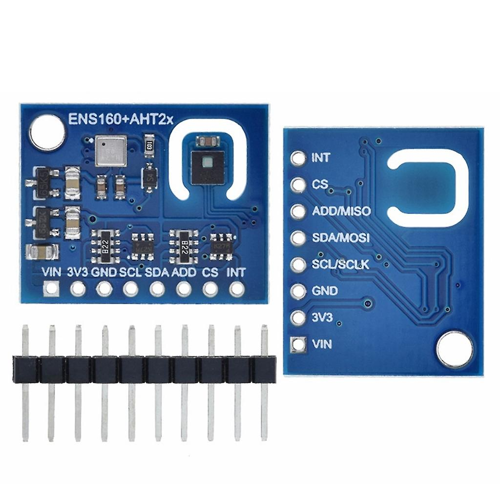
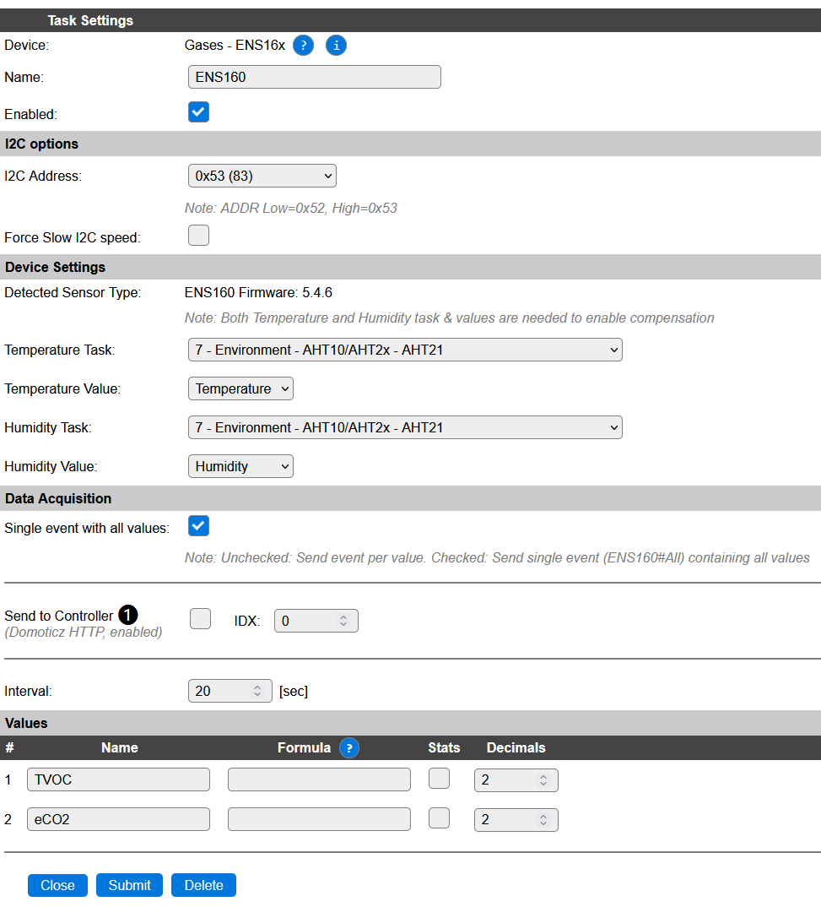

.. include:: ../Plugin/_plugin_substitutions_p16x.repl
.. _P164_page:

|P164_typename|
==================================================

|P164_shortinfo|

Plugin details
--------------

Type: |P164_type|

Name: |P164_name|

Status: |P164_status|

GitHub: |P164_github|_

Maintainer: |P164_maintainer|

Used libraries: |P164_usedlibraries|

Description
-----------

Sciosense ENS160 and its successor ENS161 are multi-gas sensors based on metal oxide (MOX) technology. They can detect multiple VOCs including ethanol, toluene, hydrogen and oxidizing gases.
The sensors are connected to the I2C bus and provide preprocessed data as TVOC and eCO2 values. See https://www.sciosense.com/ens16x-digital-metal-oxide-multi-gas-sensor-family/ for details about the device.

Hardware 
--------

Various boards with the ENS160 are available through electronics market places like Aliexpress. A popular board contains both ENS160 and AHT21 on a single PCB. The AHT21 can be used for temperature compensation as provided by this plugin.

Configuration
-------------

* **Name**: Required by ESPEasy, must be unique among the list of available devices/tasks.

* **Enabled**: The device can be disabled or enabled. When not enabled the device should not use any resources.

I2C options
^^^^^^^^^^^

* **I2C Address**: The sensor supports two addresses. The actual address depends on the voltage on the ADDR pin of the device.

.. csv-table::
    :header: "Address", "Remark"
    :widths: 10, 50

    "0x52",  "Connect ADDR GND"
    "0x53",  "Connect ADDR to VDD (default on most boards)"

The available I2C settings here depend on the build used. At least the **Force Slow I2C speed** option is available, but selections for the I2C Multiplexer can also be shown. For details see the :ref:`Hardware_page`

The chip supports both SPI and I2C. The plugin only support I2C using the following pins:

* 1 SDA: Data [MOSI/SDA]
* 2 SCL: Serial Clock [SCLK/SCL]
* 3 ADDR: Address [MISO/ADDR]
* 6 INTn: Interrupt [INTn]
* 7 CSn: SPI interface select, low-> SPI, high->I2C [CSn]

For this plugin the CSn must be wired to VDD to enable the I2C protocol. 

On boards sold online, SDO and SDI are often already pulled-up, setting the default I2C address to 0x53.

Device Settings
^^^^^^^^^^^^^^^

* **Detected Sensor Type**: Shows either ``ENS160`` or ``ENS161`` or a number if no sensor or an unknown sensor ID is detected. It will also show the firmware version read from the device if the data is available.
* **Temperature Task**: Task (plugin) providing the temperature compensation
* **Temperature Value**: Value for the temperature compensation
* **Humidity Task**: Task (plugin) providing the humidity compensation
* **Humidity Value**: Value for the humidity compensation

The ENS16x provides temperature and humidity compensation. The plugin must provide the actual temperature and humidity to the device to enable this compensation. For this the plugin needs to read these values from other tasks. 

Using the **Temperature Task** and **Temperature Value** the task and value for the Temperature compensation can be selected. Compensation can be switched off by selecting **Not Set**. 

Using the **Humidity Task** and **Humidity Value** the task and value for the Humidity compensation can be selected. Compensation can be switched off by selecting **Not Set**. 

Note that if either one of the tasks is set to **Not Set** compensation is switched off and a default value is used.

The ENS160 is sold on popular websites on a board including the AHT21 temperature and humidity sensor. This sensor can be used for the compensation algorithm of the ENS160.

Data Acquisition
^^^^^^^^^^^^^^^^

This group of settings, **Single event with all values** and **Send to Controller** settings are standard available configuration items. Send to Controller is only visible when one or more Controllers are configured.

* **Interval** By default, Interval will be set to 60 sec. The data will be collected and optionally sent to any configured controllers using this interval. If the Interval is set lower or equal than the required 10 * Heater time, the plugin will not start!

Values
^^^^^^

The plugin provides the ``TVOC`` and ``eCO2`` values. A formula can be set to recalculate. The number of decimals can be set as desired, and defaults to 2.

In selected builds, per Value is a **Stats** checkbox available, that when checked, gathers the data and presents recent data in a graph, as described here: :ref:`Task Value Statistics:  <Task Value Statistics>`

Currently the extra features offered by the sensor are not configurable in this plugin.
These may be added later.

Change log
----------

.. versionchanged:: 2.0
  ...

  |added|
  2023-12-27 Initial release version.

