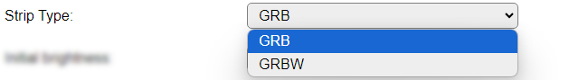

.. include:: ../Plugin/_plugin_substitutions_p16x.repl
.. _P165_page:

|P165_typename|
==================================================

|P165_shortinfo|

Plugin details
--------------

Type: |P165_type|

Name: |P165_name|

Status: |P165_status|

GitHub: |P165_github|_

Maintainer: |P165_maintainer|

Used libraries: |P165_usedlibraries|

Description
-----------

NeoPixels are very versatile, multi-color led pixels, that can be used in a lot of situations, and only need a single GPIO to be able to control multiple leds as they are connected sequentially.

This plugin offers multiple layout 7-sement displays, for use as clock, scrore-board, news-ticker etc.

Configurations can have from 1..7 pixels per segment, and up to 15 extra pixels, that can f.e. be used as a time-colon. Options for initial, unused, pixels and several settings for generating the number-plan for connecting the pixels in the correct order and position are available.

The minimum size for a display would have 1 digit, starting from 7 pixels with 1 pixel per segment and no decimal point, and the max. configuration possible has 16 digits, split in 4 groups that can be addressed as a single display or per group, with up to 1100 pixels, though that may have issues as that number of pixels hasn't been tested. Technically, larger displays are possible, but that might cause even more (signal-timing) issues because of the huge number of pixels needed.

Hardware 
--------

Most of the work is probably spent in mounting the pixels in a panel or casing, so experimenting with layouts may be helpful in finding the optimal configuration, as f.e. changing the number of pixels per segment, decimal point or extra pixels later can be a lot of work.

Signal wiring
^^^^^^^^^^^^^

.. note:: If the strips use a VCC higher than 3.3V, f.e. 5V (and they usually do), a level converter for 3V3 to 5V should be used when connecting the display to the ESP, as the ESP might be damaged, or the logic levels don't match the requirements of the display (high level ~70% of VCC = 3.5V @ VCC 5V), and may not work properly.

.. code-block:: text

   ESP        Level converter    5V   Strip 1      5V    Strip 2      5V    Strip n
   ----       ---------------    |    -----------  |     -----------  |     -----------
   3V3   -->  LV           HV  <-+->  VCC          +->   VCC          +->   VCC ...
   GND   ---  GND ------- GND   ---   GND - GND    ---   GND - GND    ---   GND ...
   GPIO  -->  LV1 ------> HV1 -[470]- DIN - DOUT   -->   DIN - DOUT   -->   DIN ...

NB: It is advised to use a single 220 to 470 ohm resistor in the wiring from ESP (after the level converter) to the first strip ``Din`` for better signal stability.

Power consumption
^^^^^^^^^^^^^^^^^

.. include:: NeoPixel_Power.rst

Also, when using several strips sequentially, separate wiring should be added for VCC and GND to each strip (or group of strips), to avoid burning out the pcb traces of the strip where the power is connected. For a group of strips of 100 to 150 LEDs, it is advised to use separate wiring for power to each group, and only connect the GND and signal connections Dout/GND to Din/GND of the next group, but **never** the VCC pins.

Configuration
-------------

* **Name**: Required by ESPEasy, must be unique among the list of available devices/tasks.

* **Enabled**: The device can be disabled or enabled. When not enabled the device should not use any resources.

Actuator
^^^^^^^^

* **GPIO -> Strip**: Select the GPIO pin where the NeoPixel strip will be connected. This has to be a pin that allows output (not input-only).

Device Settings
^^^^^^^^^^^^^^^

* **Strip Type**: Select the type of the LEDs mounted on the strip:

* *GRB* : Most commonly, the LEDs are of GRB type.

* *GRBW* : If the LEDs also support Brightness control, then the GRBW type should be selected.

|

* **Initial brightness**: The brightness that the display is initially set to. Default is 40, to protect both the eyes and the power-supply powering the display. Range: 0..255.

* **Maximum allowed brightness**: The brightness that is the maximum it can be set to, either from UI or via the ``7db`` command, to optionally help protect both the eyes and the power-supply powering the display. Default is 255. Range: 1..255.

* **Font set**: Select the font set from this list: (These fonts are the same fonts as available in :ref:`p073_page`)

*Default*: The original font as initially included in plugin P073. Includes digits 0..9, special characters: space, dash, degree (when using a ``^``), equal sign, slash, underscore and letters A..Z. Uppercase and lowercase characters are shown exactly the same, but as the possible shapes are quite limited, some can be somewhat hard to recognize at first.

*Siekoo*: The character set as documented here `Fakoo.de: Siekoo alphabet <https://fakoo.de/siekoo.html>`_ (See below for the extra special characters supported)

*Siekoo with uppercase 'CHNORUX'*: This font is the same as the normal Siekoo character set, but supports uppercase versions for characters 'CHNORUX', even though they duplicate other characters in the set.

*dSEG7*: the character set as documented here `Keshikan.net: dSEG7 <https://www.keshikan.net/fonts-e.html>`_ special characters: space, dash, degree (when using a ``^``), equal sign, slash, underscore and letters A..Z. (Again single-case, like the default font)

*If the* **Font set** *configuration option is not available, then a different font layout, default from the used library, is used.*

**Siekoo**:

The four marked characters, Ä, Ö, Ü and ß, are *not* included, as they can not reliably be sent to the unit because of conversion issues from ASCII/UTF-8/ISO charactersets. And they are possibly not often used, except in German, and some closely related, languages.

**dSEG7**:

.. image:: P073_dSEG7Set.png

The ``^`` character is again used to display the degree symbol, and the degree symbol is not recognized!

.. note:: By default, any periods used in tekst to be displayed by the plugin will be placed at the previous digit decimal point position and removed from the text, regardless of a decimal point is defined for the digit! When non of the groups has decimal dot pixels defined then this feature will be disabled, and the dot/period character defined in the font will be used.

Options
^^^^^^^

* **Suppress leading 0 on day/hour**: When enabled, will show the hours of the time and days of the date without a leading 0 when < 10.

* **Scroll text > display width**: Normally the ``7dtext,<text>`` command only show the left n characters the display can hold. This option enables the Scroll Text feature, that will scroll text sent using the ``7dtext`` or ``7dbin`` commands from right to left when the content is longer than the display can show at once.

* **Scroll text in from right**: Normally the Scroll Text feature starts with the display filled with the left part of the text to scroll, with this option enabled, the display starts empty and the text is scrolled in from the right side of the display to the left, until all text is scrolled off. Then the scrolling restarts.

* **Scroll speed (0.1 sec/step)**: Determines the speed of scrolling the text. Default value is 10, so 1 character per second.

* **Clear display on exit** When checked, will clear the display when the task is disabled, either from settings or via the ``TaskDisable`` command. This will fill the strip with black pixels, turning all NeoPixels off.

Display
^^^^^^^

.. note:: Some field-labels show an asterisk ``*`` as the last character, to indicate that when a different option is selected on these fields, the current settings are stored and the page is reloaded, so the changed configuration will reflect in the page.

* **Number of Groups \***: Select the number of digit-groups to use. With current configuration, extra pixels can only be applied at the end of a group, so if f.e. a time display is to be made with a colon between the hours and minutes (that can optionally blink every other second), 2 groups should be defined, 1 with 2 digits and extra pixels, and a second with 2 digits only. The max. number of groups is 4, for settings-technical reasons.

* **Foreground color**
* **Background color**

These are the default colors, used to display the content.

Colors can be specified in 3 ways:

* *Color name* Some named colors are recognized: White, Black, Red, Green, Blue, Yellow, Orange, Navy, Darkgreen, Cyan, Darkcyan, Maroon, Purple, Olive, Magenta, Lightgrey, Darkgrey, Pink and Greenyellow. If any of these colors is recognized, the name will be shown.
* *#RGB565* A ``#`` prefixed, 1 to 4 digit, hex-coded color value in RGB565 format (5 bits red, 6 bits green, 5 bits blue) giving the max. number of 65535 colors. This is the value that is shown after the settings are saved, and it is not one of the known color names.
* *#RRGGBB* A ``#`` prefixed, 6 digit, hex coded RGB color value. Will be transformed to an RGB565 value on save!

* **Show Pixel number-plan \***: When changed to Yes, the digit preview display will change from showing pixels, to showing the number-index of each pixel as wired in the strip. This also blocks changing any of the digit options below (calculation of the number-plan is not implemented in the front-end Javascript code).

Groups and Digits
^^^^^^^^^^^^^^^^^

This section shows 1 to 4 groups of digit configurations, depending on the **Number of Groups** selection. All groups have the exact same settings options.

The group-order is reverted (4..1) if all groups have the **Right to Left digits** option enabled.

These options determine the layout of the digits:

* **Number of Digits \***: Select the number of digits in this group. Currently limited to 4.

* **Segment Width pixels**: The number of pixels to use in the horizontal segments, range 1..7.

* **Segment Height pixels**: The number of pixels to use in the vertical segments, range 1..7.

* **Segment Corners overlap**: When enabled, 6 extra pixels, where the segments (can) overlap, will be added. These pixels will light up if either of the segments it belongs to is lit.

* **Decimal dot pixels**: The number of pixels to use for a decimal point, to the lower-right of each digit, range 0..7.

* **Extra pixels after**: The number of pixels to be used, either as a 'bridge' to the next digit, or as an optional colon or other shape, that will light up when using a time or date display output, and can also be controlled via the ``7dextra`` command.

* **Pixels in group**: A read-only field that shows the currently needed number of pixels in this group. This will be updated dynamically when any of the above settings is changed.

These options determine the number-plan of the pixels in this group:

* **Pixel-offset before**: The number of pixels to skip before the first digit is planned. Sometimes used to 'fix' the signal level for the pixels if the strip is connected to the ESP without a level converter, but that's an unreliable fix, so a level converter should best be used when powering the pixels with the 'suggested' (strongly advised) 5V. These pixels can also be used as an extra indicator, as the ``7dbefore`` command can be used to set these pixels to a color.

* **Starting pixel**: By default the number-plan starts at the left-top pixel of a digit, and flows clock-wise along all pixels for a single digit. With this setting you can select to start at the right-top of the digit, for assigning the number-plan. (See remark when using **counter-clockwise** option, below.)

* **Split g-segment pixels**: The default number-plan assigns pixel-indexes to the g-segment between the e and f segment. When using a larger number of Width pixels, wiring the g-segment can be challenging. When enabled, this option assigns pixel-indexes to the right-half set of pixels between the b and c segment, and the remaining pixels between the e and f segment.

* **Decimal dot last segment**: Similar to the g-segment, also the dp-segment can be challening to wire, as by default the f-segment is assigned the last pixel-index. So the default here is to assign pixel-indexes to the dp-segment between the c and d-segments. If you explicitly want to have these dp-pixels assigned as the last pixel-indexes, this option can be enabled.

* **Numbering counter-clockwise**: By default the pixel-indexes are assigned in a clock-wise order, but if your wiring-plan works better when numbering counter-clockwise, this is the setting to enable. This also changes how the **Starting pixel** is interpreted: Top-left will start from the f-segment, and end with the a-segment, and top-right will start assigning pixel-indexes from the right side of the a-segment, and work down the f, g, e, d, dp, c and b segments.

* **Right to Left digits**: When creating larger displays, or building a 2 1/2 or 3 1/2 digit display for displaying f.e. numbers up to 100 or 1000, starting the digits at the left is not efficient, as the entire left digit will get pixel-indexes assigned. When using the Right to Left digits option, the digits will be virtually reverted, and pixel-indexes assigned from the right digit to the left digit. The extra pixels, not needed to show anything else than ``1`` can be left out of the display. An example config is included below, showing this.

|

* **Total digits**: Shows the number of digits, as currently configured.

* **Total pixels to connect**: Shows the number of pixels to connect, as currently configured. If building a 3 1/2 or 2 1/2 digit display, the excess pixels of the left most digit can be manually subtracted.

Commands available
^^^^^^^^^^^^^^^^^^

.. include:: P165_commands.repl

Bit to segment mapping for 7dbin command
^^^^^^^^^^^^^^^^^^^^^^^^^^^^^^^^^^^^^^^^

The ``7dbin`` command allows to show any combination of segments on the display according to a (sequence of) bit pattern(s).

The mapping from bits to segments is: ``0Bhabcdefg`` (Similar to the segment mapping used by :ref:`p073_page`)

ESPEasy allows decimal, hexadecimal and binary notation for numbers. This makes creating the desired display pattern easy when using the binary notation (starting with ``0B`` or ``0b``).

Switching on all horizontal segments for a digit can be done by the command ``7dbin,0b01001001``, or in hexadecimal notation: ``7dbin,0x49``

Example configurations
----------------------

.. include:: P165_example1.rst

.. include:: P165_example2.rst

.. include:: P165_example3.rst

Change log
----------

.. versionchanged:: 2.0
  ...

  |added| 2024-08-30 Initial release version.

