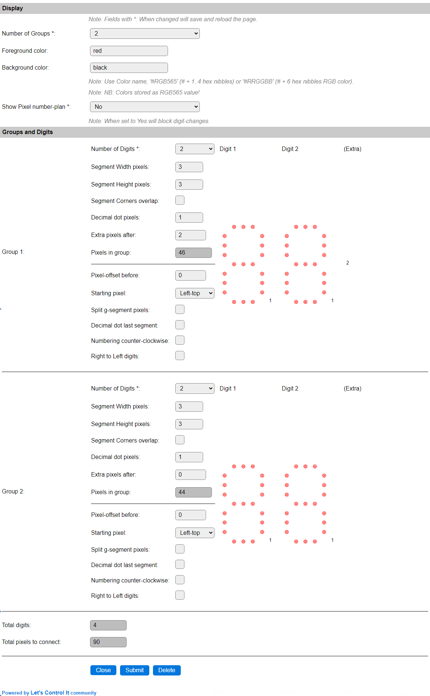
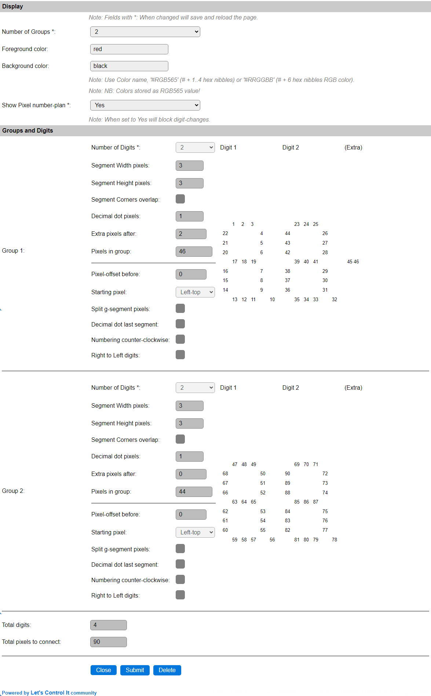

Example 1
^^^^^^^^^

For displaying the time in a 24 hour format, and an optionally blinking colon as the hours/minutes separator, you can define this Group/Digit setup:

This defines 2 Groups of each 2 Digits. The height and width of the segments can be configured as preferred, this example uses 3 pixels for both. When using more pixels per segment, like 5, 6 or 7, it is probably better to define a larger decimal point, if that is to be used, 3 seems appropriate in that case, and also the extra pixels, used to add the colon separator, could have 4 to 8 pixels to get a matching size with the large segments.

The number-plan for this layout is presented like this:

