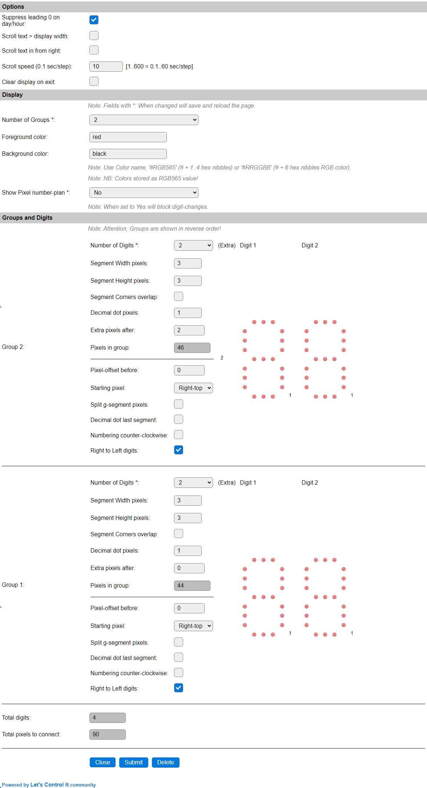
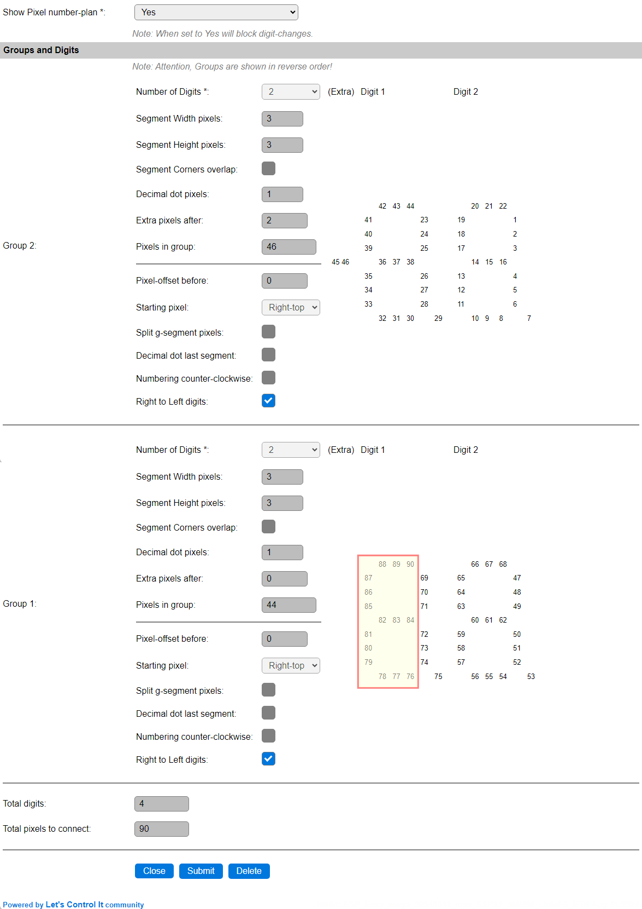
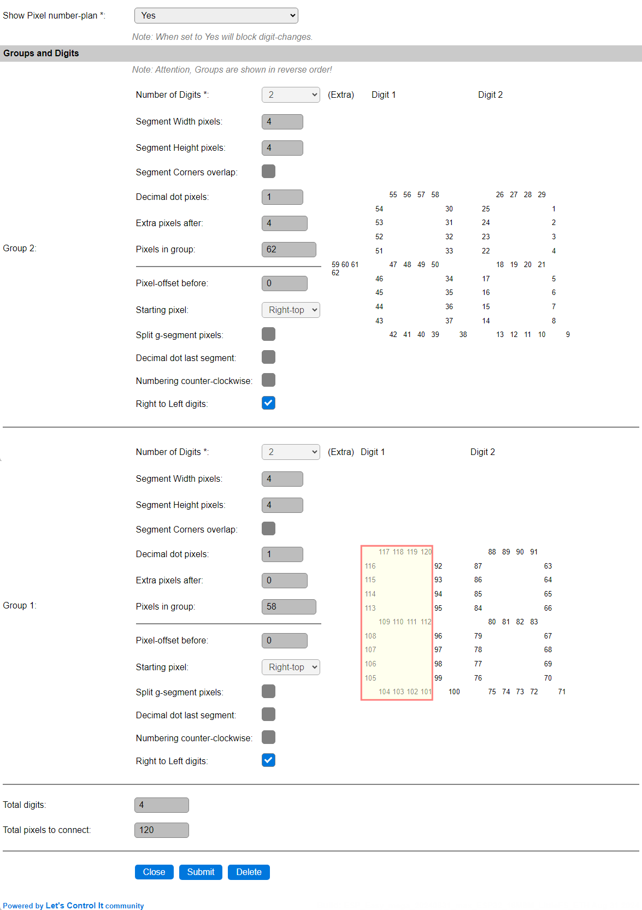

Example 2
^^^^^^^^^

For displaying the time in a 12 hour format, and an optionally blinking colon as the hours/minutes separator, you can define this Group/Digit setup:

The option to suppress the leading 0 on day/hour option is enabled now, so the left-most digit will be empty most of the time.

We have defined 2 Groups of each 2 Digits, but effectively use only 3 1/2 digit. The height and width of the segments can be configured as preferred, this example uses 3 pixels for both. When using more pixels per segment, like 5, 6 or 7, it is probably better to define a larger decimal point, if that is to be used, 3 seems appropriate in that case, and also the extra pixels, used to add the colon separator, could have 4 to 8 pixels to get a matching size with the large segments.

.. note:: This layout is presented in reverse order, as all groups use the **Right to Left digits** option. The actual positioning is still with Group 1 as the left-most group, and then using the numerically next group(s). This layout is needed to make the number-plan work from right to left.

The number-plan for this layout is presented like this:

The number-plan starts at the Right-Top pixel, instead of the Left-Top pixel, so the a-segment for the left-most digit can be excluded.

To save space and a few pixels, or create a larger display with a standard strip-length, the marked numbers (76..90) can be excluded from the build, as for a 12 hour clock the left-most digit is 0 most of the time, and that 0 is being suppressed, so no pixels will light up.

This shows an increased layout, using 4-pixel segments and a 4-pixel colon, that can be built from exactly 100 pixels, 2 50-pixel wired-pixelchains as available from EBay, Aliexpress etc.

Again, the marked pixels (101..120) can be excluded.