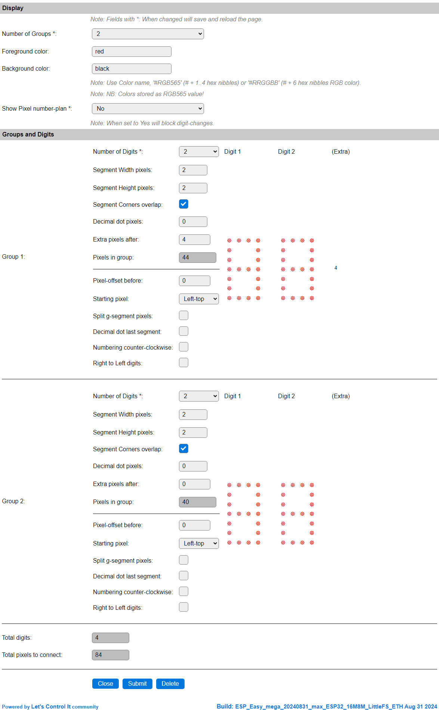
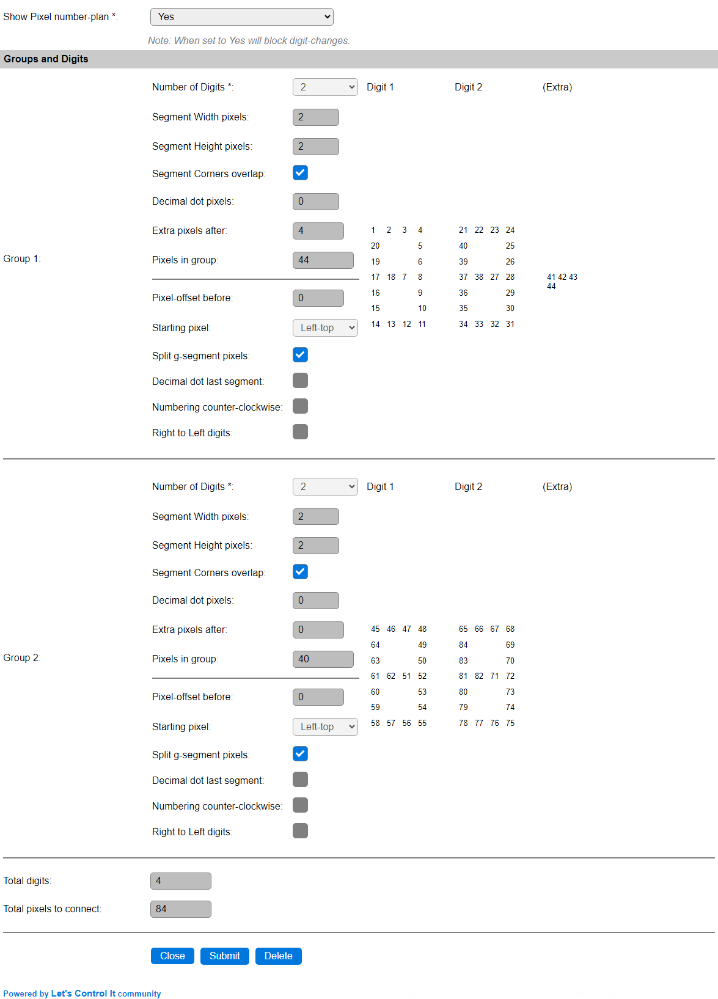

Example 3
^^^^^^^^^

For displaying a game score, with an indicator of the active player by using a half of the extra pixels, you can define this Group/Digit setup:

We have defined 2 Groups of each 2 Digits, and enabled the Corners Overlap option to have a more explicitly defined digit. The height and width of the segments can be configured as preferred, this example uses 3 pixels for both. When using more pixels per segment, like 5, 6 or 7, the extra pixels, used to add the left/right player indicator, could have 4 to 8 pixels to get a matching size with the large segments.

The number-plan for this layout is presented like this:

The number-plan starts at the Left-Top pixel.

For mounting the middle segment easier/more efficient, this segment can be split in a left and right half, by checking the Split g-segment pixels. The number-plan then looks like this:

The right half of the g-segment is placed between the b and c segments, and the left half of the g-segment between the e and f segments.

To control the player-indicator, the extra pixels 41 and 42 should be placed to indicate the digits from Group 1 being the active player score, and extra pixels 43 and 44 placed to indicate the digits from Group 2 for the other player.

These rules can be added to use 2 buttons (PlayerA and PlayerB) to select the active player:

.. code:: text

  On PlayerA#State=0 Do
    7dextra,0,4 // Player B Off
    7dextra,0,3 // Player A On
  Endon
  On PlayerB#State=0 Do
    7dextra,0,2 // Player A Off
    7dextra,0,5 // Player B On
  Endon

