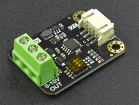

.. include:: ../Plugin/_plugin_substitutions_p16x.repl
.. _P166_page:

|P166_typename|
==================================================

|P166_shortinfo|

Plugin details
--------------

Type: |P166_type|

Name: |P166_name|

Status: |P166_status|

GitHub: |P166_github|_

Maintainer: |P166_maintainer|

Used libraries: |P166_usedlibraries|

Description
-----------

The GP8403 DAC (Digital Analog Converter) has 2 output channels, can be configured for an output voltage range of 0-10V or 0-5V, has a 12 bit resolution (4096 steps) and works from a single 3.3V or 5V power source. When powering the module with 5V, a level converter should be used on the I2C lines, to protect the ESP and other I2C devices on the same bus. The outputs can supply up to 20 mA.

(Image (c) DFRobot)

Configuration
-------------

* **Name**: Required by ESPEasy, must be unique among the list of available devices/tasks.

* **Enabled**: The device can be disabled or enabled. When not enabled the device should not use any resources.

I2C options
^^^^^^^^^^^

* **I2C Address**: The device supports 8 addresses, and by default comes configured for address ``0x5F``, as reflected in the available options:

Available addresses are in the range ``0x58`` to ``0x5F``.

The available I2C settings here depend on the build used. At least the **Force Slow I2C speed** option is available, but selections for the I2C Multiplexer can also be shown. For details see the :ref:`Hardware_page`

Device Settings
^^^^^^^^^^^^^^^

* **Output range**: Select the desired output voltage range:

Available options:

* *0-5V*: The maximum available voltage is 5V. When not using a voltage > 5V, this would be the apropriate settings, both for accuracy, and to avoid the risk of applying up to 10V to an input that might not be able to handle that.

* *0-10V*: (Preconfigured default) The maximum available voltage is 10V.

The DAC does not support a different output range setting per output.

The DAC can supply up to 20 mA per output, so the input or device that is connected to this output should be configured to not overload the output.

* **Restore output on warm boot**: (Enabled by default) When the outputs are set to a specific value and the ESP unit is restarted, f.e. when updating the ESPEasy firmware, the output values will be restored. On cold boot, or after saving the settings, the configured Initial value per output will be set.

* **Initial value output 0**:

* **Initial value output 1**: The output value at startup, or after power-loss, can be configured here per output. The allowed range is 0-10V. Although the resolution is in milli Volt, the resolution of the DAC is limited to 12 bit (4096 steps). If a voltage is set here that exceeds the Output range (f.e. when set to 0-5V, and 7V is configured), the setting will **not** be applied!

Preset values
^^^^^^^^^^^^^

* **Preset value 1..25**: This table allows to configure up to 25 named presets, where the name can be up to 16 characters long, and the voltage in range 0-10V. When all available inputs are filled, Submitting the page will add more inputs until the limit of 25 is reached.

When leaving the *Name* field empty, that preset will not be saved, thus effectively deleted from the list.

Data Acquisition
^^^^^^^^^^^^^^^^

This group of settings, **Single event with all values** and **Send to Controller** settings are standard available configuration items. Send to Controller is only visible when one or more Controllers are configured.

* **Interval** By default, Interval will be set to 0 sec. The data will be collected and optionally sent to any configured controllers using this interval. When an output value is changed, the data will be sent to any configured controller, and an event will also be generated when the Rules are enabled (Tools/Advanced).

Values
^^^^^^

The plugin provides the ``Output0`` and ``Output1`` values, analogue to the availabe output connections. A formula can be set to recalculate the displayed, and sent, value. The number of decimals can be set as desired, and defaults to 2.

In selected builds, per Value is a **Stats** checkbox available, that when checked, gathers the data and presents recent data in a graph, as described here: :ref:`Task Value Statistics:  <Task Value Statistics>`

Commands available
^^^^^^^^^^^^^^^^^^

.. include:: P166_commands.repl

Get Config Values
^^^^^^^^^^^^^^^^^

Get Config Values retrieves values or settings from the plugin, and can be used in Rules, Display plugins, Formula's etc. The square brackets **are** part of the variable. Replace ``<taskname>`` by the **Name** of the task.

.. include:: P166_config_values.repl

Change log
----------

.. versionchanged:: 2.0
  ...

  |added|
  2024-01-30 Initial release version.

