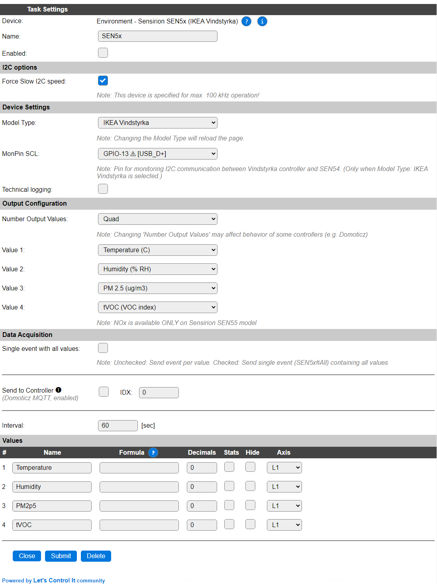
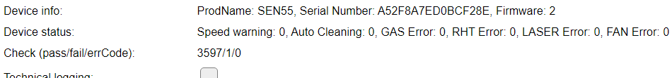
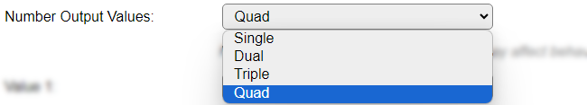
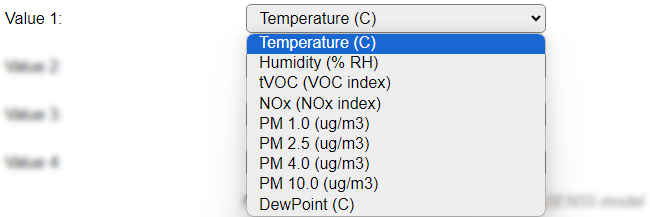

.. include:: ../Plugin/_plugin_substitutions_p16x.repl
.. _P167_page:

|P167_typename|
==================================================

|P167_shortinfo|

Plugin details
--------------

Type: |P167_type|

Name: |P167_name|

Status: |P167_status|

GitHub: |P167_github|_

Maintainers: |P167_maintainer|

Used libraries: |P167_usedlibraries|

Description
-----------

The Sensirion SEN5x series of sensors measure Particle matter (all models), Temperature, Humidity and tVOC (SEN54, SEN55) and NOx (SEN55).

This plugin can read all values from these sensors.

In addition, the IKEA Vindstryka, that has a Sensirion SEN54 installed, can be 'piggy-backed' with this plugin, eavesdropping on the I2C communication to retrieve the values.

Hardware setup
--------------

When connecting a stand-alone Sensirion SEN5x sensor, be sure to power the unit with 5V! The I2C SDA/SCL signals are 3.3V safe, so these can be directly connected to an ESP. Pull-up resistors to 3.3V might be needed, as they are not installed on the device!

When installing an ESP inside an IKEA Vindstyrka, the procedure of wiring this is rather simple: Connect GND, SDA and SCL to the configured ESP pins (VCC for the ESP can also be reused from the power source for the Vindstryka), connect the **MonPin SCL** configured GPIO pin *also* to SCL, and the plugin will wait for the IKEA controller to finish communication and then fetch the data from the sensor.

Configuration
-------------

* **Name**: Required by ESPEasy, must be unique among the list of available devices/tasks.

* **Enabled**: The device can be disabled or enabled. When not enabled the device should not use any resources.

I2C options
^^^^^^^^^^^

The available settings here depend on the build used. At least the **Force Slow I2C speed** option is available, but selections for the I2C Multiplexer can also be shown. For details see the :ref:`Hardware_page`

.. note:: According to the documentation, the SEN5x sensors support a max. I2C Clock Speed of 100 kHz, **Force Slow I2C speed** should be checked. (ESPEasy has a default setting of 100 kHz for I2C Slow device Clock Speed).

Device Settings
^^^^^^^^^^^^^^^

* **Model Type**: Select the sensor model used, available options:

* *IKEA Vindstyrka* The default, with the ability to eavesdrop on the I2C communication of the Vindstyrka controller and the installed SEN54.

* *SEN54* The stand-alone model, providing the same values as the Vindstyrka. This setting can also be used when installing a SEN50, but only the PM\* values can be used on that sensor.

* *SEN55* The most advanced model, adding support for the NOx index.

When this setting is changed, the page is saved and reloaded to show/hide the extra setting to configure **MonPin SCL**.

* **MonPin SCL**: (Only available for IKEA Vindstryka) Select the GPIO pin that is connected to the I2C SCL pin. It is used to monitor the I2C communication by the IKEA controller, so we don't interfere with that.

If the plugin is enabled, Device info for the sensor is shown in the Configuration page:

This includes any warnings received from the sensor, and counters for pass/fail/errCode.

The fail value is usually 1 or 2, because of the startup time of the sensor, that often returns a failed reading. If this number increases, then a check for I2C pull-up resistors should be done, as that is a requirement for I2C devices, and also, short wires have to be used for stable communication.

* **Technical logging**: When debugging the hardware setup, especially when installing an ESP inside an IKEA Vindstryka, it can be helpful to have some extra technical logging available (INFO level).

Output Configuration
^^^^^^^^^^^^^^^^^^^^

* **Number Output Values**: Select the number of values that should be available, available options:

.. ..

* **Value 1..4**: For each of the output values configured, the value to show can be configured, some defaults have been preselected. Available options:

A description per available value is documented below, in the **Get Config Values** section.

N.B.: NOx is only available when a Sensirion SEN55 is installed, but is always shown as an option.

N.B.2: The selected options determine the names of the output Values.

Data Acquisition
^^^^^^^^^^^^^^^^

This group of settings, **Single event with all values**, **Send to Controller** and **Interval** settings are standard available configuration items. Send to Controller is only visible when one or more Controllers are configured.

* **Interval** By default, Interval will be set to 60 sec. The data will be collected and optionally sent to any configured controllers using this interval.

Values
^^^^^^

The plugin provides the configured values, with their default names.

Per Value is a **Stats** checkbox available, that when checked, gathers the data and presents recent data in a graph, as described here: :ref:`Task Value Statistics:  <Task Value Statistics>`

Commands available
^^^^^^^^^^^^^^^^^^

.. include:: P167_commands.repl

Get Config Values
^^^^^^^^^^^^^^^^^

Get Config Values retrieves values or settings from the sensor or plugin, and can be used in Rules, Display plugins, Formula's etc. The square brackets **are** part of the variable. Replace ``<taskname>`` by the **Name** of the task.

.. include:: P167_config_values.repl

Change log
----------

.. versionchanged:: 2.0
  ...

  |added| 2024-05-05 Enable support for SEN54 and SEN55 stand-alone sensors, add Get Config Values and Commands.

  |added| 2024-04-15 Initial release version supporting IKEA Vindstyrka.

