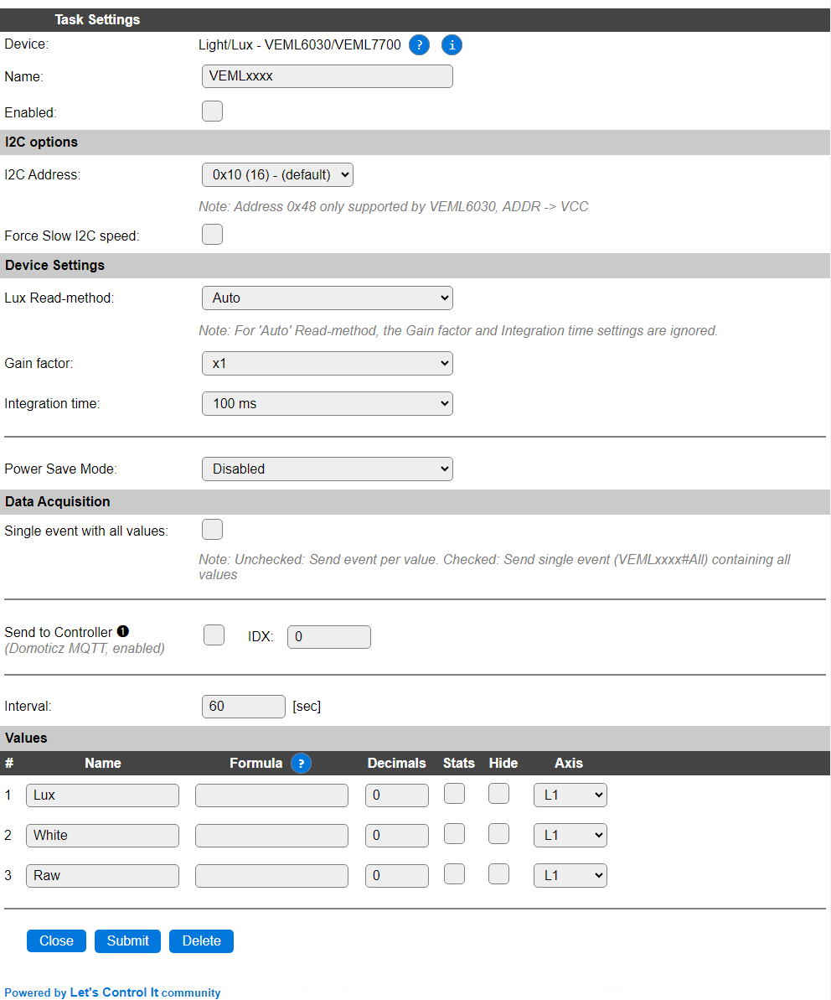
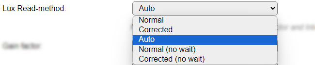
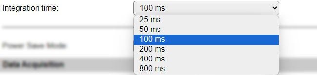
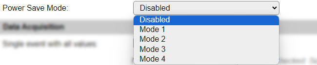

.. include:: ../Plugin/_plugin_substitutions_p16x.repl
.. _P168_page:

|P168_typename|
==================================================

|P168_shortinfo|

Plugin details
--------------

Type: |P168_type|

Name: |P168_name|

Status: |P168_status|

GitHub: |P168_github|_

Maintainer: |P168_maintainer|

Used libraries: |P168_usedlibraries|

Description
-----------

The VEML6030 and VEML7700 are Light/Lux sensors, that can measure also in the high regions of lux values, like direct sunlight and very bright outside light conditions.

Configuration
-------------

* **Name**: Required by ESPEasy, must be unique among the list of available devices/tasks.

* **Enabled**: The device can be disabled or enabled. When not enabled the device should not use any resources.

I2C options
^^^^^^^^^^^

The available settings here depend on the build used. At least the **Force Slow I2C speed** option is available, but selections for the I2C Multiplexer can also be shown. For details see the :ref:`Hardware_page`

The VEML6030 has the option of selecting an alternative I2C address of ``0x48`` by pulling up the ADDR pin to VCC, when that pin is available on the board used. The VEML6030 also supports interrupt-driven operation, but that's not implemented in this plugin.

Device Settings
^^^^^^^^^^^^^^^

* **Lux Read-method**: Select the read method to be used, available options:

* *Normal*: Normal read mode, will report the uncorrected ``Lux`` value.

* *Corrected*: Corrected read mode, Raw calculated to ``Lux`` and corrected for non-linearity.

* *Auto*: Show the corrected value, auto-scaled with Gain factor and Integration time to avoid measuring errors because of over-exposing the sensor. This is the default setting.

* *Normal (no wait)*: Normal read mode, will report the uncorrected ``Lux`` value, doesn't wait for the sensor to complete a measurement.

* *Corrected (no wait)*: Corrected read mode, Raw calculated to ``Lux`` and corrected for non-linearity, doesn't wait for the sensor to complete a measurement.

| 

* **Gain factor**: Manually configure the Gain factor. Higher gain factors may distort/clip measurements, as the sensor might return max. values.

* **Integration time**: Manually configure the Integration time. Longer integration times increase accuracy of the measurement.

.. warning:: When the **Lux Read-method** is set to *Auto* the Gain factor and Integration time settings are ignored.

* **Power Save Mode**: The sensor can go into Power Save Mode on several levels, to conserve power when used in a battery operated device. When in power save mode, the integration time increases.

Data Acquisition
^^^^^^^^^^^^^^^^

This group of settings, **Single event with all values**, **Send to Controller** and **Interval** settings are standard available configuration items. Send to Controller is only visible when one or more Controllers are configured.

* **Interval** By default, Interval will be set to 60 sec. The data will be collected and optionally sent to any configured controllers using this interval.

Values
^^^^^^

The plugin provides measurements ``Lux``, ``White``, and ``Raw``.

Per Value is a **Stats** checkbox available, that when checked, gathers the data and presents recent data in a graph, as described here: :ref:`Task Value Statistics:  <Task Value Statistics>`

.. Commands available
.. ^^^^^^^^^^^^^^^^^^

.. .. include:: P168_commands.repl

Get Config Values
^^^^^^^^^^^^^^^^^

Get Config Values retrieves values or settings from the sensor or plugin, and can be used in Rules, Display plugins, Formula's etc. The square brackets **are** part of the variable. Replace ``<taskname>`` by the **Name** of the task.

.. include:: P168_config_values.repl

Change log
----------

.. versionchanged:: 2.0
  ...

  |added| 2024-05-19 Initial release version.

