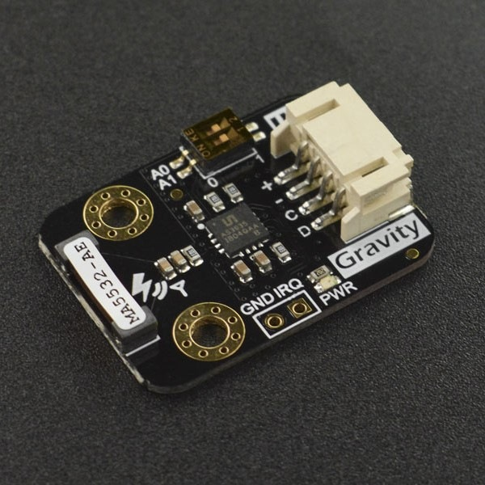
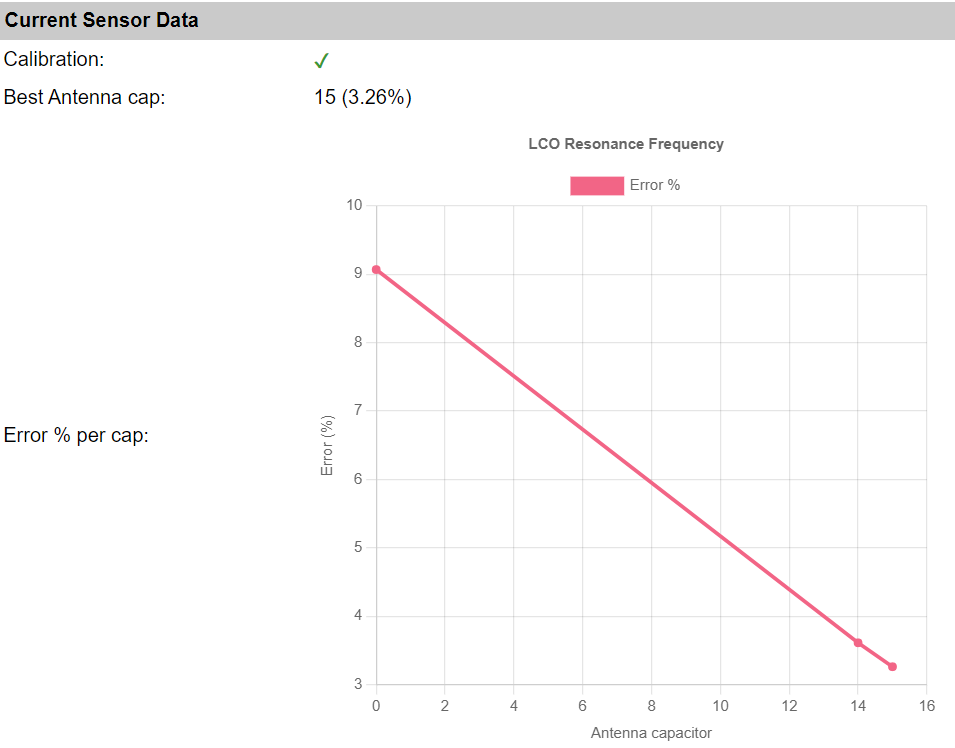
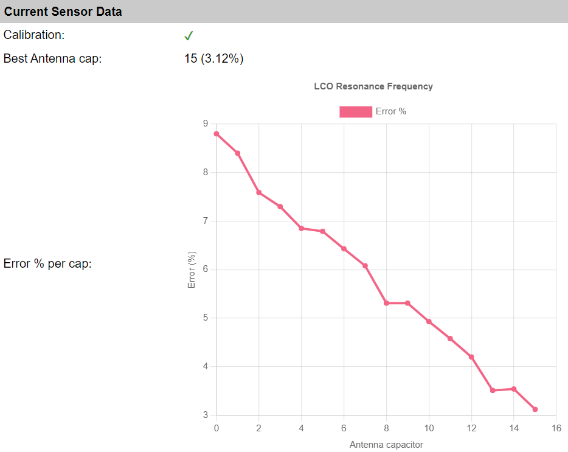
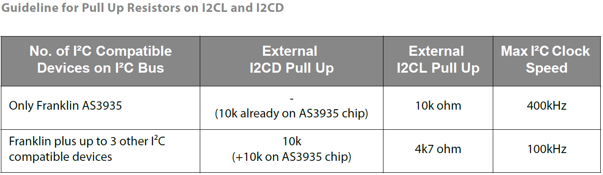
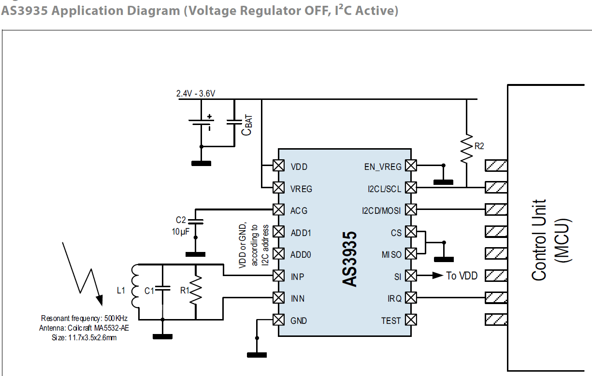
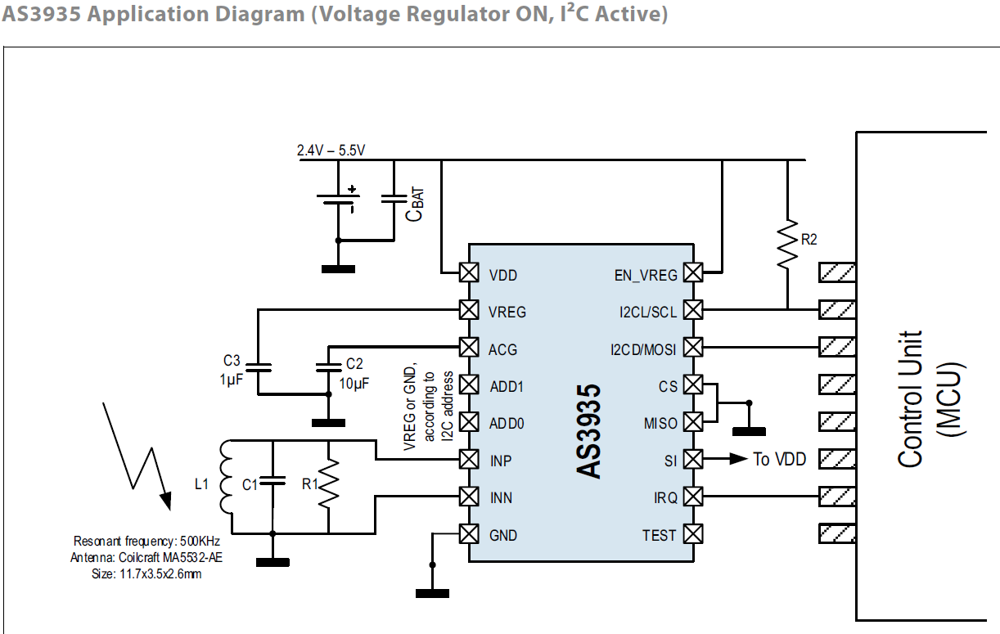
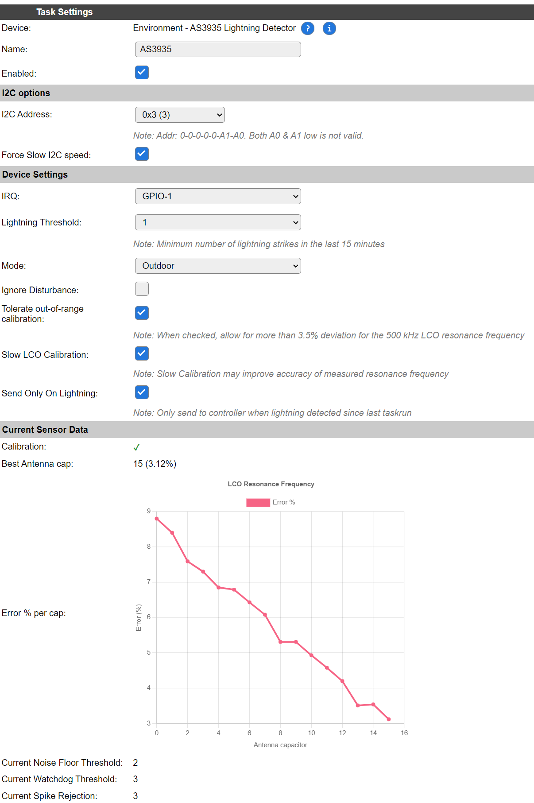

.. include:: ../Plugin/_plugin_substitutions_p16x.repl
.. _P169_page:

|P169_typename|
==================================================

|P169_shortinfo|

Plugin details
--------------

Type: |P169_type|

Name: |P169_name|

Status: |P169_status|

GitHub: |P169_github|_

Maintainer: |P169_maintainer|

Used libraries: |P169_usedlibraries|

Description
-----------

The AS3935 is a programmable fully integrated Lightning Sensor IC that detects the presence and approach of potentially
hazardous lightning activity in the vicinity and provides an estimation on the distance to the head of the storm. 
The embedded lightning algorithm checks the incoming signal pattern to reject the potential man-made disturbers.

Highlights:

* Can detect lightning storm activity within a 40 km range.
* Provides distance estimation to the head of the storm.
* Detects both cloud-to-ground and intra-cloud (cloud-to-cloud) flashes.
* Internal algorithm to reject false disturbances.

This chip can be found on a number of boards, like this one from DFRobot.

(Image (c) DFRobot)

Calibration Procedure
---------------------

The AS3935 sensor is using 3 separate oscillators:

* **LCO**: 500 kHz resonance frequency used to tune the antenna.
* **SRCO**: Typ. ~1.1 MHz signal used internally in the sensor.
* **TRCO**: Typ. 32768 Hz signal used internally in the sensor.

The LCO oscillator needs to be calibrated within 3.5% of its intended 500 kHz.
For this the sensor can connect upto 15 tuning capacitors of 8 pF parallel to another capacitor to tune the resonance frequency of the antenna to 500 kHz.

The frequency of all of these three oscillators depends on environmental factors like temperature, but also the presence of other materials close to the antenna.

The LCO calibration is performed by feeding the LCO clock via some divisor to a GPIO pin on the ESP board.
This signal is then measured several times to find the best tuning capacitor.

By default this LCO calibration does a quick test with antenna capacitor ``0`` and ``15`` and then computes the most likely capacitor.
This candidate and its neighbors are then measured for a longer period (about 30 msec) to reduce the error in measurement.

When the checkbox for "Slow LCO Calibration" is checked, each antenna capacitor is tested for about 30 msec.
This may improve the accuracy and the success rate of the calibration.

Below the calibration charts of a quick and slow LCO calibration of the same sensor:

As can be seen, both were successful in calibrating the resonance frequency within 3.5% of 500 kHz.

However, the best one on this specific board and setup is antenna capacitor 15, which is the last one.
So in this specific setup, it is very well possible the calibration may fail when some external factor changes. (e.g. temperature)

For setups like these, where the best option is close to the edge of the adjustable range, it is best to check the checkbox "Tolerate out-of-range calibration".
This way the calibration will not be considered failed when the tolerance ends up slightly above 3.5%.

On the other hand, if the best calibration is significantly further off from the optimal 500 kHz, there is something wrong with the setup.

For example:

* Metal parts mounted close to the antenna.
* Noisy environment.
* Unstable power supplied to the sensor.

See the Wiring section below for more tips.

.. note:: The **SRCO** and **TRCO** frequencies are calibrated after the **LCO** frequency. When the **LCO** frequency is off by too much, the calibration of the other two may also fail.

Sensor Operating Modes
----------------------

The sensor can signal some event via the IRQ pin to ESPEasy.
This pin state remains high until the sensor state is read.

Power-Down Mode
^^^^^^^^^^^^^^^

This mode is set when ESPEasy enters deep sleep to reduce current consumption
(typ 1μA).

Listening Mode
^^^^^^^^^^^^^^

The sensor will be operating in this mode for most of the time.
Typical current consumption in this mode is about 60μA. (70μA when the internal voltage regulator is enabled)

There will always be some noise picked up by the antenna.
When this noise exceeds the set noise floor, the sensor will pull the IRQ pin high and return to "Listening mode".

ESPEasy will then try to increase the noise floor.

After 15 seconds of not receiving any interrupt signal, ESPEasy will try to lower the noise floor.

Every time the set watchdog threshold is passed, the sensor will enter "Signal Validation" mode.

Signal Validation Mode
^^^^^^^^^^^^^^^^^^^^^^

Typical current consumption in this mode is about 350μA.

In case the incoming signal does not have the shape characteristic to lightning, the signal validation fails and the
event is classified as disturber.

If the signal is classified as disturber the chip immediately aborts the signal processing and goes back into the "Listening Mode". 
Otherwise, the energy calculation is performed and the distance estimate provided.

.. note:: The calculated energy does not reflect any physical unit of measure. It is just a number.

It takes roughly 1 second to classify an event as a lightning strike.

If the classification takes longer than 1.5 seconds, it will be classified as a disturber.

This implies the shortest time span between two lightning strikes that the sensor can resolve is approximately one second.

.. note:: Sometimes during intense thunderstorms there might be several lightning strikes in short succession. This sensor might classify those as disturbances as the total evaluation time might exceed 1.5 seconds.

As soon as the event has been classified, the sensor will return to "Listening Mode".

Signal Validation Parameters
----------------------------

During the signal validation phase the shape of the incoming signal is analyzed. 
The sensor can differentiate between signals that show the pattern characteristic of lightning strikes and man-made disturbers such as random impulses.

Noise Floor
^^^^^^^^^^^

The noise floor acts as a threshold to differentiate real signals from noise.

When an interrupt signal for "noise floor threshold exceeded" is received, ESPEasy will increase the noise floor.

Watchdog
^^^^^^^^

This sets the duration for a signal to last before entering "Signal Validation" mode.

Spike Rejection
^^^^^^^^^^^^^^^

can be used to increase the robustness against false alarms from such disturbers. 
Larger values correspond to more robust disturber rejection, yet with the
drawback of a decrease in detection efficiency.

When an "disturber detected" event is triggered, ESPEasy will try to increase either the Spike Rejection setting or Watchdog.

Dynamic Adjustment
^^^^^^^^^^^^^^^^^^

ESPEasy does dynamically change these three settings.
Upon interrupt signals for either noise floor exceeded or disturbance detected, these will be increased.

After 15 seconds ESPEasy will try to lower these values again to get as close as possible to the optimal settings.

Wiring
------

This sensor can be used via SPI or I2C.

For ESPEasy it needs to be wired for I2C:

* ``SI`` pin ("Select Interface") must be pulled high.
* ``MOSI`` pin is I2C SDA.
* ``SCL`` pin is I2C SCL.
* ``A1`` and ``A0`` pulled high for the default address of ``0x03``.

Apart from the I2C connection, there is an ``IRQ`` signal which must also be connected to the ESP board.
This IRQ signal is used to calibrate the sensor as well as to signal the ESP about some changed condition like a detected lightning strike or noise disturbances.

Board Specific
^^^^^^^^^^^^^^

Some boards already have resistors present to pull the unused pins high or low where needed and are default set for I2C.
For example 8-pin brown or purple boards with ``GY-AS3935`` written on the back is default configured for I2C with address ``0x03``.

Other boards like a slightly larger 11-pin purple board with ``WCMCU-3935`` written on the board,  
might need to have the unused pins (``CS`` & ``MISO``) explicitly pulled to GND.
The ``EN-V`` pin should be pulled high.

Power Supply and Noise
^^^^^^^^^^^^^^^^^^^^^^

This sensor is quite sensitive to noise in its direct surroundings.
Especially signals around 500 kHz will cause this sensor to perform significantly worse.

This sensor needs to have its resonance frequency calibrated within 3.5% of 500 kHz.

Some tips:

* Keep DC/DC converters and other power supplies away from this sensor.
* Keep smart phone and smart watch displays away from the sensor.
* Add some 100 uF ... 220 uF capacitor close to the power supply pins of the sensor.
* Do not use any metal close to the antenna of the sensor as this will change the antenna resonance frequency.
* Use short wires.
* Lower I2C clock frequency to 100 kHz for all I2C devices on this ESPEasy board.
* Lower I2C clock frequency on devices within a few meters from this sensor. (Explicitly stay away from 500 kHz)
* Do not leave unused pins 'floating'. Either pull them to 3V3 or GND.
* Orientation of the antenna is not really important to measure lightning strikes, since lightning is not discharging straight, but in a zigzag pattern and the distance is very far away. However the orientation of the antenna can have an effect on the noise picked up from nearby sources.

The sensor chip does have an internal voltage regulator.

On some boards, this regulator can be enabled by pulling the ``EN-V`` or ``EN_VREG`` pin high (if made availabe on the board).

Onboard voltage regulator:

* Enabled: ``EN_VREG`` pin high, ``VREG`` via 1uF to GND. Supply voltage range is 2.4V to 5.5V
* Disabled: ``EN_VREG`` pin low, ``VREG`` connected to VDD pin. Supply voltage range is 2.4V to 3.6V

With the onboard voltage regulator enabled, the current consumption will be slight higher.
But the supplied voltage to the sensor will be more stable.

See the `datasheet <https://www.sciosense.com/as3935-franklin-lightning-sensor-ic/>`_ pages 15 and 16 for more information.

Configuration
-------------

* **Name**: Required by ESPEasy, must be unique among the list of available devices/tasks.

* **Enabled**: The device can be disabled or enabled. When not enabled the device should not use any resources.

I2C options
^^^^^^^^^^^

* **I2C Address**: The device supports 8 addresses, and by default comes configured for address ``0x03``.

Available addresses are in the range ``0x01`` to ``0x03``.

The available I2C settings here depend on the build used. At least the **Force Slow I2C speed** option is available, but selections for the I2C Multiplexer can also be shown. For details see the :ref:`Hardware_page`

Device Settings
^^^^^^^^^^^^^^^

* **IRQ**: Configure the GPIO pin on the ESP board connected to the IRQ pin of the sensor.
  This pin is used for both the antenna calibration as well as to notify the ESP board of any lightning strike or detected disturbance.
* **Lightning Threshold**: Minimum number of detected strikes in 15 minutes to let the sensor trigger the IRQ pin.
* **Mode**: Set the Analog Front-End (AFE) gain for typical indoor/outdoor use case.
* **Ignore Disturbance**: The sensor may trigger the IRQ pin to signal a lightning strike, high noise or detected disturbances. With "Ignore Disturbance" checked, this last one is ignored.

Current Sensor Data
^^^^^^^^^^^^^^^^^^^

Data Acquisition
^^^^^^^^^^^^^^^^

This group of settings, **Single event with all values** and **Send to Controller** settings are standard available configuration items. Send to Controller is only visible when one or more Controllers are configured.

* **Interval** By default, Interval will be set to 0 sec. The data will be collected and optionally sent to any configured controllers using this interval. When an output value is changed, the data will be sent to any configured controller, and an event will also be generated when the Rules are enabled (Tools/Advanced).

Values
^^^^^^

In selected builds, per Value is a **Stats** checkbox available, that when checked, gathers the data and presents recent data in a graph, as described here: :ref:`Task Value Statistics:  <Task Value Statistics>`

Commands available
^^^^^^^^^^^^^^^^^^

.. .. include:: P169_commands.repl

Get Config Values
^^^^^^^^^^^^^^^^^

.. .. include:: P169_config_values.repl

Change log
----------

.. versionchanged:: 2.0
  ...

  |added|
  2024-05-24 Initial release version.

