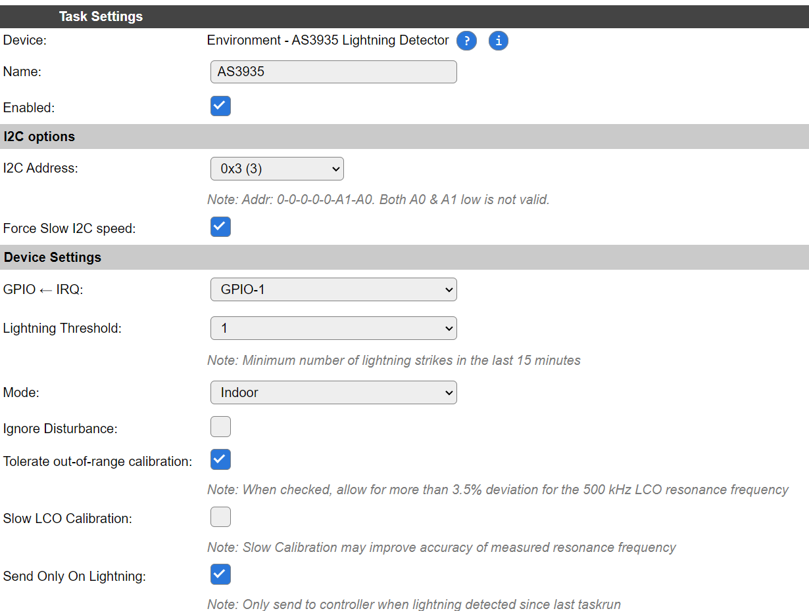

.. include:: ../Plugin/_plugin_substitutions_p16x.repl
.. _P169_page:

|P169_typename|
==================================================

|P169_shortinfo|

Plugin details
--------------

Type: |P169_type|

Name: |P169_name|

Status: |P169_status|

GitHub: |P169_github|_

Maintainer: |P169_maintainer|

Used libraries: |P169_usedlibraries|

Description
-----------

The AS3935 is a programmable fully integrated Lightning Sensor IC that detects the presence and approach of potentially
hazardous lightning activity in the vicinity and provides an estimation on the distance to the head of the storm. 
The embedded lightning algorithm checks the incoming signal pattern to reject the potential man-made disturbers.

This chip can be found on a number of boards, like this one from DFRobot.

(Image (c) DFRobot)

Wiring
------

This sensor can be used via SPI or I2C.

For ESPEasy it needs to be wired for I2C:

* ``SI`` pin ("Select Interface") must be pulled high.
* ``MOSI`` pin is I2C SDA.
* ``SCL`` pin is I2C SCL.
* ``A1`` and ``A0`` pulled high for the default address of ``0x03``.

Apart from the I2C connection, there is an ``IRQ`` signal which must also be connected to the ESP board.
This IRQ signal is used to calibrate the sensor as well as to signal the ESP about some changed condition like a detected lightning strike or noise disturbances.

Board Specific
^^^^^^^^^^^^^^

Some boards already have resistors present to pull the unused pins high or low where needed and are default set for I2C.
For example 8-pin brown or purple boards with ``GY-AS3935`` written on the back is default configured for I2C with address ``0x03``.

Other boards like a slightly larger 11-pin purple board with ``WCMCU-3935`` written on the board,  
might need to have the unused pins (``CS`` & ``MISO``) explicitly pulled to GND.
The ``EN-V`` pin should be pulled high.

Power Supply and Noise
^^^^^^^^^^^^^^^^^^^^^^

This sensor is quite sensitive to noise in its direct surroundings.
Especially signals around 500 kHz will cause this sensor to perform significantly worse.

This sensor needs to have its resonance frequency calibrated within 3.5% of 500 kHz.

Some tips:

* Keep DC/DC converters and other power supplies away from this sensor.
* Add some 100 uF ... 220 uF capacitor close to the power supply pins of the sensor.
* Do not use any metal close to the antenna of the sensor as this will change the antenna resonance frequency.
* Use short wires.
* Lower I2C clock frequency to 100 kHz for all I2C devices on this ESPEasy board.
* Lower I2C clock frequency on devices within a few meters from this sensor. (Explicitly stay away from 500 kHz)
* Do not leave unused pins 'floating'. Either pull them to 3V3 or GND.

The sensor chip does have an internal voltage regulator.

On some boards, this regulator can be enabled by pulling the ``EN-V`` or ``EN_VREG`` pin high (if made availabe on the board).

Onboard voltage regulator:

* Enabled: ``EN_VREG`` pin high, ``VREG`` via 1uF to GND. Supply voltage range is 2.4V to 5.5V
* Disabled: ``EN_VREG`` pin low, ``VREG`` connected to VDD pin. Supply voltage range is 2.4V to 3.6V

With the onboard voltage regulator enabled, the current consumption will be slight higher.
But the supplied voltage to the sensor will be more stable.

See the `datasheet <https://www.sciosense.com/as3935-franklin-lightning-sensor-ic/>`_ pages 15 and 16 for more information.

.. image:: P169_VoltageRegulator_ON.png
  :width: 500
  :alt: AS3935 Application Diagram (Voltage Regulator ON, I²C Active)

Configuration
-------------

* **Name**: Required by ESPEasy, must be unique among the list of available devices/tasks.

* **Enabled**: The device can be disabled or enabled. When not enabled the device should not use any resources.

I2C options
^^^^^^^^^^^

* **I2C Address**: The device supports 8 addresses, and by default comes configured for address ``0x5F``, as reflected in the available options:

.. image:: P169_I2CAddressOptions.png

Available addresses are in the range ``0x01`` to ``0x03``.

The available I2C settings here depend on the build used. At least the **Force Slow I2C speed** option is available, but selections for the I2C Multiplexer can also be shown. For details see the :ref:`Hardware_page`

Device Settings
^^^^^^^^^^^^^^^

* **IRQ**: Configure the GPIO pin on the ESP board connected to the IRQ pin of the sensor.
  This pin is used for both the antenna calibration as well as to notify the ESP board of any lightning strike or detected disturbance.
* **Lightning Threshold**: Minimum number of detected strikes in 15 minutes to let the sensor trigger the IRQ pin.
* **Mode**: Set the Analog Front-End (AFE) gain for typical indoor/outdoor use case.
* **Ignore Disturbance**: The sensor may trigger the IRQ pin to signal a lightning strike, high noise or detected disturbances. With "Ignore Disturbance" checked, this last one is ignored.

Current Sensor Data
^^^^^^^^^^^^^^^^^^^

Data Acquisition
^^^^^^^^^^^^^^^^

This group of settings, **Single event with all values** and **Send to Controller** settings are standard available configuration items. Send to Controller is only visible when one or more Controllers are configured.

* **Interval** By default, Interval will be set to 0 sec. The data will be collected and optionally sent to any configured controllers using this interval. When an output value is changed, the data will be sent to any configured controller, and an event will also be generated when the Rules are enabled (Tools/Advanced).

Values
^^^^^^

In selected builds, per Value is a **Stats** checkbox available, that when checked, gathers the data and presents recent data in a graph, as described here: :ref:`Task Value Statistics:  <Task Value Statistics>`

Commands available
^^^^^^^^^^^^^^^^^^

.. .. include:: P169_commands.repl

Get Config Values
^^^^^^^^^^^^^^^^^

.. .. include:: P169_config_values.repl

Change log
----------

.. versionchanged:: 2.0
  ...

  |added|
  2024-05-24 Initial release version.

