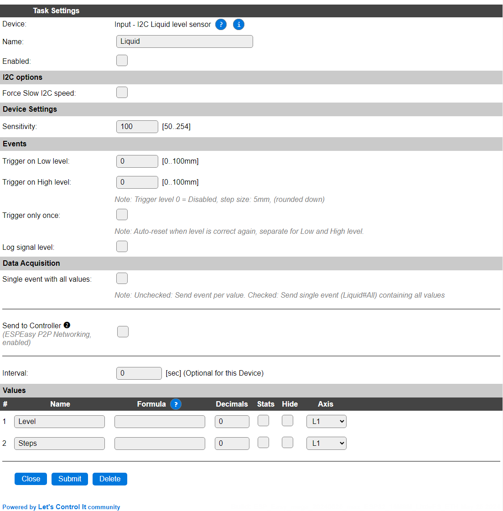

.. include:: ../Plugin/_plugin_substitutions_p17x.repl
.. _P170_page:

|P170_typename|
==================================================

|P170_shortinfo|

Plugin details
--------------

Type: |P170_type|

Name: |P170_name|

Status: |P170_status|

GitHub: |P170_github|_

Maintainer: |P170_maintainer|

Used libraries: |P170_usedlibraries|

Description
-----------

The Seeed Studio I2C Liquid level sensor can measure a liquid level in the range of 0..10cm, in a resolution of 5mm. It uses a capacitive sensor method.

(Image (c) Seeed Studio)

Configuration
-------------

* **Name**: Required by ESPEasy, must be unique among the list of available devices/tasks.

* **Enabled**: The device can be disabled or enabled. When not enabled the device should not use any resources.

I2C options
^^^^^^^^^^^

* **I2C Address**: Is not available in the configuration, but the device has a fixed address, or actually 2 fixed adjacent addresses, ``0x77`` and ``0x78``, as there are to separate but similar microcontrollers on the board, each delivering a part of the measurement range.

The available I2C settings here depend on the build used. At least the **Force Slow I2C speed** option is available, but selections for the I2C Multiplexer can also be shown. For details see the :ref:`Hardware_page`

Device Settings
^^^^^^^^^^^^^^^

* **Sensitivity**: This determines the signal level measured for each sensor-pad to be submerged in the liquid. Depending on the type of liquid to be measured, this may need adjusting.

Events
^^^^^^

* **Trigger on Low level**: When set above 0 (in steps of 5 mm, rounded down on save), an event will be generated when the liquid level goes *below* this level. The generated event is ``<taskname>#LowLevel=<level>``.

* **Trigger on High level**: When set above 0 (in steps of 5 mm, rounded down on save), an event will be generated when the liquid level rises *above* this level. The generated event is ``<taskname>#HighLevel=<level>``.

When a Trigger is set to 0 it will be disabled. Rules have to be enabled to be able to process the events.

* **Trigger only once**: When enabled, only a single event will be generated for a High or Low level trigger, until that state is reset and again passes the trigger level.

Data Acquisition
^^^^^^^^^^^^^^^^

This group of settings, **Single event with all values** and **Send to Controller** settings are standard available configuration items. Send to Controller is only visible when one or more Controllers are configured.

* **Interval** By default, Interval will be set to 0 sec. The data will be collected and optionally sent to any configured controllers using this interval. When an output value is changed, the data will be sent to any configured controller, and an event will also be generated when the Rules are enabled (Tools/Advanced).

Values
^^^^^^

The plugin provides the ``Level`` (mm) and ``Steps`` (range 0..20) values. A formula can be set to recalculate the displayed, and sent, value.

In selected builds, per Value is a **Stats** checkbox available, that when checked, gathers the data and presents recent data in a graph, as described here: :ref:`Task Value Statistics:  <Task Value Statistics>`

Events
^^^^^^

.. include:: P170_events.repl

Change log
----------

.. versionchanged:: 2.0
  ...

  |added| 2024-05-21 Initial release version.

