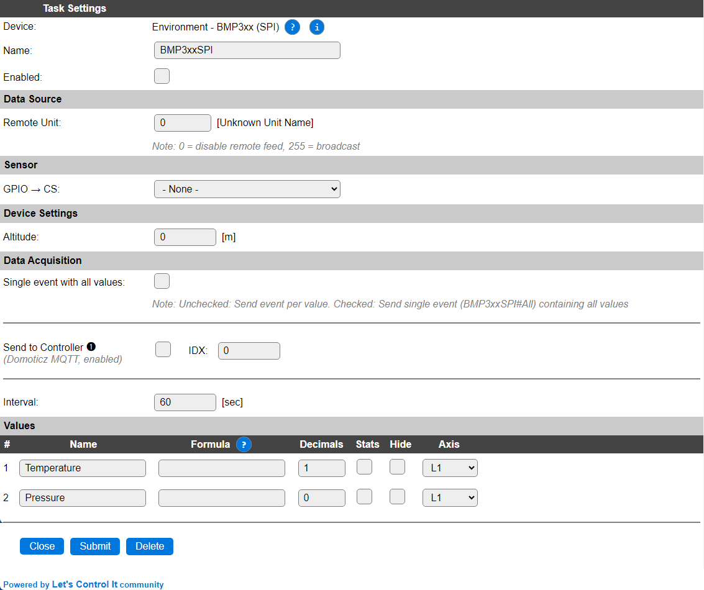

.. include:: ../Plugin/_plugin_substitutions_p17x.repl
.. _P172_page:

|P172_typename|
==================================================

|P172_shortinfo|

Plugin details
--------------

Type: |P172_type|

Name: |P172_name|

Status: |P172_status|

GitHub: |P172_github|_

Maintainer: |P172_maintainer|

Used libraries: |P172_usedlibraries|

Description
-----------

As a successor to their BMP280, Bosch made the BMP388 and the even higher resolution BMP390 temperature and air pressure sensors.

The main improvements compared to the BMP280 are:

* Lower power consumption
* Higher possible sample rate
* Option to store a number of samples in the 512 byte buffer to burst read
* Higher resolution
* Less noise

.. note:: This plugin uses the same code as plugin P154: :ref:`P154_page`, only connected via the SPI interface instead of I2C.

Configuration
-------------

* **Name**: Required by ESPEasy, must be unique among the list of available devices/tasks.

* **Enabled**: The device can be disabled or enabled. When not enabled the device should not use any resources.

Sensor
^^^^^^

* **GPIO -> CS**: Select the GPIO pin that is connected to the CS pin of the board.

Since this chip supports both SPI and I2C, the pin naming may be slightly confusing:

* SCL: SPI Clock (CLK)
* SDA: Data In (MOSI)
* SDO: Data Out (MISO)
* CS:  Chip Select (CS).
* INT: Not used.

Device Settings
^^^^^^^^^^^^^^^

* **Detected Sensor Type**: Shows either ``BMP38x`` or ``BMP390`` or a number if an unknown sensor ID is detected. (Only shown when the plugin is active.)
* **Altitude**: Optionally set the offset from sea level (in meters) of the sensor to convert pressure measurements to sea level pressure.

Data Acquisition
^^^^^^^^^^^^^^^^

This group of settings, **Single event with all values** and **Send to Controller** settings are standard available configuration items. Send to Controller is only visible when one or more Controllers are configured.

* **Interval** By default, Interval will be set to 60 sec. The data will be collected and optionally sent to any configured controllers using this interval. If the Interval is set lower or equal than the required 10 * Heater time, the plugin will not start!

Values
^^^^^^

The plugin provides the ``Temperature`` and ``Pressure`` values. A formula can be set to recalculate. The number of decimals can be set as desired, and defaults to 2.

In selected builds, per Value are a **Stats** and **Hide** checkbox available, and a coordinate axis combo, that when Stats is checked, gathers the data and presents recent data in a graph, as described here: :ref:`Task Value Statistics:  <Task Value Statistics>`

Currently the extra features offered by the sensore are not configurable in this plugin.
These may be added later.

The internal filtering in the sensor is fixed to these settings:

* Temperature: 8x oversampling
* Pressure: 4x oversampling
* IIR Filter Coefficient: 3
* Sample rate: 50 Hz

.. figure:: P154_HighResolutionTemperatureStatsExample.png
  :alt: Example of the high temperature resolution of a BMP388
  :width: 50 %
  :align: center

  Example of the high temperature resolution of a BMP388

Change log
----------

.. versionchanged:: 2.0
  ...

  |added|
  2024-07-13 Initial release of SPI version.

