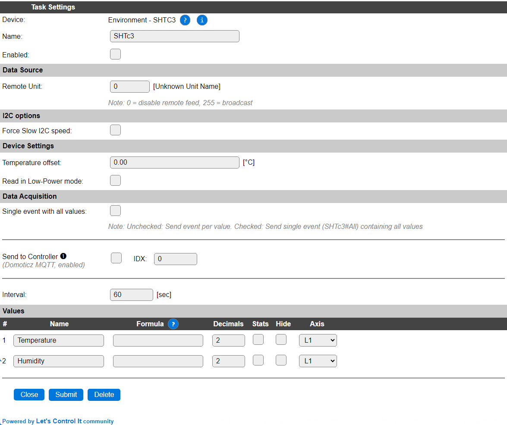

.. include:: ../Plugin/_plugin_substitutions_p17x.repl
.. _P173_page:

|P173_typename|
==================================================

|P173_shortinfo|

Plugin details
--------------

Type: |P173_type|

Name: |P173_name|

Status: |P173_status|

GitHub: |P173_github|_

Maintainer: |P173_maintainer|

Used libraries: |P173_usedlibraries|

Description
-----------

The Sensirion SHTC3 Temperature and Humidity sensor offers good accuracy in a small package, and has a very low power requirement. The sensor is kept in Sleep-mode until a measurement is requested, and even that measurement can use a low-power variant to keep power consumption as low as possible, f.e. when used in a battery-operated setup.

Configuration
-------------

* **Name**: Required by ESPEasy, must be unique among the list of available devices/tasks.

* **Enabled**: The device can be disabled or enabled. When not enabled the device should not use any resources.

I2C options
^^^^^^^^^^^

The available I2C settings here depend on the build used. At least the **Force Slow I2C speed** option is available. This sensor can also be used with an I2C Multiplexer, but as the (fixed) device address is ``0x70`` the I2C multiplexer has to be configured to use a different from the default I2C address. For details see the :ref:`Hardware_page`.

Device Settings
^^^^^^^^^^^^^^^

* **Temperature offset**: An offset from the current temperature can be applied in 0.01°C steps. The offset can be set here.

* **Read in Low-power mode**: When enabled will use the Low-power version of the command to read the data, for improved battery-life when used in a bettery-powerd setup.

Data Acquisition
^^^^^^^^^^^^^^^^

This group of settings, **Single event with all values** and **Send to Controller** settings are standard available configuration items. Send to Controller is only visible when one or more Controllers are configured.

* **Interval** By default, Interval will be set to 60 sec. The data will be collected and optionally sent to any configured controllers using this interval.

Values
^^^^^^

The plugin provides the ``Temperature`` and ``Humidity`` values. A formula can be set to recalculate, f.e. when temperature has to be presented in ° Fahrenheit instead of ° Celcius: ``%c_c2f%(%value%)``. The number of decimals can be set as desired, and defaults to 2.

In selected builds, per Value **Stats** options are available, that when enabled, will gather the measured data and present most recent data in a graph, as described here: :ref:`Task Value Statistics:  <Task Value Statistics>`

.. Commands available
.. ^^^^^^^^^^^^^^^^^^

.. .. include:: P173_commands.repl

.. Get Config Values
.. ^^^^^^^^^^^^^^^^^

.. Get Config Values retrieves values or settings from the sensor or plugin, and can be used in Rules, Display plugins, Formula's etc. The square brackets **are** part of the variable. Replace ``<taskname>`` by the **Name** of the task.

.. .. include:: P173_config_values.repl

Change log
----------

.. versionchanged:: 2.0
  ...

  |added|
  2024-08-30 Initial release version.

