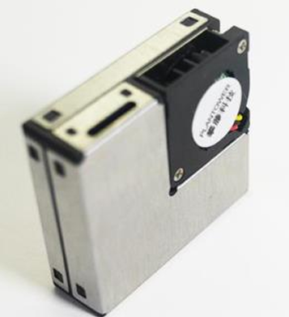
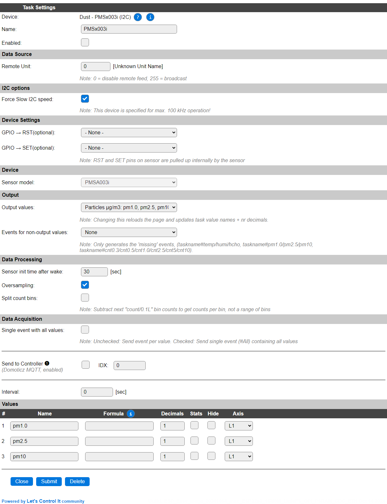

.. include:: ../Plugin/_plugin_substitutions_p17x.repl
.. _P175_page:

|P175_typename|
==================================================

|P175_shortinfo|

Plugin details
--------------

Type: |P175_type|

Port Type: |P175_porttype|

Name: |P175_name|

Status: |P175_status|

GitHub: |P175_github|_

Maintainer: |P175_maintainer|

Used libraries: |P175_usedlibraries|

Shared code
-----------

.. note:: Because of the technical overlap with other Plantower dust sensors, this plugin shares most code and documentation with :ref:`p053_page`, that's why you'll also see some information or selections related to these, very similar, Plantower dust sensors.

.. include:: P053_P175_common.repl

Supported hardware
------------------

The supported Plantower device is the PMSA003i, as no other Plantower dust sensors using an I2C interface are currently available.

PMSA003i:

Precautions
-----------

The PMSx003 run on 5V. All inputs and outputs are TTL 3.3V compatible so no level converter is needed.

Some boards come with a sweep-up circuit to convert 3.3V to 5V, and can also be powered with 3.3V.

Pins:

.. code-block:: none

  VCC     - 5V (for fan and internal logic)
  GND     - Ground (Note that chassis/case are ground also)
  SDA/SCL - 3V3 I2C Data and clock signal
  SET     - Standby function, when pulled down the module does not send information and goes into a low power state.
  RESET   - Reset the module, similar to power-up, it takes ~30 seconds before data is received

Configuration
-------------

* **Name**: A unique name should be entered here.

* **Enabled**: The device can be disabled or enabled. When not enabled the device should not use any resources.

I2C options
^^^^^^^^^^^

The available I2C settings here depend on the build used. At least the **Force Slow I2C speed** option is available. This sensor can also be used with an I2C Multiplexer. For details see the :ref:`Hardware_page`.

According to the documentation, the max. communication speed for this sensor is 100 kHz, the default Slow I2C speed setting, so this option is enabled by default.

Device Settings
^^^^^^^^^^^^^^^

* **GPIO -> RST(optional)**: The pin to control the Reset signal. Not used when set to None.

* **GPIO -> SET(optional)**: The pin to control the Active/Sleep state. Not used when set to None.

Device
^^^^^^

* **Sensor model**: Fixed value **PMSA003i**, not changeable at this time.

Output
^^^^^^

Output values
"""""""""""""

With PMSA003i extra output values are available. To choose which values are made available in the task, this combobox provides the available options.

.. note:: Changing this output selector will toggle a reload of the page. When the output selection has changed, the task value names will be reset to their (new) default names and the nr. of decimals will be set to proper values. (e.g. 1 decimal for temp/hum and 3 decimals for Formaldehyde) The nr of decimals will be set to at least 1 when oversampling is enabled.

Available options:

.. image:: P053_OutputValuesOptions.png

* *Particles µg/m3: pm1.0, pm2.5, pm10*: The default output values, available for all supported sensors.

- ``PM1.0`` - Concentration of particles < 1 micron (µg/m3)
- ``PM2.5`` - Concentration of particles < 2.5 micron (µg/m3)
- ``PM10`` - Concentration of particles < 10 micron (µg/m3)

* *Particles µg/m3: pm2.5; Other: Temp, Humi, HCHO (PMS5003ST)*: Particles > 2.5 micron (µg/m3) (**only** supported by the PMS5003ST sensor).

- ``PM2.5`` - Concentration of particles < 2.5 micron (µg/m3)
- ``Temp`` - Temperature
- ``Humi`` - Humidity
- ``HCHO`` - Formaldehyde concentration measurement (Formula: CH\ :sub:`2`\ O, or H-CHO)

Two choices for particle counts in *count/0.1L* (PMS1003/5003(ST)/7003/A003i) :

* *Particles count/0.1L: cnt1.0, cnt2.5, cnt5, cnt10*:

* *Particles count/0.1L: cnt0.3, cnt0.5, cnt1.0, cnt2.5*:

With:

- ``cnt0.3`` - Count of particles > 0.3 micron per 0.1L of air
- ``cnt0.5`` - Count of particles > 0.5 micron per 0.1L of air
- ``cnt1.0`` - Count of particles > 1 micron per 0.1L of air
- ``cnt2.5`` - Count of particles > 2.5 micron per 0.1L of air
- ``cnt5`` - Count of particles > 5 micron per 0.1L of air
- ``cnt10`` - Count of particles > 10 micron per 0.1L of air

.. image:: P053_OutputValuesCnt.png

.. note:: ``PMxx`` values relate to particles **less than or equal** to said size, while count/100ml relates to  particles of **at least** said size.
   Except when "Split count bins" is checked, then the "count/0.1L" values represent only a single bin.

Events for non-output values
""""""""""""""""""""""""""""

When an option other than **None** is selected, the **Output values** that are not directly available, will be sent via events.
If there is some overlap in selected output values and the extra event selector, only those values which were not already sent as regular task values, will be sent in extra events.

.. note:: The "Single event with all values" option only combines the 4 selected task values in 1 event. Extra events will only contain 1 value per event.

Available options:

.. image:: P053_EventOptions.png

* *Particles µg/m3 and Temp/Humi/HCHO*:

When *Particles µg/m3: pm1.0, pm2.5, pm10* is selected: ``<Taskname>#Temp``, ``<Taskname>#Humi`` and ``<Taskname>#HCHO``, with the measured value available in ``%eventvalue1%``. (Not available for PMSA003i)

When *Particles µg/m3: pm2.5; Other: Temp, Humi, HCHO (PMS5003ST)* is selected: ``<Taskname>#pm1.0`` and ``<Taskname>#pm10``.

* *Particles µg/m3, Temp/Humi/HCHO and Particles count/0.1L*:

All of the above, and also ``<Taskname>#pm2.5``, ``<Taskname>#cnt1.0``, ``<Taskname>#cnt2.5`` and ``<Taskname>#cnt10`` events are generated if these are not selected as **Output values**.

These events can be used to store the values in a Dummy Device, so they can be sent out using a Controller, or they can be directly sent to an external system.

Example: (Sensor device using model PMSA003i and Dummy device named ``Particles`` with 2 values named ``pm1.0`` and ``pm10``)

.. code-block:: none

  On PMSA003i#pm1.0 do
    TaskValueSet,Particles,pm1.0,%eventvalue1%
  Endon
  On PMSA003i#pm10 do
    TaskValueSet,Particles,pm10,%eventvalue1%
  Endon

These events will *only* be generated when the **Rules** option is enabled on the Tools/Advanced page.

Data Processing
^^^^^^^^^^^^^^^

The PMSx003 sensors may output samples quite often.
Typically a sample is sent every 800 msec, with shorter intervals when the data does change a lot between readings.
However, the sensor itself does not always have new data when a packet is sent by the sensor.
These duplicate messages are detected and ignored.

* **Sensor init time after wake**:

The Plantower datasheet suggests to let the sensor run for at least 30 seconds after power on (or wake up) to get a reliable reading.

When set to a value over 0 seconds, a timer will be set when the sensor is called to wakeup.
During this period, any received sample will be ignored.

If running the sensor at an interval to save energy consumption and extend the sensors lifetime, make sure the "active" duration is longer than this sensor init time.
The sensor typically needs 2.3 seconds to complete a measurement.

So a good duration for wake time is at least 35 - 40 seconds (oversampling enabled).

* **Oversampling**:

By default, only the last sample is output by the task.
But since the counted values may change quite a lot between samples, it is advised to enable oversampling.
With oversampling enabled, the reported values are averaged over the period between calls of ``PLUGIN_READ`` (Interval).
This may give a more stable output value to process.

The default nr of decimals will be set to 1 when oversampling is enabled. (may require to switch the output values combo box)

.. note:: When putting the sensor to sleep, any collected data in the averaging buffer is flushed by scheduling a ``PLUGIN_READ``. This will output the data to any connected controller and generate the appropriate events.
   Any data still present in the buffer when waking the sensor is flushed, to make sure no old and new data is merged.

* **Split count bins**:

The "count/0.1L" values are based on particles with at least the given size.
Thus a ``cnt0.3`` value describes all particles with a size of at least 0.3 micron.

In some use cases it can be useful to count only the particles of a specific size, like 0.3 ... 0.5 micron.
When "Split count bins" is checked, the recorded counted values will be split over single bins.

Lifetime Helper
^^^^^^^^^^^^^^^^

The laser diode inside the PMSx003 has a lifetime of about 8000 h, nearly one year. With the actual plugin the sensor is powered permanently so we have to take some care about this.

wake/sleep command
""""""""""""""""""

Using the ``pmsx003,sleep`` and ``pmsx003,wake`` commands can be used to reduce the energy consumption and extend the laser lifetime.

Example rules:

.. code-block:: none

   On System#Boot do    //When the ESP boots, do
     looptimerset,1,300  // Start loop timer 1, 300 sec interval
     timerSet,2,30 // Set timer 2 to put the sensor to sleep again
   endon
   
   On Rules#Timer=1 do
     timerSet,2,30 // Set timer 2 to put the sensor to sleep again
     pmsx003,wake
   endon
   
   On Rules#Timer=2 do
     pmsx003,sleep
   endon

In the example setup, a GPIO pin should be connected to the ``SET`` input of the PMSA003i. If it is pulled low the sensor sleeps. The ``wake`` and ``sleep`` commands change the state of the configured GPIO pin accordingly.

Unlike the serial connected PMSx003 sensors, no sleep/wake command can be sent to the sensor, so sleep/wake can only be achieved by using the **SET** pin.

Commands available
^^^^^^^^^^^^^^^^^^

.. include:: P175_commands.repl

Events
^^^^^^

A task running the PMSx003 can be configured to output a number of values as standard task values.
However the sensor outputs more values than can be used as ESPEasy task values.

To overcome this limitation, one can set what other measured values can be useful to have as an event for processing in the rules.

Which of the  following events may be sent, depends on this setting and also whether the sensor is capable of measuring the described unit of measure.

.. include:: P053_events.repl

Change log
----------

.. versionadded:: 2.0
  ...

  |added|
  2024-10-12 Initial release version.

