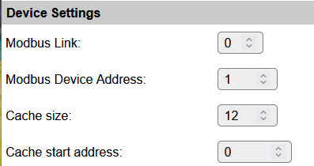

.. include:: ../Plugin/_plugin_substitutions_p18x.repl
.. _P183_page:

|P183_typename|
==================================================

|P183_shortinfo|

Plugin details
--------------

Type: |P183_type|

Port Type: |P183_porttype|

Name: |P183_name|

Status: |P183_status|

GitHub: |P183_github|_

Maintainer: |P183_maintainer|

Used libraries: |P183_usedlibraries|

Introduction
------------

Modbus is a serial communication protocol commonly used for connecting industrial electronic devices. 
It is a master/slave (or client/server) protocol, which means that one device (the master) initiates communication and the other devices (the slaves) respond. 
Modbus RTU (Remote Terminal Unit) is a variant of the Modbus protocol that uses binary representation of data and is typically used over serial communication lines such as RS-485 or RS-232.
This plugin supports Modbus RTU communication over a serial interface. To support RS-485 communication, an external RS-485 to TTL converter is required.

Modbus RTU uses a register-based addressing scheme, where each device has a unique address and data is stored in registers.
Registers can be of different types, such as holding registers, input registers, coils, and discrete inputs.
This plugin supports reading holding registers (function code 03) and writing to holding registers (function code 06).

The plugin can be configured to read up to 4 holding registers from a Modbus slave device and store the values in user variables.
It can also write values to a specified holding register on the Modbus slave device. 

The plugin can use a cache to store a limeted amount of consequitive register values. These registers are available through commands.

The plugin does not support any hardware specific features. Instead it is a generic plugin that can be used with any Modbus RTU compatible device. You have to lookup the correct register addresses and data formats in the documentation of the Modbus device you want to communicate with. 
For more complex devices dedicated plugins may be available that support the specific device and its features.

Supported hardware
------------------

|P183_usedby|

Configuration
-------------

* **Name**: Required by ESPEasy, must be unique among the list of available devices/tasks.

* **Enabled**: The device can be disabled or enabled. When not enabled the device should not use any resources.

Sensor
^^^^^^

The available Modbus protocol settings here depend on the build used.

* **Modbus Link**: The Modbs link the device is connected to. The link must be configured in the Interfaces page.

* **Modbus Device Address**: The Modbus slave device ID to communicate with (1..247).

* **Cache size**: Number of holding registers that will be read into the cache. Set to zero to disable reading data into the cache.

* **Cache start address**: The address of the first holding register to be read into the cache.

Output Configuration
^^^^^^^^^^^^^^^^^^^^

.. image:: P183_output_config.png

* **Number Output Values**: The number of output values to provide. Each value corresponds to a holding register the plugin will read (1..4).

* **Holding register for valueX**: The Modbus holding register address to read for valueX (X=1..4).

The holding register address is a 16-bit value (0..65535). This is the register address as specified with the Modbus device and is used directly in the Modbus read holding registers (function code 03). The plugin will read the number of values specified, starting with value1

Commands available
^^^^^^^^^^^^^^^^^^

.. include:: P183_commands.repl

.. Events
.. ~~~~~~

.. .. include:: P183_events.repl

Get Config Values
^^^^^^^^^^^^^^^^^

Get Config Values retrieves values or settings from the sensor or plugin, and can be used in Rules, Display plugins, Formula's etc. The square brackets **are** part of the variable. Replace ``<taskname>`` by the **Name** of the task.

.. include:: P183_config_values.repl

Modbus RTU facility
-------------------

This plugin uses a Modbus facility that allows multiple Modbus devices to share the same Modbus link.
The serial link parameters are defined for each link, not for the device itself. The Modbus facility is configured on the interfaces page, Modbus tab. Multiple Modbus devices can be connected to the same Modbus link as long as they share the same link settings.
The modbus facility can support multiple Modbus links in parallel. Use the **Modbus link** setting to select the link to be used by this device.

The Modbus facility uses a queue to process Modbus requests one after another. The Modbus facilty will not block the plugin or other ESPEasy software while the queue is processed. It even allows to process multiple Modbus links in parallel without blocking each other. 
This queueing implies that the plugin must cache the data read from the Modbus and that the values the plugin provides may be delayed. This P183 plugin reads the global cache once per second. Values are read through the Modbus from the device at the configured interval. 
At that moment the plugin will stil present the value from its internal cache. Once the reply is received from the hardware then the plugin will update both the cache and the value. Note that the cache for the values is separate from the global holding register cache. 
The holding register address for the values can be configured outside the cache range.

Change log
----------

.. versionchanged:: 2.0
  ...

  |added|
  Major overhaul for 2.0 release.

.. versionadded:: 1.0
  ...

  |added|
  Initial release version.

