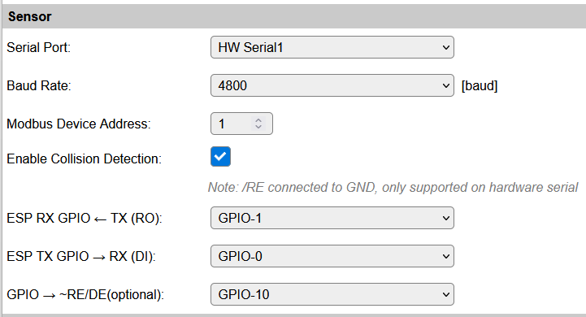
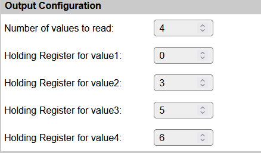

.. include:: ../Plugin/_plugin_substitutions_p18x.repl
.. _P183_page:

|P183_typename|
==================================================

|P183_shortinfo|

Plugin details
--------------

Type: |P183_type|

Port Type: |P183_porttype|

Name: |P183_name|

Status: |P183_status|

GitHub: |P183_github|_

Maintainer: |P183_maintainer|

Used libraries: |P183_usedlibraries|

Introduction
------------

Modbus is a serial communication protocol commonly used for connecting industrial electronic devices. 
It is a master/slave (or client/server) protocol, which means that one device (the master) initiates communication and the other devices (the slaves) respond. 
Modbus RTU (Remote Terminal Unit) is a variant of the Modbus protocol that uses binary representation of data and is typically used over serial communication lines such as RS-485 or RS-232.
This plugin supports Modbus RTU communication over a serial interface. To support RS-485 communication, an external RS-485 to TTL converter is required.

Modbus RTU uses a register-based addressing scheme, where each device has a unique address and data is stored in registers.
Registers can be of different types, such as holding registers, input registers, coils, and discrete inputs.
This plugin supports reading holding registers (function code 03) and writing to holding registers (function code 06).

The plugin can be configured to read up to 4 holding registers from a Modbus slave device and store the values in user variables.
It can also write values to a specified holding register on the Modbus slave device. 

The plugin does not support any hardware specific features. Instead it is a generic plugin that can be used with any Modbus RTU compatible device. You have to lookup the correct register addresses and data formats in the documentation of the Modbus device you want to communicate with.

Supported hardware
------------------

|P183_usedby|

Configuration
-------------

* **Name**: Required by ESPEasy, must be unique among the list of available devices/tasks.

* **Enabled**: The device can be disabled or enabled. When not enabled the device should not use any resources.

Sensor
^^^^^^

The available Serial protocol settings here depend on the build used.

* **Serial Port**: The serial port to use for Modbus communication.

* **Baudrate**: The baudrate for the serial communication. Common values are 1200, 2400, 4800, 9600, 19200, 38400, 57600, 115200.

* **Modbus Device Address**: The Modbus slave device ID to communicate with (1..247).

* **Enable Collision Detection**: Enable collision detection to avoid data corruption when multiple devices are connected to the same serial bus. This requires a GPIO pin to be configured as input and connected to the bus transceiver's DE/RE pin.

* **ESP RX GPIO ← TX (RO)**: The GPIO pin to use as RX input for the serial communication. This pin should be connected to the TX output of the RS-485 to TTL converter.

* **ESP TX GPIO → RX (DI)**: The GPIO pin to use as TX output for the serial communication. This pin should be connected to the RX input of the RS-485 to TTL converter.

* **GPIO → RE/DE(optional)**: The GPIO pin to use for collision detection. This pin should be connected to the DE/RE pin of the RS-485 to TTL converter.

Output Configuration
^^^^^^^^^^^^^^^^^^^^

* **Number of registers to read**: The number of holding registers the plugin will read (1..4).

* **Holding register for valueX**: The Modbus holding register address to read for valueX (X=1..4).

The holding register address is a 16-bit value (0..65535). This is the register address as specified with the Modbus device and is used directly in the Modbus read holding registers (function code 03). The plugin will read the number of values specified, starting with value1

Commands available
^^^^^^^^^^^^^^^^^^

.. include:: P183_commands.repl

.. Events
.. ~~~~~~

.. .. include:: P183_events.repl

Get Config Values
^^^^^^^^^^^^^^^^^

Get Config Values retrieves values or settings from the sensor or plugin, and can be used in Rules, Display plugins, Formula's etc. The square brackets **are** part of the variable. Replace ``<taskname>`` by the **Name** of the task.

.. include:: P183_config_values.repl

Change log
----------

.. versionchanged:: 2.0
  ...

  |added|
  Major overhaul for 2.0 release.

.. versionadded:: 1.0
  ...

  |added|
  Initial release version.

