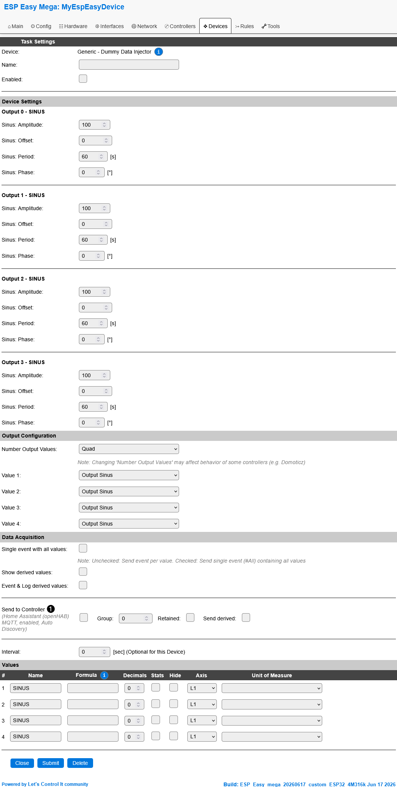
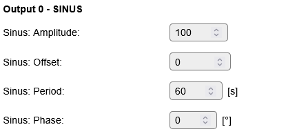
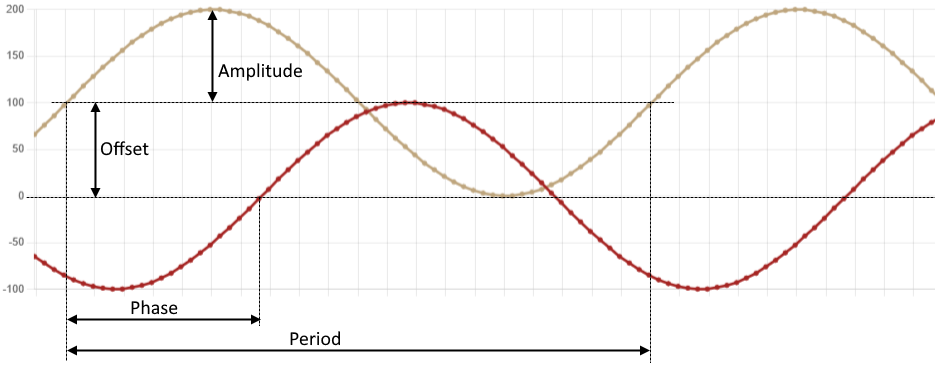
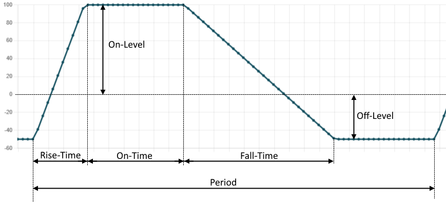
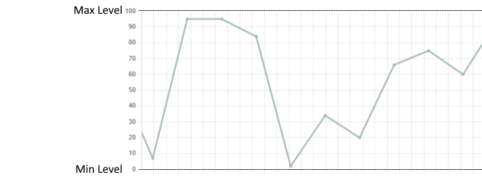

.. include:: ../Plugin/_plugin_substitutions_p18x.repl
.. _P187_page:

|P187_typename|
==================================================

|P187_shortinfo|

Plugin details
--------------

Type: |P187_type|

Name: |P187_name|

Status ESP32: |P187_status|

Status ESP8266: |P187_status_lb|

GitHub: |P187_github|_

Maintainer: |P187_maintainer|

Used libraries: |P187_usedlibraries|

Introduction
------------

The Dummy Data Injector plugin simulates peripheral data output. It can be used e.g. to test IOT backend systems by providing input data for debugging.
Up to four synchronized data streams can be generated per deployment of the plugin. 

There are following output configurations possible:

* **Sinus**: sinus shaped output values. The datastream can be configured in Amplitude, Offset, Period and Phase.
  
* **Trapezoid**: trapezoid shaped output values. The datastream's On-Level, Off-Level, Period, On-Time, Rise-Time and Fall-Time can be configured.

* **Random**: generates random output values. Minimum and Maximum values can be configured.

.. image:: P187_Output_Combined.png
  :alt: Output view

Configuration
-------------

* **Name**: Required by ESPEasy, must be unique among the list of available devices/tasks.

* **Enabled**: The device can be disabled or enabled. When not enabled, no output data is generated.

Device Settings
^^^^^^^^^^^^^^^

Depending on the selected 'Number Output values', up to four sections are used to configure the output values (press 'Submit' after changing) :

Output Sinus
~~~~~~~~~~~~

* **Amplitude**: Amplitude of the signal (integer value -65537 to +65537)
* **Offset**: Offset from 0-Line (integer value -65537 to +65537)
* **Period**: period time in seconds (integer value 60 - 3600)
* **Phase**: phase offset in degrees (integer value 0 - 359)

- for floating value output, use formula to divide output levels (e.g. floating value output with 2 decimals use the formula '%value%/100')

Output Trapezoid
~~~~~~~~~~~~~~~~

.. image:: P187_Config_Trapezoid.png
  :alt: Output trapezoid configuration

* **On-Level**: output level during On-Time period (integer value -65537 to +65537)
* **Off-Level**: output level during Off-Time period (integer value -65537 to +65537)
* **Period**: period time in seconds (must be greater than On-Time + Rise-Time + Fall-Time)
* **On-Time**: duration of On-Time period in seconds
* **Rise-Time**: duration of linear slope from Off-Level to On-Level
* **Fall-Time**: duration of linear slope from On-Level to Off-Level

  
- for inverted output, swap On-Level value with Off-Level value.
- for floating value output, use formula to divide output levels (e.g. floating value output with 2 decimals use the formula '%value%/100')

Output Random
~~~~~~~~~~~~~

.. image:: P187_Config_Random.png
  :alt: Output random configuration

* **Max-Level**: maximum output level (integer value -65537 to +65537)
* **Min-Level**: minimum output level (integer value -65537 to +65537)

- for floating value output, use formula to divide output levels (e.g. floating value output with 2 decimals use the formula '%value%/100')

Change log
----------

.. versionadded:: 1.0
  ...

  |added|
  Initial release version.

