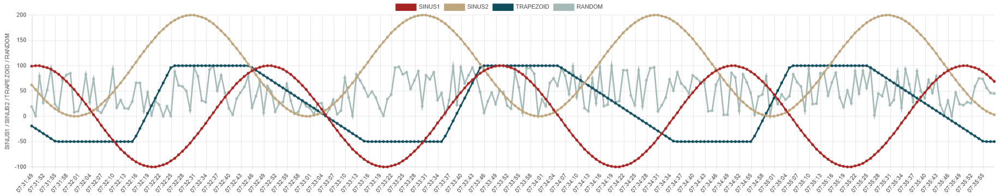
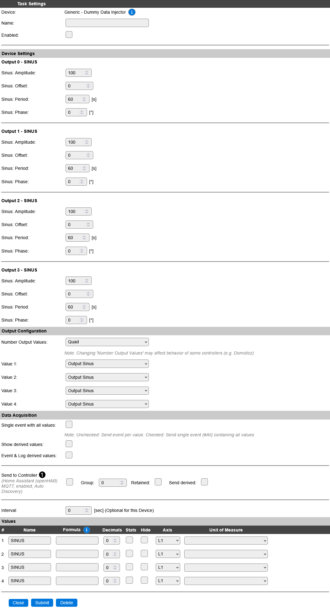
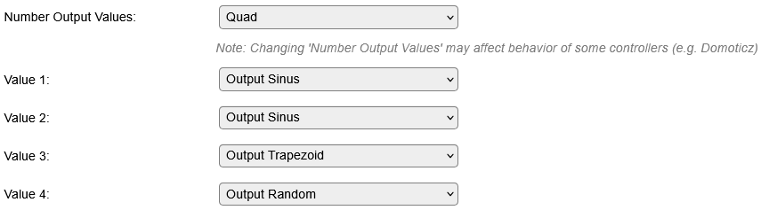
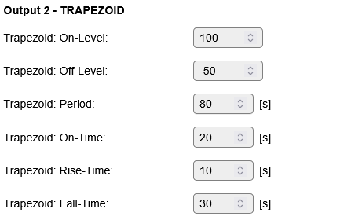

.. include:: ../Plugin/_plugin_substitutions_p18x.repl
.. _P187_page:

|P187_typename|
==================================================

|P187_shortinfo|

Plugin details
--------------

Type: |P187_type|

Name: |P187_name|

Status ESP32: |P187_status|

Status ESP8266: |P187_status_lb|

GitHub: |P187_github|_

Maintainer: |P187_maintainer|

Used libraries: |P187_usedlibraries|

Introduction
------------

The Dummy Data Injector plugin simulates peripheral data output. It can be used e.g. to test IOT backend systems by providing input data for debugging.

The plugin can be applied multiple times in the devices list. Up to four synchronized data streams can be generated per deployment of the plugin, but the outputs of multiple plugins are not synchronized across the plugin boundaries.

Currently, there are following output configurations supported:

* **Sinus**: produces sinus shaped output values. The data stream can be configured in Amplitude, Offset, Period and Phase.
  
* **Trapezoid**: trapezoid shaped output values are created. The data stream's On-Level, Off-Level, Period, On-Time, Rise-Time and Fall-Time can be configured.

* **Random**: generates random output values. Minimum and Maximum values can be configured.

Configuration
-------------

* **Name**: Required by ESPEasy, must be unique within the list of available devices/tasks.

* **Enabled**: The device can be disabled or enabled. When not enabled, no output data is generated.

Device Settings
^^^^^^^^^^^^^^^

Depending on the selected 'Number Output values', up to four sections are used to configure the output values (press 'Submit' after changing) :

Output Sinus
~~~~~~~~~~~~

.. image:: P187_OutputConfigurationSinus.png
  :alt: Output sinus configuration

* **Amplitude**: Amplitude of the signal (integer value 0 to +65537)
* **Offset**: Offset from 0-Line (integer value -65537 to +65537)
* **Period**: period time in seconds (integer value 30 - 3600)
* **Phase**: phase offset in degrees (integer value 0 - 359)

.. image:: P187_OutputSinus.png
  :alt: Output sinus view

- for floating value output, use formula to divide the output levels (e.g. for floating value output with 2 decimals use the formula '%value%/100').

Output Trapezoid
~~~~~~~~~~~~~~~~
	

* **On-Level**: output level during On-Time period (integer value -65537 to +65537)
* **Off-Level**: output level during Off-Time period (integer value -65537 to +65537)
* **Period**: period time in seconds (integer value 30 - 3600)
* **On-Time**: duration of On-Time period in seconds (integer value 0 - 3600)
* **Rise-Time**: duration of linear slope from Off-Level to On-Level (integer value 0 - 3600)
* **Fall-Time**: duration of linear slope from On-Level to Off-Level (integer value 0 - 3600)

.. image:: P187_OutputTrapezoid.png
  :alt: Output trapezoid view
  
- for inverted output, swap On-Level value with Off-Level value.
- Period must be greater or equal than the sum of On-Time, Rise-Time and Fall-Time. If not, some automatic adjustments are made to these values to meet this rule.
- for floating value output, use formula to divide the output levels (e.g. for floating value output with 2 decimals use the formula '%value%/100').

Output Random
~~~~~~~~~~~~~

* **Max-Level**: maximum output level (integer value -65537 to +65537)
* **Min-Level**: minimum output level (integer value -65537 to +65537)

.. image:: P187_OutputRandom.png
  :alt: Output random view

- for floating value output, use formula to divide the output levels (e.g. for floating value output with 2 decimals use the formula '%value%/100').

Performance
-----------

For performance measurement, an ESP32 development board was reset to factory default settings via Wi-Fi.

One 'System Info' device was added with a single output measuring the system load each 30s.

Furthermore 3 Dummy Data Injector plugins were added to the devices:
- Number one generates 4 sinus outputs, interval was set to 1 second, 'Stats' box was activated for all four outputs.
- Number two generates 4 trapezoid outputs, interval was set to 1 second, 'Stats' box was activated for all four outputs.
- Number three generates 4 random outputs, interval was set to 1 second, 'Stats' box was activated for all four outputs.

The devices page was open in one browser window, and the device was left idling for 5 minutes. Afterwards the System load shows ~29%

In comparison, the same ESP32 system, after deleting the three Dummy Data Injector plugins showed an idle System load of ~23%.

Change log
----------

.. versionadded:: 1.0
  ...

  |added|
  Initial release version.

