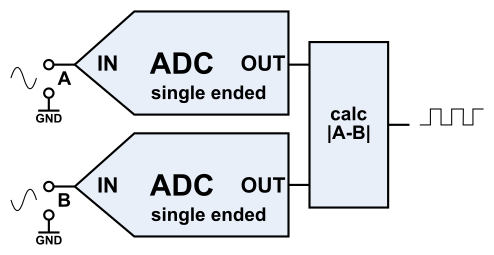
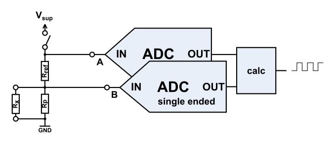
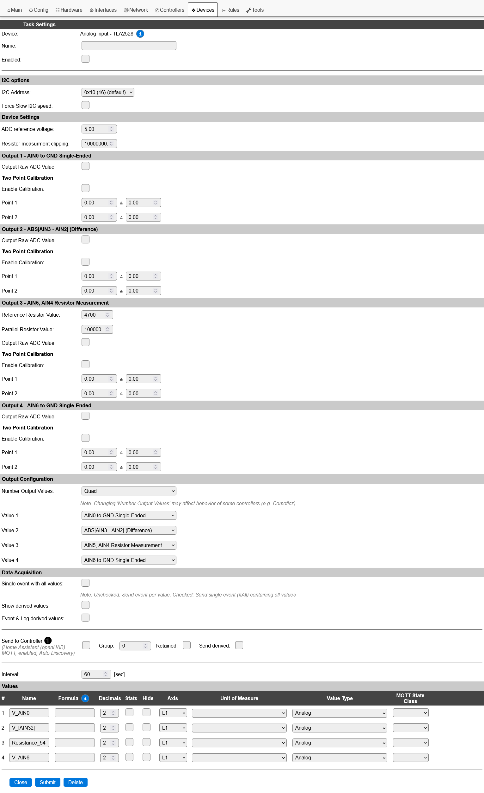

.. include:: ../Plugin/_plugin_substitutions_p18x.repl
.. _P188_page:

|P188_typename|
==================================================

|P188_shortinfo|

Plugin details
--------------

Type: |P188_type|

Name: |P188_name|

Status ESP32: |P188_status|

Status ESP8266: |P188_status_lb|

GitHub: |P188_github|_

Maintainer: |P188_maintainer|

Used libraries: |P188_usedlibraries|

Introduction
------------

The `TLA2528 <https://www.ti.com/product/de-de/TLA2528>`__ is an eight-channel analog to digital converter chip with 12-bit resolution and I2C interface.

The plugin supports up to 4 output channels, where each is configurable to perform one of the following:

* **singled ended measurement**
    Single voltage input measured to GND.

* **difference measurement**
    Voltage difference between two inputs - two consecutive inputs measured to GND.

* **resistor measurement**
    | Voltage drop over a reference resistor - two consecutive inputs measured to GND.
    | Resistor meassurement mode is only available when compiled with ``P188_FEATURE_RESISTOR_MEASUREMENT`` defined

Configuration
-------------

For proper operation, the device must be configured via the ESPEasy web interface. The configuration page can be accessed by clicking on the 'Edit' button of the device in the 'Devices' tab.

* **Name**: 
    Required by ESPEasy, must be unique among the list of available devices/tasks.

* **Enabled**: 
    The device can be disabled or enabled. When not enabled, no output data is generated.

I\ :sup:`2`\C options
^^^^^^^^^^^^^^^^^^^^^

The available I\ :sup:`2`\C settings here depend on the build used.
The I\ :sup:`2`\C address for the device is determined by connecting external resistors to the ADDR pin. 
The voltage level on the ADDR pin is measured at power-up time and the address can be in the range of 0x10 to 0x17.
The specific address for your hardware can be found in the related documentation, the schematic or by using the ``i2cscanner`` command.

For details see the device datasheet (chapter 7.3.5) and the :ref:`i2c-bus` page.

Device Settings
^^^^^^^^^^^^^^^

* **ADC reference voltage**:
    The TLA2528 uses the analog supply voltage of the ADC as reference (float value, 2.35V to 5.5V)

* **Resistor measurement clipping**: 
    | Clipping value, which is returned when the measured resistance exceeds the maximum value (float value, 0 Ohm to 10 MOhm).
    | This is only shown if resistor measurement is selected as mode for one of the output values.
    | Resistor meassurement mode is only available when compiled with ``P188_FEATURE_RESISTOR_MEASUREMENT`` defined. 

Depending on the selected 'Number Output values', up to four sections are used to configure the output values (press 'Submit' after changing):

Output [1-4] Settings
^^^^^^^^^^^^^^^^^^^^^

* **Reference Resistor Value**:
    | The value of the reference resistor used for the resistor measurement (integer value, 100 Ohm to 470 kOhm).
    | This is only shown if resistor measurement is selected as mode for the output value.
    | Resistor meassurement mode is only available when compiled with ``P188_FEATURE_RESISTOR_MEASUREMENT`` defined. 

* **Parallel Resistor Value**:
    | The value of the parallel resistor used for the resistor measurement (integer value, 0 Ohm to 470 kOhm).
    | Set Parallel Resistor Value to **0 Ohm** if no parallel resistor is used.
    | This is only shown if resistor measurement is selected as mode for the output value.
    | Resistor meassurement mode is only available when compiled with ``P188_FEATURE_RESISTOR_MEASUREMENT`` defined. 

* **Output Raw ADC Value**:
    When checked, the raw ADC value is output instead of the calculated value.

* **Two Point Calibration**
    The measured samples taken by the ADC often has to be adjusted in order to compensate for parts tolerances of the input circuit or to be mapped on to a specific range.
    
    For example, measuring the current going through a resistor, one normally needs to apply a formula to transform the measured voltage difference to a current value. 
    The two point calibration allows to map the measured difference values to a known output range by applying a linear transformation.
  
    .. image:: P188_Current.png

    In single ended mode, the raw ADC values are mapped to the desired output values, whereas in difference and resistance mode, the calculations are performed using the raw ADC values and the two point calibration is performed afterwards.

    To find the correct calibration values, one must perform following measurements without applying the calibration:

    - In single ended mode, one must measure 2 known voltages and record their corresponding raw ADC values.
    - In difference and resistance mode, one must apply 2 known input parameters and record their corresponding measured values.

    With these measurements results, the calibration values can be entered and the two point calibration can be enabled.

Output Configuration
^^^^^^^^^^^^^^^^^^^^

* **Number Output Values**: 
    The number of output values to be generated (Single, Dual, Triple or Quad). Depending on the selected number of output values, the corresponding number of output sections will be available for configuration.

* **Value x**: 
    Select the ADC input channels (0 to 7) and mode to be used for each of the output values. The selection can be configured in detail in the corresponding output section as described above.

Change log
----------

.. versionadded:: 1.0
  ...

  |added|
  2026-08-22 Initial release version.

