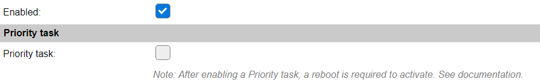

Priority task
^^^^^^^^^^^^^

* **Priority task** The Priority task option is available in selected plugins only, where they can be configured to be initialized as part of the ESPEasy hardware initialization procedure.

For some ESP devices, the installed controllers need to be powered via a Power management device before they can be initialized, but as the Power management controllers are implemented as plugins, to use the available Device configuration infrastructure, a mechanism to load and initialize these plugins before parts of the hardware, like the SPI interface, are initialized, the Priority task option is available.

Enable a Priority task
~~~~~~~~~~~~~~~~~~~~~~

* *Configure the plugin as desired and required* All settings must be completed **before** assigning the Priority task setting, as once enabled, no settings can be changed, to avoid the unit getting into a hardware deadlock.

* *Check if the settings are as intended* Just a double-check option to validate the plugin settings. This includes enabling the plugin.

* *Enable the Priority task option* Once the plugin is enabled, the settings are saved in that state, and no other Power management plugin is enabled as Priority task, the checkbox will be enabled, and can be checked.

* *Save the plugin with enabled Priority task* Enable the checkbox, and Submit the device page. After the usual page reload, the Enabled checkbox, while it still *looks* available, can no longer be unchecked, the Predefined device configuration won't reload the page, and the *Submit* and *Delete* buttons are no longer available.

* *Reboot the ESP* To complete the Priority task configuration, the device needs to be restarted. This can be achieved by a reboot command, or using the Reboot button on the Tools page, a power cycle, or by pressing the reset button, if available.

When viewing the log during startup, these extra log messages are available at the Info level:

.. code-block:: text

  7982 : Info   : INIT : I2C
  7985 : Info   : INIT : Check for Priority tasks
  8035 : Info   : INIT : Started Priority task 1, [AXP192] Power mgt - AXP192 Power management
  8036 : Info   : INIT : SPI not enabled

.. note:: 
  
  An enabled Priority task can not be disabled, or re-enabled, using the ``TaskEnable,<task>`` and ``TaskDisable,<task>`` commands, to avoid hardware dead-lock situations.

.. note::

  When a Priority task is enabled, on the Hardware tab the I2C GPIO configuration can not be changed anymore, as that could inhibit the correct working of the related plugin, and block the entire ESP unit from working as intended.

Now that the Power management controller is enabled and configured as a Priority task, the dependent hardware can be configured, in this case the SPI controller on the Hardware page.

After configuring the SPI settings, any Device that needs the SPI interface, like a TFT controller, can be configured as usual. Configuring the SPI settings may require to reset or power cycle the device.

Disable a Priority task
~~~~~~~~~~~~~~~~~~~~~~~

* *Prepare configuration to disable Priority task* If the Priority task needs to be disabled, it is required to execute a similar procedure as when enabling the Priority task, but in reverse order.

  * *Disable Devices/Tasks that use the specific hardware* Any task that uses the hardware, controlled via the Priority task, like a TFT controller, **must** be disabled (and saved).

  * *Disable the hardware interface* The same goes for the SPI interface, it **must** be disabled on the Hardware page, and the device should at least be rebooted, to activate that change.

* *Send the command to disable the priority task* To disable a priority task, a separate command is introduced: ``disableprioritytask,<task>`` that takes 1 required argument, the name or number of a task that is a Priority task. This will disable the Priority task state in memory, **but not save that state!**

* *Open the Device configuration* To complete disabling of the former Priority task, open the device confguration page for that task. You will notice that the Enabled checkbox is still disabled (can't be clicked to change state). To complete this, the page should be saved using the Submit button. When the page is reloaded, also the task will be **Disabled** automatically! If so desired, instead of saving the page, the task can immediately be deleted by use of the Delete button.

* *Procedure completed* The Priority task is now disabled (or removed), and the settings are updated. After another reboot, the startup log will provide the matching information:

.. code-block:: text

  7882 : Info   : INIT : I2C
  7886 : Info   : INIT : Check for Priority tasks
  7896 : Info   : INIT : SPI not enabled

(No mention of a Priority task being started.)

