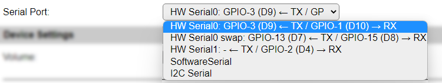
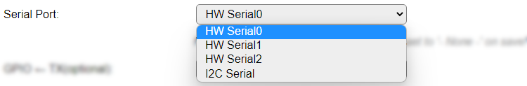

.. _SerialHelper_page:

Serial Helper configuration
===========================

There are several options for serial port configuration available, based on the unit model, ESP8266 or ESP32, plugin requirements, and the build type. Some ESP8266 builds don't have the I2C Serial options included (though it is available in the **Serial Port** list, but it won't work), to limit the build-size.

Using ESP8266
~~~~~~~~~~~~~

* **HW Serial0: GPIO-3 (D9) <- TX / GPIO-1 (D10) -> RX**: The regular serial port of the ESP. NB: **Enable Serial port** has to be **disabled** (unchecked) in Tools/Advanced settings for any plugin to be able to use this port!
* **HW Serial0 swap: GPIO-13 (D7) <- TX / GPIO-15 (D8) -> RX**: Alternative hardware serial port, using different pins. The same restrictions apply!
* **HW Serial1: - <- TX / GPIO-2 (D4) -> RX**: The secondary serial port. Can only be used for out-going data.
* **SoftwareSerial**: Uses a software serial receiver, not useable for high data speeds or devices that send high data volumes, as that will overload the ESP.
* **I2C Serial**: SC16IS752 based I2C Serial boards are supported (see above), select the I2C Address and Channel below.

**I2C Serial**

**I2C Address**: A list of supported I2C addresses for the I2C serial adapter:

.. image:: SerialHelper_I2CAddressOptions.png
  :alt: I2C Addresses for I2C Serial adapter.

**Channel**: Select the channel the sensor is connected to:

.. image:: SerialHelper_I2CChannelOptions.png
  :alt: Available I2C Serial Channel options

**SoftwareSerial**

.. image:: SerialHelper_SoftwareSerialPins_ESP8266.png
  :alt: Configure pins for Software Serial

* **GPIO <- TX**: Select the GPIO pin that the sensor TX signal is connected to.
* **GPIO -> RX(optional)**: Optional. Select the GPIO pin that the sensor RX signal is connected to. When this pin is not used this can be set to None.

Using ESP32
~~~~~~~~~~~

* **HW Serial0**: ESP32 supports up to 3 serial ports, with freely configurable GPIO pins. NB: **Enable Serial port** has to be **disabled** (unchecked) in Tools/Advanced settings for any plugin to be able to use this port!
* **HW Serial1**: ESP32 supports up to 3 serial ports, with freely configurable GPIO pins.
* **HW Serial2**: ESP32 supports up to 3 serial ports, with freely configurable GPIO pins.
* **I2C Serial**: The SC16IS752 based I2C Serial boards are supported (see above), select the I2C Address and Channel below.

**I2C Serial**

See **I2C Serial** above in the *Using ESP8266* section.

**HW SerialN**

* **GPIO <- TX**: Select the GPIO pin that the sensor TX signal is connected to.
* **GPIO -> RX**: Select the GPIO pin that the sensor RX signal is connected to. When this pin is not used this can be set to None.

Both ESP8266 and ESP32
~~~~~~~~~~~~~~~~~~~~~~

Depending on the requirements for the plugin, these options can be shown:

* **Baud Rate**: Select the speed of serial configuration, specified in bits per second (Baud):

* **Serial Config**: Select the bit size, parity and number of stop bits from this list:

All combinations of these values are available:

* Data bits:

  * 5 bit

  * 6 bit

  * 7 bit

  * 8 bit

* Parity:

  * None

  * Even

  * Odd

* Stop bits:

  * 1

  * 2
