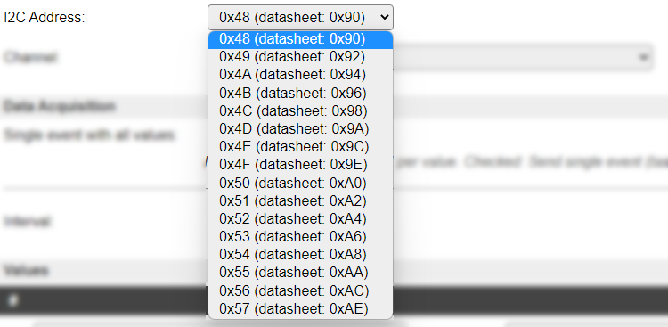

.. _SerialHelper_page:

Serial Helper configuration
===========================

There are several options for serial port configuration available, based on the unit model, ESP8266 or ESP32, plugin requirements, and the build type. Some ESP8266 builds don't have the I2C Serial options included (though it is available in the **Serial Port** list, but it won't work), to limit the build-size.

Using ESP8266
~~~~~~~~~~~~~

.. image:: SerialHelper_PortOptions_ESP8266.png
  :alt: Serial port options, specific to ESP8266

* **HW Serial0: GPIO-3 (D9) <- TX / GPIO-1 (D10) -> RX**: The regular serial port of the ESP. NB: **Enable Serial port** has to be **disabled** (unchecked) in Tools/Advanced settings for any plugin to be able to use this port!
* **HW Serial0 swap: GPIO-13 (D7) <- TX / GPIO-15 (D8) -> RX**: Alternative hardware serial port, using different pins. The same restrictions apply!
* **HW Serial1: - <- TX / GPIO-2 (D4) -> RX**: The secondary serial port. Can only be used for out-going data.
* **SoftwareSerial**: Uses a software serial receiver, not useable for high data speeds or devices that send high data volumes, as that will overload the ESP.
* **I2C Serial**: SC16IS752 based I2C Serial boards are supported (see above), select the I2C Address and Channel below.

**I2C Serial**

**I2C Address**: A list of supported I2C addresses for the I2C serial adapter:

**Channel**: Select the channel the sensor is connected to:

**SoftwareSerial**

* **GPIO <- TX**: Select the GPIO pin that the sensor TX signal is connected to.
* **GPIO -> RX(optional)**: Optional. Select the GPIO pin that the sensor RX signal is connected to. When this pin is not used this can be set to None.

.. note:: SoftwareSerial should not be used on high baud rates as it will show bit errors and probably not recognize received data.  Also running multiple Software Serial ports is really not a good idea.

(SoftwareSerial for ESP32 added: 2023-06-01)

Use of Software Serial on ESP32-C3 should be considered as an absolute last resort as it will hardly send without bit errors.

Software Serial on ESP32-S3 does seem to work prefectly fine upto 28800 baud.

Using ESP32
~~~~~~~~~~~

.. image:: SerialHelper_PortOptions_ESP32.png
  :alt: Serial port options, specific to ESP32

.. note:: ESP32-C3 and ESP32-S2 only support upto 2 HW Serial ports.  ESP32 and ESP32-S3 support upto 3 HW Serial ports.

* **HW Serial0**: Serial port 0, with freely configurable GPIO pins. NB: **Enable Serial port** has to be **disabled** (unchecked) in Tools/Advanced settings for any plugin to be able to use this port!
* **HW Serial1**: Serial port 1, with freely configurable GPIO pins.
* **HW Serial2**: Serial port 2, with freely configurable GPIO pins.
* **I2C Serial**: The SC16IS752 based I2C Serial boards are supported (see above), select the I2C Address and Channel below.
* **USB CDC**: Emulate a serial port via USB on ESP32-S2 (added: 2023-06-01)
* **HW CDC**: Hardware serial/JTAG port via USB on ESP32-C3 and ESP32-S3. (added: 2023-06-01)
* **SW Serial**: Software emulated serial port with freely configurable GPIO pins. (added: 2023-06-01)

**I2C Serial**

See **I2C Serial** above in the *Using ESP8266* section.

**HW SerialN**

.. image:: SerialHelper_HWSerialPins_ESP32.png
  :alt: Configure pins for HW Serial 0 to HW Serial 2

* **GPIO <- TX**: Select the GPIO pin that the sensor TX signal is connected to.
* **GPIO -> RX**: Select the GPIO pin that the sensor RX signal is connected to. When this pin is not used this can be set to None.

**USB CDC**

(Added: 2023-06-01)

Since a lot of cheap ESP32-S2 boards are currently available with only an USB-C connector, the console was not usable without support for a serial port via the native USB support in the ESP32-S2.
This is a fully emulated serial port, based on TinyUSB.
On those devices, one might need to fully power cycle the device to switch back from flash mode back to normal mode.

The ESP32-S2 isn't running as USB host, so the use of this USB CDC serial port is mostly limited to being used for the ESPEasy console.

When the ESP reboots, the emulated serial port will be deleted from the connected host (e.g. PC) and enumerated again when ESPEasy boots.
This means any connected terminal client software will loose connection to the USB CDC port.

**HW CDC**

(Added: 2023-06-01)

The ESP32-C3 and ESP32-S3 will allow to offer a serial/JTAG port via USB.
In ESPEasy this port will probably only be used for the ESPEasy console.

When the serial port connection gets closed by the host (e.g. a serial terminal program on a PC), the ESP will reboot.
Currently there is no way to suppress this behavior.

**SW Serial**

(Added: 2023-06-01)

See **SW Serial** above in the *Using ESP8266* section.

Both ESP8266 and ESP32
~~~~~~~~~~~~~~~~~~~~~~

Depending on the requirements for the plugin, these options can be shown:

* **Baud Rate**: Select the speed of serial configuration, specified in bits per second (Baud):

.. image:: SerialHelper_BaudRate.png
  :alt: Baud rate

* **Serial Config**: Select the bit size, parity and number of stop bits from this list:

.. image:: SerialHelper_SerialConfigOptions.png
  :alt: Serial config

All combinations of these values are available:

* Data bits:

  * 5 bit

  * 6 bit

  * 7 bit

  * 8 bit

* Parity:

  * None

  * Even

  * Odd

* Stop bits:

  * 1

  * 2
