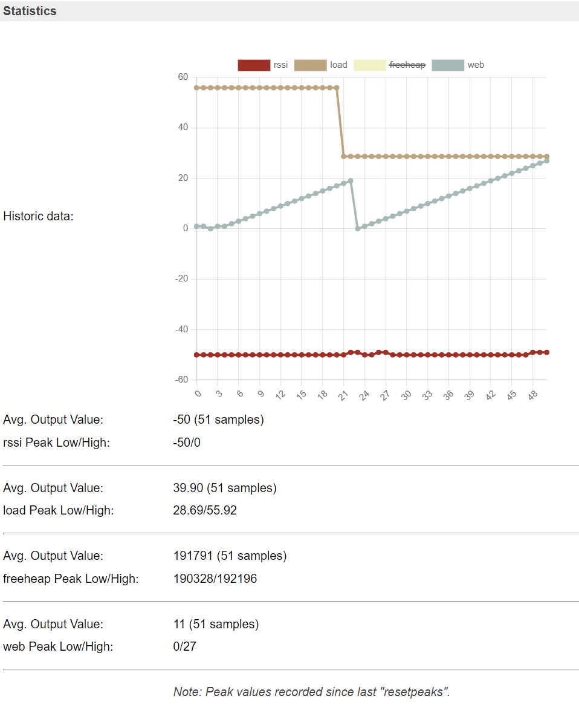

.. include:: ../Plugin/_plugin_substitutions.repl
.. include:: _plugin_categories.repl

############
Devices Page
############

ESPEasy supports lots of sensors and displays via "Plugins".
A plugin is a piece of code tailored specifically to communicate with some hardware like a sensor.

There are several builds made of ESPEasy which mainly differ in the plugins included during build.
See below to check which build is needed to support specific sensors.

In ESPEasy, one can setup a number of "Tasks".
A task is an instance of a plugin and may yield upto 4 "task values". (typically measurements taken from the connected sensor)
These task values can be sent to connected controllers to send the data to some other system, like a MQTT broker.

There can be multiple instances of the same plugin, however this might not be implemented for all plugins yet.
For example, it makes perfect sense to have multiple temperature sensors on a single ESPEasy node.

The Devices page shows a list of all tasks, including the last task values.
These task values may be updated live. The update interval depends on the lowest set task interval of any (enabled) task.

Task Config Page
================

Via the "Edit" button on the "Devices Page", one can see and edit the configuration of a task.

A typical layout of a task setup page.

Each task needs to have an unique name and has to be enabled in order to actually start collecting task values.
The reason to have unique task names is to make sure task values can be used elsewhere in the ESPEasy system. (e.g. showing a task value on a display)

Sensor
------

Next section is about how to communicate with the device.
Typically:

* For I2C sensors: I2C address, I2C speed
* For UART/Serial sensors: Serial port, type of serial port (hardware/software serial), baudrate, GPIO pins used.
* GPIO pins for other sensor types, whether pull-up resistors should be enabled etc.

Device Settings
---------------

Some other plugins support several variants of the same sensor. (e.g. PMSx003 plugin)
This can then be configured here.

A lot of sensors allow for some options to operate.
For example in the shown screenshot above, one can set the voltage range.

Output
------

Some sensors can collect more than 4 types of data.
GPS is one of those, which can collect values like:

* Longitude
* Latitude
* Altitude
* Speed
* Satellites tracked
* HDOP
* etc.

These can then be selected to be output as task value.

Statistics
----------

.. _Task Value Statistics:

(Added: 2022/07/11)

A chart is shown with the recorded task values for all task values which have 
the "Stats" option is checked in the "Values" section at the bottom of the page.

As can be seen in the screenshot taken from a "sysinfo" task, a dataset can be disabled in the chart by clicking on the item in the legend.
This will scale the chart to fit the other data sets.
For example the amount of free memory on an ESP32 is several orders of magnitude larger than the typical system load.

Enabling "Stats" on a task value also extends how task values can be addressed within ESPEasy.

For example using just like normal task value data:

* ``[bme#temp.avg]`` Compute the average over the last N samples in the historic buffer (typically: 64 samples on ESP32, 16 on ESP8266)
* ``[bme#temp.avgX]`` Compute the average over the last X samples (or less if there are less samples available)
* ``[bme#temp.stddev]`` Compute the standard deviation over the last N samples in the historic buffer (typically: 64 samples on ESP32, 16 on ESP8266)
* ``[bme#temp.stddevX]`` Compute the standard deviation over the last X samples (or less if there are less samples available)
* ``[bme#temp.max]`` Refer to the maximum recorded sample since the last ``resetpeaks``. N.B. Not all tasks log the min and max peaks.
* ``[bme#temp.min]`` See ``[bme#temp.max]`` 

Commands on "Stats" data:

* ``bme.resetpeaks`` Reset the recorded "max" and "min" value of all task values of that task.
* ``bme.clearsamples`` Clear the recorded historic samples of all task values of that task.

Data Acquisition
----------------

Each time a task is "run", it may collect some data.
When successful, other parts of the ESPEasy system should be notified.

If rules are enabled, a task may generate several events.
Each event consists of the task name, value name and the new sample.

For a task named "bme" with a task value "temperature", the events looks like this: ``bme#temperature=23.45``

Please note the number of decimals as this will be discussed below.

Such events will be generated for all task values of this task.

To limit the number of events, one may also check the "Single event with all values" checkbox.
This will then generate only a single event like this: ``bme#All=23.45,78.90,1001.23`` (the assumed order of task values: Temp/Humidity/Pressure)

Below this checkbox is a number of options to send this data to a controller.
This only shows controllers which are configured.
Some controllers, like Domoticz MQTT and Domoticz HTTP, also require some IDX value to identify the sample origin.

This Interval is the number of seconds between repeated calls to ``TaskRun``, which will perform a read of the sensor.

Some plugins allow this to be set to ``0``, which then effectively disables repetitive calls to run this task.
However, most plugins consider ``0`` to be the default of 60 seconds.

A task can also be called to run via the command ``TaskRun`` from the rules.
This can be useful to trigger a read based on an event.

A nice use case can be to take samples on a number of sensors as soon as the GPS task sends new coordinates.
Since a GPS task can be configured to send updates each N meters travelled, this allows for collecting samples at an equal distance spaced, regardless the driving speed.

Values
------

At the bottom of the task config page, one can configure the task values.

Task Value Name
^^^^^^^^^^^^^^^

Each task value has to have an unique name within that task.
It does not have to be unique on the entire ESPEasy system, as long as the combination of task name and task value name is unique.

For example ``bme#temp`` and ``bme2#temp`` are perfectly fine as each can be addressed.

Formula
^^^^^^^

ESP Easy can use a simple formula to change the task value before it is processed further.

A few samples will be provided here. Remember that this is just a simple build-in 'calculator' with only the basic stuff like add, substract, multiply, devide.

On a successful "task run", the new task values will be processed by the formula.
To refer to the new task value, use ``%value%`` in the formula.

For example to convert a temperature from Celsius to Fahrenheit, one may use:

.. code-block:: none

  (%value%*9/5)+32

For some very common conversions, see also the "Standard Conversions" section on the ``sysvars`` page in ESPEasy.
This conversion from Celsius to Fahrenheit is so common, one may also use this in the formula field:

.. code-block:: none

  %c_c2f%(%value%)

To use the previous task value in a formula, use ``%pvalue%``.

It is also possible to refer to other task values and system variables. (added: 2021/08/06)

.. note:: The syntax in the formula field is nearly the same as in the rules. Only the ``%value%`` and ``%pvalue%`` cannot be used in rules.

Stats
^^^^^

(Added: 2022/07/11)

This checkbox allows to collect some historic data of this task value.
On ESP32 it will collect upto 64 samples. On ESP8266 this is limited to 16 samples due to memory.

When checked, the last N samples of each checked task value will be shown in a chart in the "Statistics" section.

Decimals
^^^^^^^^

The number of decimals set here will be used throughout ESPEasy whenever a task value has to be formatted.
For example, when referring to a task value on a display via ``[bme#temperature]``, the value formatting will include the set number of decimals.

See :ref:`Rules: Formatting referred values <Formatting values>` on how this can be customized.
Just remember such formatting cannot "make up" more decimals than what was set here in the task setup.

List of official plugins
========================

There are different released versions of ESP Easy:

:green:`NORMAL` is the regular set of plugins, this is the base set of plugins, and with all secondary features enabled, like I2C multiplexer, RTTL, DEBUG logging, etc.

:yellow:`COLLECTION` (split into sets A..x) with plugins that don't fit into the NORMAL builds. Because of space limitations, this collection is split into a number of sets. When only :yellow:`COLLECTION` is mentioned, the plugin is available in **all** :yellow:`COLLECTION` builds. Also, some features are disabled to save space in the .bin files, like RTTTL, tooltips, and some DEBUG logging.

:red:`DEVELOPMENT` is used for plugins that are still being developed and are not considered stable at all. Currently there are no DEVELOPMENT builds available.

:yellow:`ENERGY` :yellow:`DISPLAY` :yellow:`IR` :yellow:`IRext` :yellow:`NEOPIXEL` :yellow:`CLIMATE` are specialized builds holding all Energy-, Display-, Infra Red- (extended), NeoPixel- and Climate- related plugins.

:yellow:`MAX` is the build that has all plugins that are available in the ESPEasy repository. Only available for ESP32 16MB Flash units.

:gray:`RETIRED` plugin has been retired and removed from ESPEasy.

2022-07-22: :yellow:`TESTING` builds renamed to :yellow:`COLLECTION`.

.. csv-table::
   :header: "Plugin name", "Build set", "Plugin number"
   :widths: 10, 8, 5

   ":ref:`P000_page`","|P000_status|","P000 (core)"
   ":ref:`P001_page`","|P001_status|","P001"
   ":ref:`P002_page`","|P002_status|","P002"
   ":ref:`P003_page`","|P003_status|","P003"
   ":ref:`P004_page`","|P004_status|","P004"
   ":ref:`P005_page`","|P005_status|","P005"
   ":ref:`P006_page`","|P006_status|","P006"
   ":ref:`P007_page`","|P007_status|","P007"
   ":ref:`P008_page`","|P008_status|","P008"
   ":ref:`P009_page`","|P009_status|","P009"
   ":ref:`P010_page`","|P010_status|","P010"
   ":ref:`P011_page`","|P011_status|","P011"
   ":ref:`P012_page`","|P012_status|","P012"
   ":ref:`P013_page`","|P013_status|","P013"
   ":ref:`P014_page`","|P014_status|","P014"
   ":ref:`P015_page`","|P015_status|","P015"
   ":ref:`P016_page`","|P016_status|","P016"
   ":ref:`P017_page`","|P017_status|","P017"
   ":ref:`P018_page`","|P018_status|","P018"
   ":ref:`P019_page`","|P019_status|","P019"
   ":ref:`P020_page`","|P020_status|","P020"
   ":ref:`P021_page`","|P021_status|","P021"
   ":ref:`P022_page`","|P022_status|","P022"
   ":ref:`P023_page`","|P023_status|","P023"
   ":ref:`P024_page`","|P024_status|","P024"
   ":ref:`P025_page`","|P025_status|","P025"
   ":ref:`P026_page`","|P026_status|","P026"
   ":ref:`P027_page`","|P027_status|","P027"
   ":ref:`P028_page`","|P028_status|","P028"
   ":ref:`P029_page`","|P029_status|","P029"
   ":ref:`P030_page`","|P030_status|","P030"
   ":ref:`P031_page`","|P031_status|","P031"
   ":ref:`P032_page`","|P032_status|","P032"
   ":ref:`P033_page`","|P033_status|","P033"
   ":ref:`P034_page`","|P034_status|","P034"
   ":ref:`P035_page`","|P035_status|","P035"
   ":ref:`P036_page`","|P036_status|","P036"
   ":ref:`P037_page`","|P037_status|","P037"
   ":ref:`P038_page`","|P038_status|","P038"
   ":ref:`P039_page`","|P039_status|","P039"
   ":ref:`P040_page`","|P040_status|","P040"
   ":ref:`P041_page`","|P041_status|","P041"
   ":ref:`P042_page`","|P042_status|","P042"
   ":ref:`P043_page`","|P043_status|","P043"
   ":ref:`P044_page`","|P044_status|","P044"
   ":ref:`P045_page`","|P045_status|","P045"
   ":ref:`P046_page`","|P046_status|","P046"
   ":ref:`P047_page`","|P047_status|","P047"
   ":ref:`P048_page`","|P048_status|","P048"
   ":ref:`P049_page`","|P049_status|","P049"
   ":ref:`P050_page`","|P050_status|","P050"
   ":ref:`P051_page`","|P051_status|","P051"
   ":ref:`P052_page`","|P052_status|","P052"
   ":ref:`P053_page`","|P053_status|","P053"
   ":ref:`P054_page`","|P054_status|","P054"
   ":ref:`P055_page`","|P055_status|","P055"
   ":ref:`P056_page`","|P056_status|","P056"
   ":ref:`P057_page`","|P057_status|","P057"
   ":ref:`P058_page`","|P058_status|","P058"
   ":ref:`P059_page`","|P059_status|","P059"
   ":ref:`P060_page`","|P060_status|","P060"
   ":ref:`P061_page`","|P061_status|","P061"
   ":ref:`P062_page`","|P062_status|","P062"
   ":ref:`P063_page`","|P063_status|","P063"
   ":ref:`P064_page`","|P064_status|","P064"
   ":ref:`P065_page`","|P065_status|","P065"
   ":ref:`P066_page`","|P066_status|","P066"
   ":ref:`P067_page`","|P067_status|","P067"
   ":ref:`P068_page`","|P068_status|","P068"
   ":ref:`P069_page`","|P069_status|","P069"
   ":ref:`P070_page`","|P070_status|","P070"
   ":ref:`P071_page`","|P071_status|","P071"
   ":ref:`P072_page`","|P072_status|","P072"
   ":ref:`P073_page`","|P073_status|","P073"
   ":ref:`P074_page`","|P074_status|","P074"
   ":ref:`P075_page`","|P075_status|","P075"
   ":ref:`P076_page`","|P076_status|","P076"
   ":ref:`P077_page`","|P077_status|","P077"
   ":ref:`P078_page`","|P078_status|","P078"
   ":ref:`P079_page`","|P079_status|","P079"
   ":ref:`P080_page`","|P080_status|","P080"
   ":ref:`P081_page`","|P081_status|","P081"
   ":ref:`P082_page`","|P082_status|","P082"
   ":ref:`P083_page`","|P083_status|","P083"
   ":ref:`P084_page`","|P084_status|","P084"
   ":ref:`P085_page`","|P085_status|","P085"
   ":ref:`P086_page`","|P086_status|","P086"
   ":ref:`P087_page`","|P087_status|","P087"
   ":ref:`P088_page`","|P088_status|","P088"
   ":ref:`P089_page`","|P089_status|","P089"
   ":ref:`P090_page`","|P090_status|","P090"
   ":ref:`P091_page`","|P091_status|","P091"
   ":ref:`P092_page`","|P092_status|","P092"
   ":ref:`P093_page`","|P093_status|","P093"
   ":ref:`P094_page`","|P094_status|","P094"
   ":ref:`P095_page`","|P095_status|","P095"
   ":ref:`P097_page`","|P097_status|","P097"
   ":ref:`P099_page`","|P099_status|","P099"
   ":ref:`P100_page`","|P100_status|","P100"
   ":ref:`P101_page`","|P101_status|","P101"
   ":ref:`P102_page`","|P102_status|","P102"
   ":ref:`P103_page`","|P103_status|","P103"
   ":ref:`P104_page`","|P104_status|","P104"
   ":ref:`P105_page`","|P105_status|","P105"
   ":ref:`P106_page`","|P106_status|","P106"
   ":ref:`P107_page`","|P107_status|","P107"
   ":ref:`P108_page`","|P108_status|","P108"
   ":ref:`P109_page`","|P109_status|","P109"
   ":ref:`P110_page`","|P110_status|","P110"
   ":ref:`P111_page`","|P111_status|","P111"
   ":ref:`P113_page`","|P113_status|","P113"
   ":ref:`P114_page`","|P114_status|","P114"
   ":ref:`P115_page`","|P115_status|","P115"
   ":ref:`P116_page`","|P116_status|","P116"
   ":ref:`P117_page`","|P117_status|","P117"
   ":ref:`P118_page`","|P118_status|","P118"
   ":ref:`P119_page`","|P119_status|","P119"
   ":ref:`P120_page`","|P120_status|","P120"
   ":ref:`P121_page`","|P121_status|","P121"
   ":ref:`P124_page`","|P124_status|","P124"
   ":ref:`P125_page`","|P125_status|","P125"
   ":ref:`P126_page`","|P126_status|","P126"
   ":ref:`P127_page`","|P127_status|","P127"
   ":ref:`P128_page`","|P128_status|","P128"
   ":ref:`P129_page`","|P129_status|","P129"
   ":ref:`P131_page`","|P131_status|","P131"
   ":ref:`P132_page`","|P132_status|","P132"
   ":ref:`P133_page`","|P133_status|","P133"
   ":ref:`P134_page`","|P134_status|","P134"
   ":ref:`P135_page`","|P135_status|","P135"
   ":ref:`P137_page`","|P137_status|","P137"
   ":ref:`P138_page`","|P138_status|","P138"
   ":ref:`P141_page`","|P141_status|","P141"
   ":ref:`P143_page`","|P143_status|","P143"
   ":ref:`P145_page`","|P145_status|","P145"
   ":ref:`P148_page`","|P148_status|","P148"

Internal GPIO handling
----------------------

Plugins: :ref:`P000_page`

Hardware: |P000_usedby_GPIO|, |P000_usedby_RTTTL|, |P000_usedby_Relay|, |P000_usedby_Servo|, |P000_usedby_LevelConverter|

Analog input
------------

Plugins: |Plugin_Analog_input|

Acceleration
------------

Plugins: |Plugin_Acceleration|

Communication
-------------

Plugins: |Plugin_Communication|

Display
-------

Plugins: |Plugin_Display|

Distance
--------

Plugins: |Plugin_Distance|

Dust
----

Plugins: |Plugin_Dust|

Energy (AC)
-----------

Plugins: |Plugin_Energy_AC|

Energy (DC)
-----------

Plugins: |Plugin_Energy_DC|

Energy (Heat)
-------------

Plugins: |Plugin_Energy_Heat|

Environment
-----------

Plugins: |Plugin_Environment|

Hardware: |P004_usedby|, |P005_usedby|, |P006_usedby|, |P024_usedby|, |P028_usedby|

Extra IO
--------

Plugins: |Plugin_Extra_IO|

Gases
-----

Plugins: |Plugin_Gases|

Hardware: |P052_usedby|

Generic
-------

Plugins: |Plugin_Generic|

Hardware: |P003_usedby|

Gesture
-------

Plugins: |Plugin_Gesture|

Gyro
----

Plugins: |Plugin_Gyro|

Hardware
--------

Plugins: |Plugin_Hardware|

Hardware: |P046_usedby|

Input
-----

Plugins: |Plugin_Input|

Keypad
------

Plugins: |Plugin_Keypad|

Light/Color
-----------

Plugins: |Plugin_Light_Color|

Light/Lux
---------

Plugins: |Plugin_Light_Lux|

Hardware: |P015_usedby|

Light/UV
-----------

Plugins: |Plugin_Light_UV|

Motor
-----

Plugins: |Plugin_Motor|

Notify
------

Plugins: |Plugin_Notify|

Output
------

Plugins: |Plugin_Output|

Position
--------

Plugins: |Plugin_Position|

Hardware: |P013_usedby|, |P082_usedby|

Power management
----------------

Plugins: |Plugin_PowerMgt|

Regulator
---------

Plugins: |Plugin_Regulator|

RFID
----

Plugins: |Plugin_RFID|

Switch input
------------

Plugins: |Plugin_Switch_input|

Hardware: |P001_usedby|

Touch
-----

Plugins: |Plugin_Touch|

Weight
------

Plugins: |Plugin_Weight|