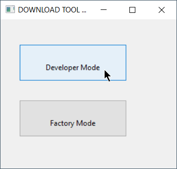
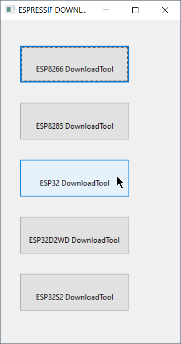
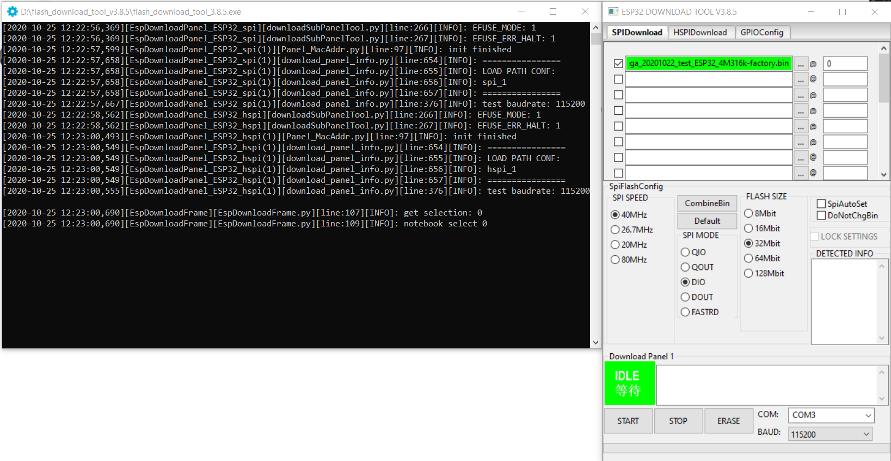
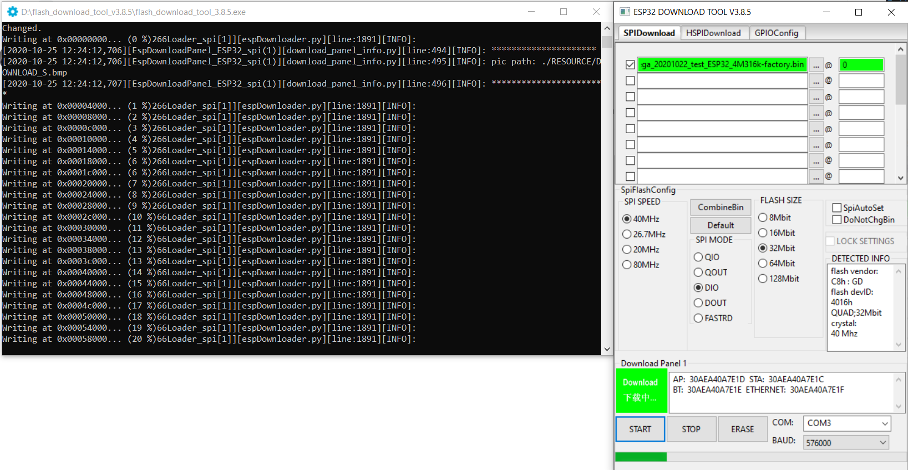

Flashing
********

The programming procedures for flashing an ESP82xx and ESP32 via the serial port differ slightly.

In general the steps are the same to enter flashing mode on both types ESP boards:

* Boot the node with GPIO-0 connected to GND
* Start the flashing procedure

Most boards which already have an USB to serial on board, also have some circuit present to help booting into flash mode via the USB port.
Such a circuit consists of 2 transistors and a few resistors to trigger the reset and GPIO-0 pin in the correct sequence.
All flashing software is able to use this way of bootstrapping.

Some flashing tools also support different methods and thus require a parameter indicating the specific method to boot into flash mode.
For ESP boards with an USB to serial adapter on board, the needed boot method is referred to as "NodeMCU" or some abbreviation of this name.

Flashing Software
=================

A number of flashing tools is included in the nightly build ZIP files.
The included tools are all for Windows.

* ``ESP.Easy.Flasher.exe`` A flasher with graphic UI written by Grovkillen. This tool can also be used to send a number of commands to prepare the unit while still connected to the PC. For example to configure WiFi.
* ``esptool.exe`` A command line ESP8266/ESP32 build and upload helper tool, `maintained by Ivan Grokhotkov <https://github.com/igrr/esptool-ck>`_
* ``FlashESP8266.exe`` A very simple flash tool "ESPEasy Flasher" for ESP82xx. Should be called from the same directory as the compiled bin files: ``C:\Download\ESPEasy\bin> ..\FlashESP8266.exe``
* ``Espressif Flash Download Tool`` located in the directory ``Espressif_flash_download_tool_v3.8.5``. New versions can be found `Espressif Download <https://www.espressif.com/en/support/download/other-tools>`_

For Linux or Mac users, the recommended tool for ESP82xx/ESP32 is `esptool.py <https://github.com/espressif/esptool>`_

Flashing Parameters
===================

Some flash tools allow to set specific parameters, like flash chip related settings.
Those parameters are also defined in the compiled .bin files, but when set in the flash tool they are overridden for the boot sequence.
As soon as the ESPEasy code is executed, the configured parameters at compile time will be used.

N.B. Not all parameters can be set in all flashing tools.

See the documentation of the flash tool for more information.

Baud Rate
---------

Most flashing tools allow to set the communication speed.
It is advised to use a baud rate of 115200 bps as this seems to be the best trade off between flashing speed and success rate.
However it is possible to select a higher baud rate, which may reduce flashing time significantly.

* Boards using a FTDI USB to serial chip seem to work fine when flashing at rates of upto 921600 bps.
  When they fail, it is often presented as a timeout. Try again with flashing at a lower baud rate.
* Boards using a CH340 USB to serial chip are less likely to handle high baud rates without errors.

Crystal
---------

On ESP8266, the tool will overwrite the 48th byte of RF parameter(default_init_data.bin) if chosen.
This option will do nothing for ESP32 chips.

SPI Speed
---------

This is the SPI clock speed to read/write SPI flash. (40Mhz default)

Usually 40Mhz is enough and safe, if you want to enable 80Mhz for SPI flash, make
sure:

* The flash you are using support 80Mhz.
* Your PCB layout is good enough for 80Mhz.

The configure byte is in the 4th byte from flash address 0x0. So the tool will overwrite
the 4th byte of bin file which is to be written to 0x0 address.

SPI Mode
--------

This sets the SPI data mode for flash R/W operations.

From fastest to slowest mode:

* QIO/QOUT: use /HOLD and /WP pin as SPI data2/data3, make sure your flash
  support Quad instructions before select.
  QIO and QOUT are almost the same. "QIO" will send address in quad mode, where "QOUT" will not.
* DIO/DOUT: Use Dual mode instructions to read/write flash. 
  DIO and DOUT are almost the same. "DIO" will send address in Dual mode, where "DOUT" will not.

Almost all flash chips used on ESP32 support DIO/DOUT mode.

Almost all ESPEasy builds are set to use "DOUT" mode.

ESP82xx
=======

ESPEasy builds based on esp8266/Arduino library version 2.7.x and later can handle compressed ``.bin.gz`` files.
When in doubt, just use the ``.bin`` files.

ESP32
=====

Flashing ESP32 nodes is slightly more complex compared to ESP82xx.

The main differences:

* The binary layout on the flash is split in several parts each with their own specific offset from the start of the flash block.
* ESP32 allows to have several fuses set (flags which can be set only once)

Most tutorials show the Espressif Download Tool with a number of separate binaries each with their own offset.
This is rather error prone, and therefore the ESPEasy build process creates 2 different .bin files.

* A binary with ``factory`` in the file name, used for flashing via serial.
* A binary **without** ``factory`` in the file name, used for flashing via the web interface.

The ``factory`` bin file has all separate binaries with their offsets included in a single file.
Therefore the needed offset for this ``factory`` bin file should be set to 0. (starting at the begin of the flash area)

When the ESP board later needs to update the firmware to a different version, there is no need for a serial connection.
This can be done "OTA" (over the air) via the web interface.
For OTA updates, use the bin file **without** ``factory`` in the file name.

Flash ESP32 with Espressif Download Tool
----------------------------------------

Select "Developer Mode"
^^^^^^^^^^^^^^^^^^^^^^^

Select "ESP32 DownloadTool"
^^^^^^^^^^^^^^^^^^^^^^^^^^^

Select the bin file and offset of 0
^^^^^^^^^^^^^^^^^^^^^^^^^^^^^^^^^^^

Double check all parameters and start flashing
^^^^^^^^^^^^^^^^^^^^^^^^^^^^^^^^^^^^^^^^^^^^^^

