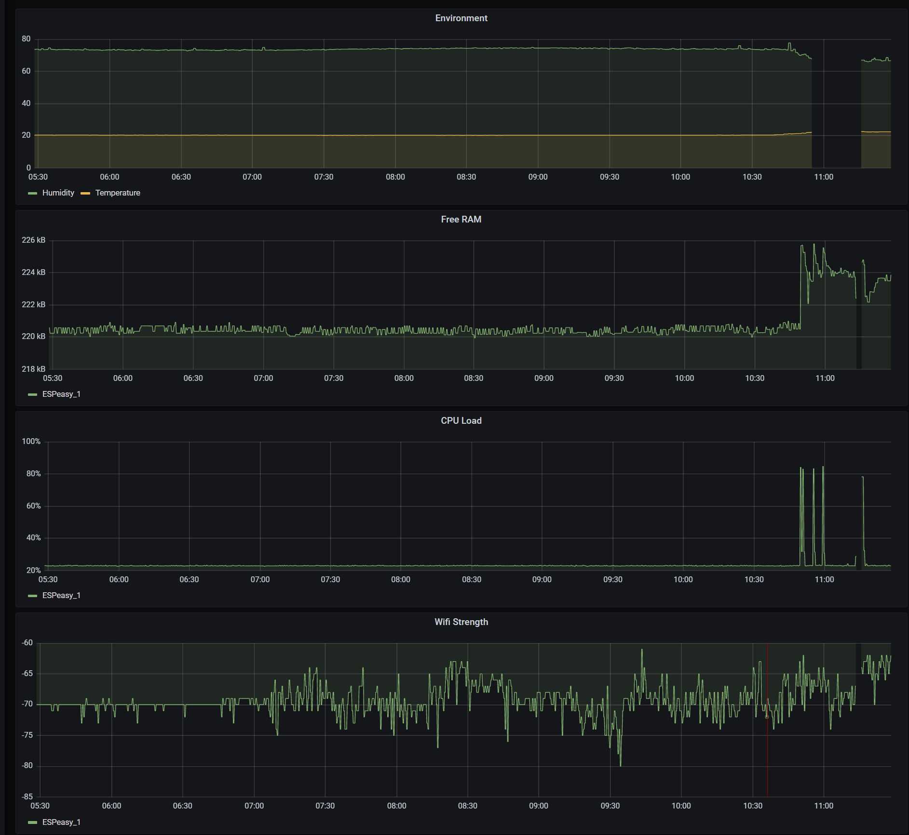
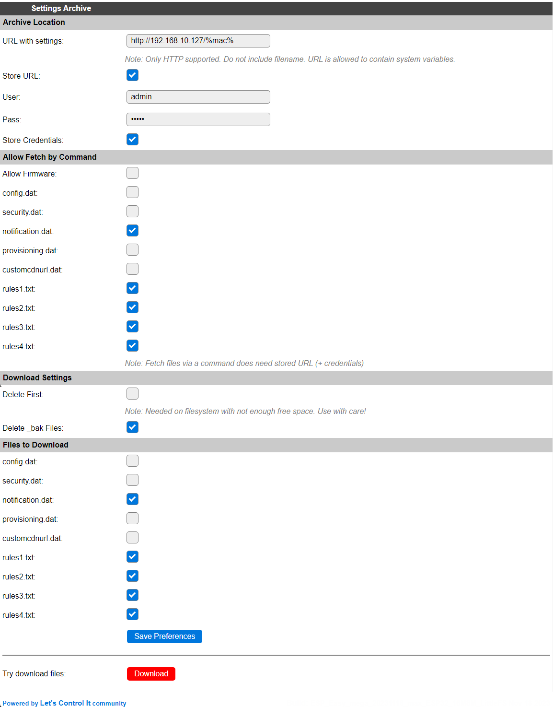

Tools
*****

Log
===

ESPEasy can output a lot of diagnostics via logs.

There are several output directions where you can send the logs and per direction the log level can be set.

Log Directions
--------------

Logs can be sent to:

* Syslog - A log collecting service running on another computer
* Serial port
* Web Log - Visible via the web interface
* SD card (only when included in the build)

Syslog
^^^^^^

A Syslog service (often called ``rsyslog``) is often standard included in many Linux distributions.

Some How-to:

* `How to setup rsyslog on Ubuntu 18.04 <https://www.howtoforge.com/how-to-setup-rsyslog-server-on-ubuntu-1804/>`_

ESPEasy sends the syslog via UDP to the configured IP-address.

It is also possible to set the Syslog Facility, which allows to set a level to help sort the log messages on the syslog server.

Serial
^^^^^^

When configuring to send the logs to serial, all logs will be sent to `Serial0`.
This means you should not use that port for sensors.

The logs will only be sent to the serial port, if under "Serial Settings" the serial port is set to enabled.

N.B. Serial-0 and Serial-0 Swapped are the same port, only configured to use different pins.

Web Log
^^^^^^^

The Web log is accessible via the web interface via Tools => Log.

To save resources, the buffer for logs sent to the web log is only used as long as the web log page is active.
This means that it may initially take some time to see the first log entries and also that it is not possible 
to see log entries from before the web log page was opened.

SD Card
^^^^^^^

It is possible to send logs to an SD card.
However this is not included in the standard builds by default.
The needed libraries for this add a few tens of kByte to the bin size of the firmware, which is why it has been made optional.

Next to the logs, it is also possible to send the task values to the SD card.
Please be aware frequent writing to an SD card may wear out an SD card and thus shortens its life span.

Log Levels
----------

There are several log levels.
A more verbose level also includes all previous levels.

All log levels sorted by increased verbosity:

* None - No logs are generated for the log output direction.
* Error - Typical error messages like failed connection attempts or read/write errors
* Info - Quite a lot of operational information like new values, time set, etc.
* Debug - Typically used to determine a cause for issues.
* Debug More - Only used when a bit more detailed information is needed to find the cause of an issue.
* Debug Dev - Only used while developing a piece of code. The amount of logs generated at this level is quite overwhelming for a typical setup.

These log levels can be set per output direction.

Please note the most verbose active log level is used to determine whether a log entry should be generated.
For the best performance the log level on all output directions should be set as low as possible, since these log entries do take resources like RAM and CPU cycles.

Info
====

The ``sysinfo`` page does show a lot of information about the system.

* **Unit Number**: The assigned unit number of the node.
* **Local Time**:	The local time as known by the node. This includes any set timezone and DST (Daylight Saving).
* **Time Source**:	The origin of the current system time. (e.g. NTP / GPS / Manual set)
* **Time Wander**:	Time drift of the crystal in ppm. Espressif states the crystal should have an accuracy of better than 10 ppm, which translates in a wander of 0.010 msec/sec.  (older ESPEasy builds used msec/sec as unit, but ppm is more relatable to crystal specs.)
* **Uptime**:	Current uptime of the node
* **Load**:	CPU load in percent. ``LC`` is the number of calls to the ``loop()`` function per second.
* **CPU Eco Mode**:	Whether the ECO mode is enabled or not.
* **Boot**:	e.g. ``Manual Reboot (22)`` Stating the latest reboot reason and number of reboots since power on.
* **Reset Reason**:	More extensive last reboot reason.
* **Last Action before Reboot**:	Some indicator of the last action performed before the last reboot.
* **SW WD count**:	Counter of the number of reboots triggered by the Software Watchdog. (not reliable at this moment)

Memory
------

* **Free RAM**:	Amount of free heap memory. With statistics enabled, also showing the lowest amount of free heap and the function where this occured. Example: ``12112 (9592 - sendContentBlocking)``
* **Heap Max Free Block**:	Largest continuous free block in heap memory.
* **Heap Fragmentation**:	Amount of fragmentation of the heap memory. High fragmentation may lead to crashes or slow response of the node.
* **Free Stack**:	Amount of free memory on the stack. With statistics enabled, also showing the lowest amount of free stack and the function where this occured. Example: ``3664 (848 - sendContentBlocking)``

Network
-------

* **IP Config**:	Static or DHCP
* **IP / Subnet**:	Example: ``192.168.10.58 / 255.255.255.0``
* **Gateway**:	Example: ``192.168.10.254``
* **Client IP**:	IP-address of the computer used to access the ESP. Example: ``192.168.10.135``
* **DNS**:	Example: ``192.168.88.1 / (IP unset)``
* **Allowed IP Range**:	Configured filter to allow access to the web interface only from a specific subnet, or ``All Allowed``
* **Connected**:	Duration of the current network connection. Example: ``4h55m``
* **Number Reconnects**:	Number of reconnects to a network since boot.

WiFi
----

* **WiFi Connection**:	Description of the current connection speed and signal strength of the access point connected to. Example: ``802.11n (RSSI -41 dBm)``
* **SSID**:	SSID of the WiFi network the node is connected to, plus its BSSID. Example: ``Lurch_2G (74:4D:28:FA:35:7D)``
* **Channel**:	Current used WiFi channel.
* **Encryption Type**:	Used WiFi encryption. Example: ``WPA/WPA2/PSK``
* **Last Disconnect Reason**:	The reason of the last disconnect from the access point. Showing the numeric ID and a description. Example: ``(1) Unspecified``
* **Configured SSID1**:	The first SSID of a WiFi network stored in the settings.
* **Configured SSID2**:	The second SSID of a WiFi network stored in the settings.
* **STA MAC**:	MAC address of the station WiFi interface of the ESPEasy node. Example: ``2C:3A:E8:39:14:07``
* **AP MAC**:	MAC address of the access point WiFi interface of the ESPEasy node. Example: ``2E:3A:E8:39:14:07``

WiFi Settings
-------------

All these values are described in great detail in the Advanced section, where the WiFi settings can be configured.

* **Force WiFi B/G**:	Shows whether the ESPEasy node is forced into 802.11b/g mode.
* **Restart WiFi Lost Conn**:	Shows whether the ESPEasy node is configured to restart the WiFi radio when connection is lost. When reporting false (the default), the WiFi radio is not restarted, but it just retries to connect to WiFi.
* **Force WiFi No Sleep**:	``true`` indicates the WiFi radio is not allowed to enter low power mode to conserve energy.
* **Periodical send Gratuitous ARP**:	``true`` indicates the ESPEasy node will send Gratuitous ARP packets to improve reachability from the network to the node.
* **Connection Failure Threshold**:	Counter indicating the number of failed connection attempts needed to perform a reboot.
* **Max WiFi TX Power**:	The set maximum TX power in dBm.
* **Current WiFi TX Power**:	The current active TX power in dBm
* **WiFi Sensitivity Margin**:	The set WiFi Sensitivity Margin
* **Send With Max TX Power**:	``true`` indicates the WiFi TX power will not be changed and thus is sending at maximum TX power for the active WiFi mode (802.11 b/g/n)
* **Extra WiFi scan loops**:	The set number of extra scans of all channels when a WiFi scan is needed.
* **Use Last Connected AP from RTC**:	``false`` means the ESPEasy node needs to scan at reboot and cannot reuse the last used connection before the reboot.

Firmware
--------

* **Build**:  Showing the internal build number. Example: ``20114 - Mega``
* **System Libraries**:  Showing the used core library version. Example: ``ESP82xx Core 2843a5ac, NONOS SDK 2.2.2-dev(38a443e), LWIP: 2.1.2 PUYA support``
* **Git Build**: Showing the GIT branch or tag information with SHA of the last commit. 	Example: ``feature/randomize_NTP_interval_569442e``
* **Plugin Count**: 	Number of plugins included in the build. 
* **Build Origin**:	Indication whether it is "self built" or an official build.
* **Build Time**:  Date and time when the running version of ESPEasy was built. Example: ``Aug 11 2021 14:00:44``
* **Binary Filename**: The filename of the installed ESPEasy build.  Example: ``ESP_Easy_mega_20210811_custom_ESP8266_4M1M``
* **Build Platform**:	The platform used to build the installed ESPEasy build. Example: ``Windows-10-10.0.19041-SP0``
* **Git HEAD**: The Git branch + SHA of the last commit used to build the installed ESPEasy build.	Example: ``feature/randomize_NTP_interval_569442e``

System Status
-------------

Showing the current active log level per log destination.
N.B. The web log will switch to ``None`` when the log is not fetched from the web log page, regardless of the actual setting.

* **Syslog Log Level**:	None
* **Serial Log Level**:	Info
* **Web Log Level**:	None

Network Services
----------------

Showing checkboxes when a service is started with success.

* **Network Connected**:	✔
* **NTP Initialized**:	✔
* **MQTT Client Connected**:	✔

ESP Board
---------

Showing detected chip and used board definition.

* **ESP Chip ID**:	Unique chip ID, showin in decimal and hexadecimal notation. Example: ``3740679 (0x391407)``
* **ESP Chip Frequency**:	Set CPU clock frequency. Example: ``80 MHz``
* **ESP Chip Model**:	Detected or configured CPU platform. Example: ``ESP8266``
* **ESP Chip Cores**:	Detected or configured number of CPU cores. Example: ``1``
* **ESP Board Name**:	Used board definition. Example: ``PLATFORMIO_ESP12E``

Storage
-------

Showing detailed information about the flash chip and used file system.

* **Flash Chip ID**:  Detected flash chip vendor ID and flash model. Example: ``Vendor: 0x20 Device: 0x4016``
* **Flash Chip Real Size**:	The detected real size of the flash chip. Example: ``4096 kB``
* **Flash IDE Size**:	Defined size in the build project. (may be less than the detected real size) Example: ``4096 kB``
* **Flash IDE Speed**:	Configured frequency of the flash chip. Example: ``40 MHz``
* **Flash IDE Mode**:	Configured access mode to the flash chip. Example: ``DOUT``
* **Flash Writes**:	Number of writes to the flash of the current day and since the last power cycle boot. Example: ``16 daily / 37 boot``
* **Sketch Size**:	Size of the current ESPEasy build + the amount of free space for an OTA update.  Example: ``844 kB (2224 kB free)``
* **Max. OTA Sketch Size**:	Example: Maximum size of an ESPEasy build that can be flashed using OTA. ``1019 kB (1044464 bytes)``
* **OTA possible**:	``true`` indicates it is possible to update the firmware via OTA.
* **OTA 2-step Needed**:	``false`` indicates a user does not need to perform an OTA update via the 2-step OTA process. ``true`` means it is only possible to perform an OTA update via the 2-step OTA update process.
* **SPIFFS Size**:	Example: Total size + free space of the current file system. Example: ``934 kB (792 kB free)``
* **Page size**:	The size of a page on the flash chip. Example: ``256``
* **Block size**:	Smallest size of consequitive pages that can be erased. Example: ``8192``
* **Number of blocks**:	Total number of blocks occupied by the file system. Example: ``116``
* **Maximum open files**:	Configured maximum number of simultaneous open files. Example: ``5``
* **Maximum path length**:	Maximum length of file name + path. Example: ``32``

Advanced
========

Rules Settings
--------------

* Rules - Check to enable rules functionality (on next page load, extra Rules tab will appear)
* Old Engine - Default checked.
* Enable Rules Cache - Rules cache will keep track of where in the rules files each ``on ... do`` block is located. This significantly improves the time it takes to handle events. (Enabled by default, Added 2022/04/17)
* Allow Rules Event Reorder - It is best to have the rules blocks for the most frequently occuring events placed at the top of the first rules file. (also for frequently happening events, which you don't want to act on) The cached event positions can be reordered in memory based on how often an event was matched.  (Enabled by default, Added 2022/04/17, disabled 2022/06/24)
* Tolerant last parameter - When checked, the last parameter of a command will have less strict parsing.
* SendToHTTP wait for ack - When checked, the command SendToHTTP will wait for an acknowledgement from the server.
* SendToHTTP Follow Redirects - When checked, HTTP calls may follow redirects. Strict RFC2616, only requests using GET or HEAD methods will be redirected (using the same method), since the RFC requires end-user confirmation in other cases.

Time Source
-----------

* Use NTP - Check to  query an NTP server for proper system time.
* NTP Hostname - When left empty, a random host from pool.ntp.org will be used. (when NTP is enabled)
* External Time Source - Set of supported external RTC chips which can keep the time while the ESP is not powered (e.g. deep sleep)

External Time Source is added on 2021-07-21.

Supported RTC chips:

* `DS1307 <https://datasheets.maximintegrated.com/en/ds/DS1307.pdf>`_
* `DS3231  <https://datasheets.maximintegrated.com/en/ds/DS3231.pdf>`_
* `PCF8523  <https://www.nxp.com/docs/en/data-sheet/PCF8523.pdf>`_
* `PCF8563  <https://www.nxp.com/docs/en/data-sheet/PCF8563.pdf>`_

Most modules sold with one of these RTC chips also have a battery socket to keep track of time while the rest is not powered.
This allows ESPEasy to know the correct date and time after been powered off for a while, or deep sleep, without the need for working network to query a NTP server.

N.B. these modules all use I2C, so they need to be connected to the configured I2C pins and those pins should be set.

Procedure to configure a real time clock (RTC) chip:
^^^^^^^^^^^^^^^^^^^^^^^^^^^^^^^^^^^^^^^^^^^^^^^^^^^^

* Connect the RTC chip to the configured I2C pins, and boot up the ESPEasy unit.
* From Tools/Advanced, enable the use of NTP, and set DST option in the DST settings and the Timezone offset, Latitude and Longitude in the Location settings **correctly**.
* Select the used RTC chip from the list.
* Submit the page to save the settings.
* Reboot the unit.
* The time will be retrieved using NTP once more, and set into the RTC chip.
* Check on the Main tab if the time is displayed correctly.
* On the Tools/Advanced page, the NTP setting can now be disabled, if so desired, as it won't be used anymore (unless the External Time Source is set to None).

Besides using NTP to set the date/time to the RTC chip, other supported options are:

* Using the ``DateTime`` command to set the date and time.
* Having a GPS receiver connected, using the GPS plugin (:ref:`P082_page`), the ESPEasy date/time will be set when GPS date/time is valid, as that is more accurate than the RTC date/time. The RTC date/time will be used from boot, and be updated once the GPS has a fix, which may take some time, depending on conditions.

DST Settings
------------

Define the start and end of Daylight Saving Time (DST)

* Start (DST start / CEST) - e.g. Last Sunday of March    2am => 3am
* End (DST end / CET) - e.g. Last Sunday of October  3am => 2am
* DST - Check to enable DST.

Location Settings
-----------------

* Timezone Offset (UTC +) - Number of minutes offset from UTC. (e.g. +60 minutes for Europe/Amsterdam time)
* Latitude - Coordinate (South/North) in degrees.
* Longitude - Coordinate (West/East) in degrees.

The coordinates are not used to compute the time zone. 
They are only used to compute the time of sunrise and sunset.

Log Settings
------------
See `Log section <Tools.html#log>`_ for more detailed information.

* Syslog IP - IP address of the syslog server.
* Syslog UDP port - Port number of the syslog service. (default: 514)
* Syslog Log Level - Log Level for sending logs to the syslog server.
* Syslog Facility - Specify the syslog facility to send along with the logs. (default: Kernel)
* Serial Log Level - Log Level for sending logs to the serial port.  (see also Serial Settings below)
* Web Log Level - Log Level for sending logs to be viewed on the web log viewer.
* SD Log Level - Log Level for sending logs to a SD card (only when included in the build)

Serial Settings
---------------

These settings only apply to using the serial port in core ESPEasy functionality,
like sending out logs or receiving commands via the serial port.

* Enable Serial Port - When unchecked, logs will not be sent to the serial port and commands will not be read from it.
* Baud Rate - Baud rate of the serial port. (default: 115200)

Make sure to disable the serial port here when a sensor is connected to Serial0 
or the GPIO pins are used for something other then a serial port.

Inter-ESPEasy Network
---------------------

UDP port used for ESPEasy p2p protocol.
When set to 0, this functionality is disabled.

Preferred (and IANA registered) port is UDP port 8266.

See for more detailed information "Controller - ESPEasy P2P Networking"

Special and Experimental Settings
---------------------------------

Fixed IP Octet
^^^^^^^^^^^^^^

Sets the last byte(octet) of the IP address to this value, regardless of what IP is given using DHCP (all other settings received via DHCP will be used)

So if you receive 192.168.1.234 from your DHCP server and this value is set to "10",
then the used IP in your node is 192.168.1.10.
But since you're receiving more information from the DHCP server,
like subnet mask / gateway / DNS, it may still be useful.
This allows a somewhat static IP in your network (N.B. use it with an 'octet' outside the range of the DHCP IPs) while still having set to DHCP.
So if you take the node to another network which does use 192.168.52.x then you will know it will be on 192.168.52.10 (when setting this value to "10")

I2C ClockStretchLimit
^^^^^^^^^^^^^^^^^^^^^

- `I2C-bus.org - Clock Stretching <https://www.i2c-bus.org/clock-stretching/>`_
- `ESPeasy wiki - Basics: The I2C Bus <https://www.letscontrolit.com/wiki/index.php/Basics:_The_I%C2%B2C_Bus>`_

WD I2C Address
^^^^^^^^^^^^^^

The Watchdog timer can be accessed via I2C.
What can be read/set/changed must still be documented.

JSON bool output without quotes
^^^^^^^^^^^^^^^^^^^^^^^^^^^^^^^

ESPEasy JSON output has always used quoted bool values, ``"true"`` and ``"false"``, that are in fact string values. According to JSON standards, bool values should be ``true`` and ``false``, so this setting selects what type of bool values will be emitted. As existing functionality is to be left unaltered/backward compatible as much as possible, by default this setting is unchecked.

Allow TaskValueSet on all plugins
^^^^^^^^^^^^^^^^^^^^^^^^^^^^^^^^^

Added: 2021-08-06

The command TaskValueSet was never intended to be used on any other then a 'dummy' task.
However it appeared there are some use cases where it may be useful to use TaskValueSet on other types of tasks.

To use it on other then a 'dummy' task, this option must be checked.

Default: unchecked

Try clear I2C bus when stuck
^^^^^^^^^^^^^^^^^^^^^^^^^^^^

Added: 2021-09-26

Occasionally the I2C bus can become "stuck".
This is quite hard to reproduce, as it is very likely this is caused by external noise.
Another possible cause can be that the ESP rebooted in the middle of an I2C transaction.

When this happens, the ESP cannot communicate with any I2C device on the bus, until a power cycle.
In every occasion when a user reported this, it appeared the SDA line was held low by an I2C device.

With this option checked to clear the I2C bus, the ESP will detect if the I2C bus is "stuck" and does make several attempts to clear the I2C bus without the need for a power cycle.

As a last resort, the user may try to perform an I2C scan via the web interface, which will then perform an even more rigorous attempt to clear the bus.
This will swap the SDA/SCL pins and tries to perform a scan and then restores the correct SDA/SCL assignment.

If this is the fix, where ESPEasy is not able to resolve the lockec I2C bus on itself, please open an issue for this on GitHub.

Default: unchecked

Allow OTA without size-check
^^^^^^^^^^^^^^^^^^^^^^^^^^^^

Added: 2022-04-22

On ESP's with 1MB or 2MB Flash, updates via OTA *may* be disabled because of a lack of free flash memory to store the new image during OTA update.

Enabling this setting will allow OTA updates even when there is not enough free Flash space to perform the update by allowing to overwrite the file-system, probably trashing the settings and other files like rules.

This should best only be enabled if the configuration, and other files like rules, can be restored from an external source, or be re-entered manually.

NB: If the OTA update is bigger than available flash + file-system size, the OTA update will fail, but as the file-system is already overwritten, any configuration and files are overwritten irreversibly!

Web light/dark mode
^^^^^^^^^^^^^^^^^^^

Added: 2022-09-05

When using Dark-mode as an Operating System or Web-browser setting, the ESPEasy Web interface defaults to using a Dark theme as well. For those that prefer to use non-dark mode, or use ESPEasy in dark mode while the OS/browser is not configured that way, this can be selected here.

NB: If this option is not available, the regular non-dark mode will be used.

Deep Sleep Alternative
^^^^^^^^^^^^^^^^^^^^^^

Added: 2021-06-07

On some ESP8266 boards deep sleep does consume quite a lot compared to the stated 20 uA by Espressif.
For those boards it may be beneficial to use alternative code to set the WiFi radio in such a mode that allows the ESP to really enter deep sleep.
However, on older boards like the ESP12E or ESP12F, this alternative code prevents the ESP to wake up at all.

This option is only available for ESP82xx boards.

Default: disabled.

Use SSDP
^^^^^^^^

Is disabled for now since it is causing crashes.
SSDP can be used to help auto discovery of a node.
For example Windows uses it to find hosts on a network.

Connection Failure Threshold
^^^^^^^^^^^^^^^^^^^^^^^^^^^^

Number of failed network connect attempts before issuing a reboot (0 = disabled)
A side effect is that trying to reach some server which is offline, may also result
in reboots of the ESP node.

Force WiFi B/G
^^^^^^^^^^^^^^

Force the WiFi to use only 802.11-B or -G protocol (not -N)
Since the 802.11 G mode of the ESP is more tolerant to noise, it may improve link
stability on some nodes.

Restart WiFi on lost conn.
^^^^^^^^^^^^^^^^^^^^^^^^^^

Force a complete WiFi radio shutdown & restart when connection with access point is lost.

Force WiFi no sleep
^^^^^^^^^^^^^^^^^^^

This option will set the WiFi sleep mode to no sleep.
This may cause the node to consume maximum power and should only be used for testing purposes.
It may even lead to more instability on nodes where the power supply is not
sufficient or the extra heat cannot be dissipated.

Since changing the mode back to the default setting may lead to crashes in some core versions, this option is only enabled when starting the node.
To activate a change of this setting, a reboot is required.

Periodical send Gratuitous ARP
^^^^^^^^^^^^^^^^^^^^^^^^^^^^^^

The ESP node may sometimes miss ARP broadcast packets and thus not answer them if needed.
This may lead to the situation where a packet sent to the node cannot be delivered,
since the switch does not know how to route the packet.
To overcome this, the ESP node may send a *Gratuitous ARP* packet, which is
essentially an answer to a request which hasn't been made.
These gratuitous ARP packets however may help the switch to remember which
MAC address is connected via what port.

By default the ESP will send out such a gratuitous ARP packet every time it
receives an IP address and also when it was unable to make a connection to a host.
It could be the other host was replying, but the packet was not routable to the ESP node.

This *Periodical send Gratuitous ARP* option will send these kind of ARP packets
continuously with some interval.
This interval is defined in the source code in ``TIMER_GRATUITOUS_ARP_MAX`` (e.g. 5000 msec)

CPU Eco mode
^^^^^^^^^^^^

Will call delay() from scheduler during idle loops.
This will result in a significant energy reduction of up-to 0.2 Watt.

However, it is no guarantee the power consumption will be reduced.
For example when the host is receiving continuous ping requests, it will never activate the power save mode.

If the power save mode is active, the node may miss some broadcast packets.
For example the ESPeasy p2p packets will be missed every now and then, so do not
activate this mode when response time  on received packets is important.

If the node is only sending packets (e.g. only a sensor connected and sending to some server),
then this is a great way to save energy and also reduce heat.

See also :any:`cpu-eco-mode-explanation`

WiFi TX Power
^^^^^^^^^^^^^

(Added: 2021-01-26)

The default TX power of an ESP unit is:

* 802.11 b: +20 dBm
* 802.11 g: +17 dBm
* 802.11 n: +14 dBm

For some units it can help to reduce the TX power of the WiFi.
As of now the exact reason why this may improve stability is a bit unclear.
For example, the power supply may be slightly underdimensioned, or the antenna impedance isn't perfect. (can be affected by a lot of factors)

The effect of a reduction in TX power is of course lower energy consumption, but also a reduction in WiFi range as the received signal strength on the access point will be lower.
The unit for WiFi TX power is expressed in dBm, which makes it very easy to calculate the effect.

.. note:: dBm represents an absolute power level (in mWatt) while dB is a relative index.
          RSSI is a bit confusing in its unit of measure as both dBm and dB are used.
          As a rule of thumb, if the RSSI is expressed as a negative value, it is usually referring to dBm. 
          For positive values (i.e. 0 .. 100) it is in dB.
          To further confuse the understanding, our ESPs use an RSSI of +31 as an error code.

The relation between TX power in dBm and Watt:

* 20 dBm = 0.1 Watt  (= 30 mA @3.3V)
* 10 dBm = 0.01 Watt
* 0 dBm = 0.001 Watt
* -10 dBm = 0.0001 Watt

Every 10 dBm lower is a factor 10 less energy sent from the antenna.
N.B. Since most ESP boards use a linear voltage regulator from 5V to 3.3V, the power reduction can be as high as 0.15 Watt.

See also "WiFi Sensitivity Margin"

For example the AP does receive the signal from your ESP node with an RSSI of -60 dBm.
If we lower the TX power from 20 dBm to 10 dBm, the access point will receive our signal with an RSSI of -70 dBm.

Lowering the TX power can also be useful to make it more likely a node will connect to an access point close to the node in a setup with a number of access points using the same SSID.
Most access points will disconnect a node if its signal drops below a certain RSSI value.  (some brands of access points allow to set this threshold)

WiFi Sensitivity Margin
^^^^^^^^^^^^^^^^^^^^^^^

(Added: 2021-01-26)

See also WiFi TX Power.

The ESP boards have a RX sensitivity depending on the used WiFi connection protocol:

* 802.11 b: –91 dbm (11 Mbps)
* 802.11 g: –75 dbm (54 Mbps)
* 802.11 n: –72 dbm (MCS7)

These are the numbers for an ESP8266.

N.B. The ESP32 is more sensitive for lower bit rates, but we use these more conservative ones.

The WiFi Sensitivity Margin is added to these RX sensitivity numbers above.

Our dynamic WiFi TX power strategy is based on the following assumptions:

* Without any changes in TX power on both the ESP as well as the access point (AP), we can assume the signal strength attenuates the same from the AP to the ESP as the return path from the ESP to the AP.
  Meaning if we see the signal from an AP has an RSSI value of -60 dBm, we can assume the AP receiving our signal has a similar signal strength with an RSSI of -60 dBm.
* An access point usually has a better RX sensitivity than an ESP board.

With these assumptions in mind, we can lower our WiFi TX power.

Let's assume the ESP is connected to an access point using 802.11N and we see an RSSI of -60 dBm.
Without lowering TX power on the ESP, the access point will receive the ESP with an RSSI of -60 dBm.

When the TX power on this ESP is lowered from 14 dBm to 4 dBm, the access point will receive the ESP with an RSSI of -70 dBm.
This is still within the stated -72 dBm RX sensitivity.

However for improved stability, it is wise to add some margin. For example a margin of 5 dBm.
When applying this margin of +5 dBm, the ESP must try to match its output power to make sure the access point will receive the ESP with an RSSI of at least - 67 dBm.
The set TX output power will then be (-60 dBm - -67 dBm =) +7 dBm, which is still a significant improvement in power consumption.

This margin can also be used to compensate for an access point which is set to a non default TX power.
For example, it is good practice to lower the TX power of an access point to improve separation and take over in a network with multiple APs set to use the same SSID to provide roaming.
Since these offsets are also expressed in dBm, they can be used without conversion for correcting this margin.

* Negative margin: Used for access point with better RX sensitivity (high SNR) and/or lowered TX power
* Positive margin: Used for access point with lower RX sensitivity (low SNR) and/or increased TX power

.. note:: It is almost always a bad idea to increase TX power of an access point. The signal from the access point may cover a longer range, but the RX sensitivity is not improved thus the client can not reply.  It also affects other WiFi networks in the neighborhood, causing more interference.

.. note:: Changing the antenna of an access point for a "High Gain Antenna" does improve TX range as well as RX sensitivity and thus cancel each other out regarding this margin setting. A high gain antenna is more directional than traditional antennas.

To get a feeling of RSSI values (in dBm) in relation to the experienced link quality:

* -30 dBm: Amazing
* -67 dBm: Very Good
* -70 dBm: Okay
* -80 dBm: Not Good
* -90 dBm: Likely Unstable

Link quality depends on more then just the RSSI.
For example a connection with lower band width (e.g. 802.11g compared to 802.11n) is usually more forgiving.

The actual link quality depends on the ratio between received signal strength (RSSI) and the noise floor.
The noise floor is simply erroneous background transmissions that are emitted from either other devices that are too far away for the signal to be intelligible, or by devices that are inadvertently creating interference on the same frequency. 
Some brands of access points can show the current noise floor and/or the SNR.

For example, if a signal is received at -80 dBm and the noise floor is -100 dBm, the effective signal-to-noise ratio (SNR) is 20 dB, which is still very usable for ESP nodes as we don't send lots of data.

For a stable link the SNR should be > 15 dB.
The SNR does have big of impact on how responsive an ESPEasy node will 'feel' when operating it.

Sending with a very strong signal may also affect the link stability of other nodes as it will increase the noise floor for all access points in the neighborhood.

For best link stability of all nodes, it is best to target somewhere between -67 and -70 dBm.
Therefore the default value of +3dB margin will attempt to let the access point receive with a signal strength of roughly that sweet spot.

Of course nodes with an already high signal attenuation cannot send with more than the max allowed TX power of roughly 20.5 dBm.
Trying to reach this sweet spot in signal strength is just a best effort and not a guarantee.

Extra WiFi scan loops
^^^^^^^^^^^^^^^^^^^^^

Added: 2021-04-16

A single WiFi scan does loop over all channels only once and waits per channel only for a fixed amount of time for APs to reply.
It is an "active" WiFi scan, meaning the node does send out a packet for access points to reply to.

Per scan, an AP may be too busy handling other traffic so it may not even receive the request, or does not reply in due time and the node already switched over to another channel and thus does not receive the reply from the AP.
This may lead to the situation where a node which is configured to connect to multiple APs, to connect to the least optimal AP as the AP which would be the better choice did not reply.

A scan can be "sync" or "async". A "sync" scan is blocking, meaning it will halt execution of other code on the ESP.
An "async" scan is just started and when finished it fires an event to fetch the scan results and thus is not blocking.
Blocking code may affect timing critical actions, which are sometimes essential to interact with some sensors.

This setting (default = 0) may help in finding the best AP when a sync scan needs to be performed, but it also may block execution of other code over a longer period.

Sync scans are performed when:

* No recent scan results are present and the node needs to (re)connect (thus always at a cold boot)
* When loading the WiFi scanner and setup page with no recent scan results present.

As an alternative, the next setting can be used to perform an async scan every minute and thus prevent blocking code on a reconnect.

Periodical Scan WiFi
^^^^^^^^^^^^^^^^^^^^

Added: 2021-04-16
Removed: 2021-10-18

Use Last Connected AP from RTC
^^^^^^^^^^^^^^^^^^^^^^^^^^^^^^

Added: 2021-06-20

The last used (stable) connection is stored in RTC memory.
This will survive a reboot (and deep sleep) as long as the unit remains powered.

On WiFi reconnect, the stored last active connection is tried first.
This can reduce the time needed to reconnect on a reboot, or when waking from deep sleep.

Side effect is that if a node cannot see the stronger configured AP when connecting, it may never try to connect to the stronger AP as on reconnect the last used is tried first.

Especially on mesh networks this appears to cause a lot of instability, therefore this is now made an optional feature.

This is no new functionality, as it was present before and also enabled by default.

New default value since 2021-06-20: unchecked

Show JSON
=========

Show Metrics
============

Shows various system metrics and device values in prometheus format

- `Prometheus monitoring system and time series database <https://prometheus.io/>`_

Metrics are exposed on the prometheus standard /metrics url

System metrics exposed are:

* Uptime
* CPU load
* RAM free
* Stack free 
* Wifi Strength
* Wifi connection time
* Wifi reconnection count (since boot)

In Addition, device values are exposed.  

This allows easy connection via prometheus to grafana for graphing, as in the screenshot below:

Timing Stats
============

The timing stats page is a diagnostics tool to help pinpoint possible causes for issues a user may experience.

Throughout the code timing statistics are collected.
These can be represented in one big table with these columns:

- Description  - Name of the function/plugin/controller being monitored
- Function     - For plugins and controllers, the function call of that item
- #calls       - Number of times seen.
- call/sec     - Number of calls per second.
- min (ms)     - Minimum duration in msec.
- Avg (ms)     - Average duration in msec.
- max (ms)     - Maximum duration in msec.

Please note that every time the timing stats page is loaded, the statistics will be reset.
So the statistics in the table reflect the period mentioned at the bottom of the page.

Interpret Statistics
--------------------

All timing values over 100 msec will be marked in bold.
To further help pinpoint some of these extremes, any row containing a bold timing is also given a green hue.

These are just some indicators where actions may take longer than optimal, 
but it should not be considered as faulty when some value exceeds 100 msec.
Sometimes there is a perfectly fine explanation, like when a host is contacted on the other side of the globe.

Some function names give a good indication on how frequent they should be run.
For example ``FIFTY_PER_SECOND`` or ``TEN_PER_SECOND`` should be run at 50x/sec, resp. 10x/sec.

If these values differ substantially, something may be keeping the unit occupied.

Please note that if multiple instances of the same plugin are active, the number of calls per second should also be higher.

Also the number of samples should be large enough to be able to be useful.
For example if the ``ONCE_A_SECOND`` function is only observed once over a time interval of 1.99 second, it will be shown as a frequency of about 0.5 calls/sec.
That would seem much less than expected, but it fact it is perfectly fine.

As noted, it is to be preferred if no scheduled action on the node takes over 100 msec.
Some plugins, like OLED Framed may take more to update the display. Especially when scrolling is enabled.

But for other plugins it may deserve some attention if a plugin (almost) always takes over 100 msec to perform an action.
For example when minimum, average and maximum timing values are very close to each other, 
then there may be reason to look into the plugin (or controller) to see if things can be improved.

For stable WiFi connection, every now and then a call to ``yield()`` or ``delay()`` should be made.
The time between such calls should be less than 10 msec.
So if some code execution does take longer than 10 msec, it must also make sure to call yield() every now and then.

When some entries in the timing stats happen frequently and take over 100 msec, 
then they will for sure affect other plugins and controllers active on the same node.
This is also a very good reason to try and keep the timing stats values as low as possible.

Typical Outliers
----------------

Some of the timing stats are "nested".
For example the ``loop()`` function is probably the row with the largest maximum timing value, since all other functions are called from the loop.

The same applies for the two ``handle_schedule()`` functions. These either call scheduled actions to do, or things to be done when idle.

Both the ``loop()`` and the ``handle_schedule()`` functions are called very often.
Given enough time, their count value will be high, or even overflow since they are a 32-bit integer.
When this happens, the values for calls/sec or avg will be no longer useful.

A really busy node (CPU load > 75%) may drop a few scheduled calls in order to keep up.
This will be noticable in low values for calls/sec of the most frequently called functions like ``FIFTY_PER_SECOND`` or ``TEN_PER_SECOND``.

Tweaking Timeout using Timing Stats
-----------------------------------

As an example to tweak timing settings, take the time needed of one of the active controllers.
Lets assume the average time needed to contact such a controller is 30 msec.
Then it does not make sense to have the client timeout of that controller set to 1000 msec.
2x - 3x the average time is often a perfectly fine value to use as a timeout.

System Variables
================

Factory Reset
=============

Sometimes it can be useful to start over with a fresh setup.
The Factory Reset allows just that, and more.

- Format flash filesystem (so called SPIFFS)
- Re-create new settings files
- Already store some existing values to keep
- Allow for some pre-defined module config

Pre-defined module configurations help to setup the following:

- GPIO connected to button => plugin switch configured
- GPIO connected to relay => plugin switch configured
- If there is a conflict with default I2C pins, then those are set to no pin assigned for I2C
- Status LED GPIO
- Added rule to combine button and relay.

.. image:: images/FactoryReset_screenshot.png

Only pre-defined options for modules will be enabled for selection when they match the detected flash chip size.
For example, the Sonoff POW modules will not be selectable on a module with 1 MB flash
and the Sonoff Basic cannot be selected on a board with 4 MB flash.

.. warning:: Pressing the red "Factory Reset" button will immediately perform the reset with the set selection.

Settings Archive
================

(Only available for core 2.5.0 and newer)

ESPeasy does not support an "undo" when it comes to settings.
Also cloning the settings of a node can be a lot of work.

The Settings Archive is an initial step to help cloning settings or reverting to an older version of the settings.
To revert to an older version, one still has to have a backup of the settings stored on some server which is accessible via HTTP.

Later the (automatic) upload of settings will be added, including encryption.

Download Settings
-----------------

.. image:: images/SettingsArchive_download1.png

In order to download settings files, one has to select which ones to download and from where.
In the example shown here, the notification settings and rules were cloned from another ESPeasy node.
This other node is protected using a login, just to show basic authentication is also allowed.

Due to the needed memory resources, it is not possible to download from HTTPS.
This also meand the settings file and credentials are sent in plain text. 
So do not use this to download settings with sensitive information directly from the internet.

On some nodes the remaining free space on the SPIFFS filesystem may be too small to keep the original file and a downloaded version.
For example on 1MB nodes, there is only 120k SPIFFS, which means it is not possible to have the ''config.dat'' file stored twice on the filesystem.

For these, the "Delete First" checkbox should be used.
But be aware that the file is deleted first, even if the host holding the files to download is unavailable.

Better try first with a smaller file on such nodes.
Especially if the node is hard to reach for a proper clean setup.

.. image:: images/SettingsArchive_download2.png

After downloading the files, a summary is given.

A returned error can be something like 404 (file not available) or 401 (not authorized).
These are the standard HTTP error codes.
The error will be ``-1`` if the host is unreachable.

If a file already exists, the new file is downloaded with ``_tmp`` appended to the filename.
If successful, the original file will be renamed to one with ``_bak`` appended to the filename and then the ``_tmp`` version is renamed to the original filename.
However, if the ``_bak`` is present, it may fail to rename the original one, so the operation fails.
The presence of the ``_bak`` file is also some protection to not being able to fetch a new version, unless the "Delete First" option is checked.

If ''config.dat'' or ''security.dat'' was downloaded, it is very important to do a reboot and not try to change (and save) anything on the ESPeasy node.
The old settings are still active in memory and if something will be saved, only the changed part may be saved.
This would corrupt the settings file.

With only ``FEATURE_SETTINGS_ARCHIVE`` defined during build, the URL and credentials cannot be stored.
(2022/07/24: Renamed USE_SETTINGS_ARCHIVE to FEATURE_SETTINGS_ARCHIVE)
For this the build must be made with ``FEATURE_CUSTOM_PROVISIONING`` defined.

N.B. ``FEATURE_CUSTOM_PROVISIONING`` is added on 2022/05/13. (2022/07/24: Renamed from USE_CUSTOM_PROVISIONING to FEATURE_CUSTOM_PROVISIONING)

URL with Settings
^^^^^^^^^^^^^^^^^

This holds the full URL without file name where the files must be fetched from.

Since builds made after 2022/05/13, the URL may also contain system variables.
This allows for an URL like: ``http://192.168.10.127/%mac%``

System variables will be converted into an URL encoded form, which may end up like this:

* ``http://192.168.10.127/A0%3a20%3aA6%3a14%3a84%3a81/rules4.txt`` MAC address: ``A0:20:A6:14:84:81``

The URL will not be stored, unless the build is made with ``FEATURE_CUSTOM_PROVISIONING`` defined and the option is checked to save the URL. (option only present when ``FEATURE_CUSTOM_PROVISIONING`` defined)

Using system variables may allow for multi stage setup of a node, as you could for example fetch a rule which may set a variable to a new value and thus new files may be fetched from a different URL.

Side Effects on cloning
-----------------------

Please note that cloning settings from another node may have some side effects.
For example the host name and unit number will be the same.
But also the controllers will be active and may start sending incorrect data.

Controller credentials may also be used on multiple nodes, which may also lead to various issues.

If the original node is configured to use static IP, the clone will use the same IP address.
This can render both inaccessible.

Provisioning
============

Added: 2022/05/13

When the build is made with ``FEATURE_CUSTOM_PROVISIONING`` defined, this Settings Archive screen does allow for more settings helping deployment and remote administration of ESPEasy nodes.

All Settings on the Settings Archive page can be stored in a file named ``provisioning.dat``.
This file also can store the factory default settings like the device model to ease deployment of a large number of nodes.

N.B. The ``FEATURE_SETTINGS_ARCHIVE`` define is needed to allow to edit the ``provisioning.dat`` file, but it is not needed to use the provisioning feature.

As can be seen, the URL and credentials can be stored.
This will be stored in a file named ``provisioning.dat`` 
Such a file may also be fetched from a server.

The ``provisioning.dat`` file can also be automatically generated when performing a factory reset.
For this the (custom) build must be prepared via a number of defined defaults.
See the ``Custom-sample.h`` file for some examples.

Allow Fetch by Command
----------------------

This checkbox allows provisioning via commands.
These commands are not restricted, so they can also be given via HTTP or MQTT.

However, they can only be executed when:

* Allow Fetch by Command is enabled
* the file to download is checked
* URL (+ optional credentials) is stored

The commands are:

* ``ProvisionConfig`` Fetch ``config.dat``
* ``ProvisionSecurity`` Fetch ``security.dat``
* ``ProvisionNotification`` Fetch ``notification.dat``
* ``ProvisionProvision`` Fetch ``provisioning.dat``
* ``ProvisionRules,1`` Fetch ``rules1.txt``
