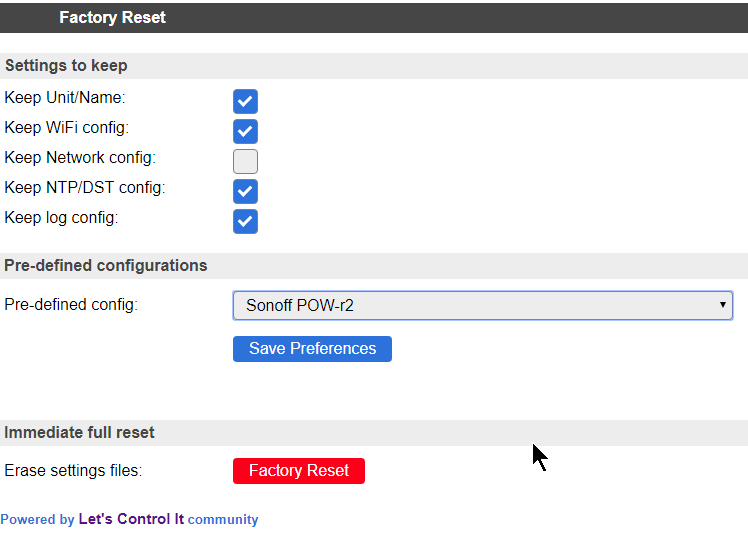

Tools
*****

Log
===

INFO
====

Show JSON
=========

Timing Stats
============

System Variables
================

Factory Reset
=============

Sometimes it can be useful to start over with a fresh setup.
The Factory Reset allows just that, and more.

- Format flash filesystem (so called SPIFFS)
- Re-create new settings files
- Already store some existing values to keep
- Allow for some pre-defined module config

Pre-defined module configurations help to setup the following:

- GPIO connected to button => plugin switch configured
- GPIO connected to relais => plugin switch configured
- If there is a conflict with default I2C pins, then those are set to no pin assigned for I2C
- Status LED GPIO
- Added rule to combine button and relais.

Only pre-defined options for modules will be enabled for selection when they match the detected flash chip size.
For example, the Sonoff POW modules will not be selectable on a module with 1 MB flash
and the Sonoff Basic cannot be selected on a board with 4 MB flash.

.. warning:: Pressing the red "Factory Reset" button will immediately perform the reset with the set selection.
