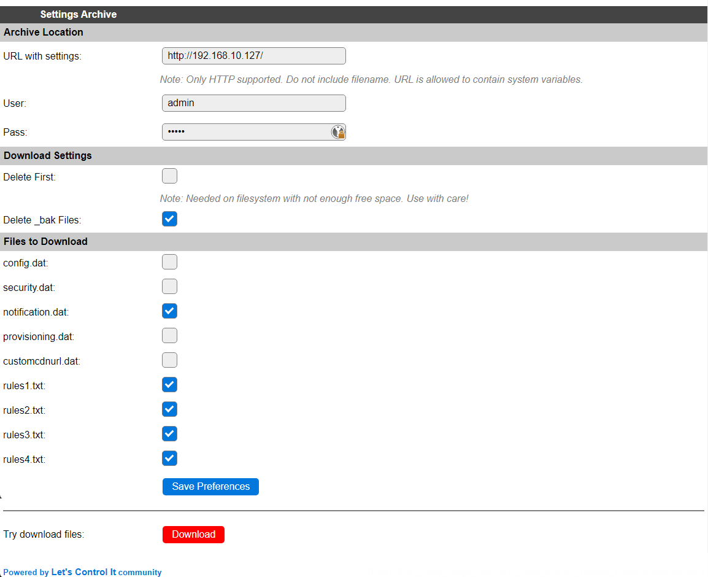
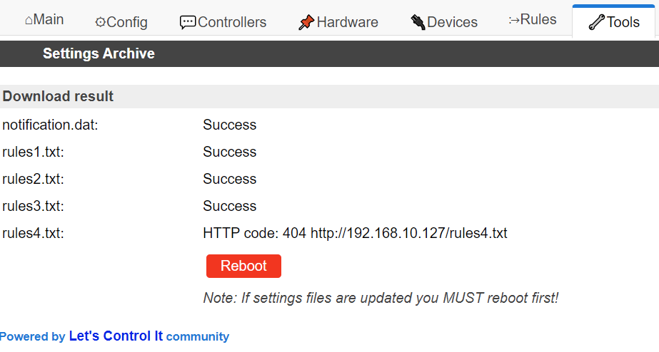

Tools
*****

Log
===

ESPEasy can output a lot of diagnostics via logs.

There are several output directions where you can send the logs and per direction the log level can be set.

Log Directions
--------------

Logs can be sent to:

* Syslog - A log collecting service running on another computer
* Serial port
* Web Log - Visible via the web interface
* SD card (only when included in the build)

Syslog
^^^^^^

A Syslog service (often called ``rsyslog``) is often standard included in many Linux distributions.

Some How-to:

* `How to setup rsyslog on Ubuntu 18.04 <https://www.howtoforge.com/how-to-setup-rsyslog-server-on-ubuntu-1804/>`_

ESPEasy sends the syslog via UDP to the configured IP-address.

It is also possible to set the Syslog Facility, which allows to set a level to help sort the log messages on the syslog server.

Serial
^^^^^^

When configuring to send the logs to serial, all logs will be sent to `Serial0`.
This means you should not use that port for sensors.

The logs will only be sent to the serial port, if under "Serial Settings" the serial port is set to enabled.

N.B. Serial-0 and Serial-0 Swapped are the same port, only configured to use different pins.

Web Log
^^^^^^^

The Web log is accessible via the web interface via Tools => Log.

To save resources, the buffer for logs sent to the web log is only used as long as the web log page is active.
This means that it may initially take some time to see the first log entries and also that it is not possible 
to see log entries from before the web log page was opened.

SD Card
^^^^^^^

It is possible to send logs to an SD card.
However this is not included in the standard builds by default.
The needed libraries for this add a few tens of kByte to the bin size of the firmware, which is why it has been made optional.

Next to the logs, it is also possible to send the task values to the SD card.
Please be aware frequent writing to an SD card may wear out an SD card and thus shortens its life span.

Log Levels
----------

There are several log levels.
A more verbose level also includes all previous levels.

All log levels sorted by increased verbosity:

* None - No logs are generated for the log output direction.
* Error - Typical error messages like failed connection attempts or read/write errors
* Info - Quite a lot of operational information like new values, time set, etc.
* Debug - Typically used to determine a cause for issues.
* Debug More - Only used when a bit more detailed information is needed to find the cause of an issue.
* Debug Dev - Only used while developing a piece of code. The amount of logs generated at this level is quite overwhelming for a typical setup.

These log levels can be set per output direction.

Please note the most verbose active log level is used to determine whether a log entry should be generated.
For the best performance the log level on all output directions should be set as low as possible, since these log entries do take resources like RAM and CPU cycles.

Info
====

Advanced
========

Rules Settings
--------------

* Rules - Check to enable rules functionality (on next page load, extra Rules tab will appear)
* Old Engine - Default checked.
* Tolerant last parameter - When checked, the last parameter of a command will have less strict parsing.
* SendToHTTP wait for ack - When checked, the command SendToHTTP will wait for an acknowledgement from the server.

NTP Settings
------------

* Use NTP - Check to  query an NTP server for proper system time.
* NTP Hostname - When left empty, a random host from pool.ntp.org will be used. (when NTP is enabled)

DST Settings
------------

Define the start and end of Daylight Saving Time (DST)

* Start (DST start / CEST) - e.g. Last Sunday of March    2am => 3am
* End (DST end / CET) - e.g. Last Sunday of October  3am => 2am
* DST - Check to enable DST.

Location Settings
-----------------

* Timezone Offset (UTC +) - Number of minutes offset from UTC. (e.g. +60 minutes for Europe/Amsterdam time)
* Latitude - Coordinate (South/North) in degrees.
* Longitude - Coordinate (West/East) in degrees.

The coordinates are not used to compute the time zone. 
They are only used to compute the time of sunrise and sunset.

Log Settings
------------
See `Log section <Tools.html#log>`_ for more detailed information.

* Syslog IP - IP address of the syslog server.
* Syslog UDP port - Port number of the syslog service. (default: 514)
* Syslog Log Level - Log Level for sending logs to the syslog server.
* Syslog Facility - Specify the syslog facility to send along with the logs. (default: Kernel)
* Serial Log Level - Log Level for sending logs to the serial port.  (see also Serial Settings below)
* Web Log Level - Log Level for sending logs to be viewed on the web log viewer.
* SD Log Level - Log Level for sending logs to a SD card (only when included in the build)

Serial Settings
---------------

These settings only apply to using the serial port in core ESPEasy functionality,
like sending out logs or receiving commands via the serial port.

* Enable Serial Port - When unchecked, logs will not be sent to the serial port and commands will not be read from it.
* Baud Rate - Baud rate of the serial port. (default: 115200)

Make sure to disable the serial port here when a sensor is connected to Serial0 
or the GPIO pins are used for something other then a serial port.

Inter-ESPEasy Network
---------------------

UDP port used for ESPEasy p2p protocol.
When set to 0, this functionality is disabled.

Preferred (and IANA registered) port is UDP port 8266.

See for more detailed information "Controller - ESPEasy P2P Networking"

Special and Experimental Settings
---------------------------------

Fixed IP Octet
^^^^^^^^^^^^^^

Sets the last byte(octet) of the IP address to this value, regardless of what IP is given using DHCP (all other settings received via DHCP will be used)

So if you receive 192.168.1.234 from your DHCP server and this value is set to "10",
then the used IP in your node is 192.168.1.10.
But since you're receiving more information from the DHCP server,
like subnet mask / gateway / DNS, it may still be useful.
This allows a somewhat static IP in your network (N.B. use it with an 'octet' outside the range of the DHCP IPs) while still having set to DHCP.
So if you take the node to another network which does use 192.168.52.x then you will know it will be on 192.168.52.10 (when setting this value to "10")

I2C ClockStretchLimit
^^^^^^^^^^^^^^^^^^^^^

- `I2C-bus.org - Clock Stretching <https://www.i2c-bus.org/clock-stretching/>`_
- `ESPeasy wiki - Basics: The I2C Bus <https://www.letscontrolit.com/wiki/index.php/Basics:_The_I%C2%B2C_Bus>`_

WD I2C Address
^^^^^^^^^^^^^^

The Watchdog timer can be accessed via I2C.
What can be read/set/changed must still be documented.

JSON bool output without quotes
^^^^^^^^^^^^^^^^^^^^^^^^^^^^^^^

ESPEasy JSON output has always used quoted bool values, ``"true"`` and ``"false"``, that are in fact string values. According to JSON standards, bool values should be ``true`` and ``false``, so this setting selects what type of bool values will be emitted. As existing functionality is to be left unaltered/backward compatible as much as possible, by default this setting is unchecked.

Deep Sleep Alternative
^^^^^^^^^^^^^^^^^^^^^^

Added: 2021-06-07

On some ESP8266 boards deep sleep does consume quite a lot compared to the stated 20 uA by Espressif.
For those boards it may be beneficial to use alternative code to set the WiFi radio in such a mode that allows the ESP to really enter deep sleep.
However, on older boards like the ESP12E or ESP12F, this alternative code prevents the ESP to wake up at all.

This option is only available for ESP82xx boards.

Default: disabled.

Use SSDP
^^^^^^^^

Is disabled for now since it is causing crashes.
SSDP can be used to help auto discovery of a node.
For example Windows uses it to find hosts on a network.

Connection Failure Threshold
^^^^^^^^^^^^^^^^^^^^^^^^^^^^

Number of failed network connect attempts before issuing a reboot (0 = disabled)
A side effect is that trying to reach some server which is offline, may also result
in reboots of the ESP node.

Force WiFi B/G
^^^^^^^^^^^^^^

Force the WiFi to use only 802.11-B or -G protocol (not -N)
Since the 802.11 G mode of the ESP is more tolerant to noise, it may improve link
stability on some nodes.

Restart WiFi on lost conn.
^^^^^^^^^^^^^^^^^^^^^^^^^^

Force a complete WiFi radio shutdown & restart when connection with access point is lost.

Force WiFi no sleep
^^^^^^^^^^^^^^^^^^^

This option will set the WiFi sleep mode to no sleep.
This may cause the node to consume maximum power and should only be used for testing purposes.
It may even lead to more instability on nodes where the power supply is not
sufficient or the extra heat cannot be dissipated.

Since changing the mode back to the default setting may lead to crashes in some core versions, this option is only enabled when starting the node.
To activate a change of this setting, a reboot is required.

Periodical send Gratuitous ARP
^^^^^^^^^^^^^^^^^^^^^^^^^^^^^^

The ESP node may sometimes miss ARP broadcast packets and thus not answer them if needed.
This may lead to the situation where a packet sent to the node cannot be delivered,
since the switch does not know how to route the packet.
To overcome this, the ESP node may send a *Gratuitous ARP* packet, which is
essentially an answer to a request which hasn't been made.
These gratuitous ARP packets however may help the switch to remember which
MAC address is connected via what port.

By default the ESP will send out such a gratuitous ARP packet every time it
receives an IP address and also when it was unable to make a connection to a host.
It could be the other host was replying, but the packet was not routable to the ESP node.

This *Periodical send Gratuitous ARP* option will send these kind of ARP packets
continuously with some interval.
This interval is defined in the source code in ``TIMER_GRATUITOUS_ARP_MAX`` (e.g. 5000 msec)

CPU Eco mode
^^^^^^^^^^^^

Will call delay() from scheduler during idle loops.
This will result in a significant energy reduction of up-to 0.2 Watt.

However, it is no guarantee the power consumption will be reduced.
For example when the host is receiving continuous ping requests, it will never activate the power save mode.

If the power save mode is active, the node may miss some broadcast packets.
For example the ESPeasy p2p packets will be missed every now and then, so do not
activate this mode when response time  on received packets is important.

If the node is only sending packets (e.g. only a sensor connected and sending to some server),
then this is a great way to save energy and also reduce heat.

See also :any:`cpu-eco-mode-explanation`

WiFi TX Power
^^^^^^^^^^^^^

(Added: 2021-01-26)

The default TX power of an ESP unit is:

* 802.11 b: +20 dBm
* 802.11 g: +17 dBm
* 802.11 n: +14 dBm

For some units it can help to reduce the TX power of the WiFi.
As of now the exact reason why this may improve stability is a bit unclear.
For example, the power supply may be slightly underdimensioned, or the antenna impedance isn't perfect. (can be affected by a lot of factors)

The effect of a reduction in TX power is of course lower energy consumption, but also a reduction in WiFi range as the received signal strength on the access point will be lower.
The unit for WiFi TX power is expressed in dBm, which makes it very easy to calculate the effect.

.. note:: dBm represents an absolute power level (in mWatt) while dB is a relative index.
          RSSI is a bit confusing in its unit of measure as both dBm and dB are used.
          As a rule of thumb, if the RSSI is expressed as a negative value, it is usually referring to dBm. 
          For positive values (i.e. 0 .. 100) it is in dB.
          To further confuse the understanding, our ESPs use an RSSI of +31 as an error code.

The relation between TX power in dBm and Watt:

* 20 dBm = 0.1 Watt  (= 30 mA @3.3V)
* 10 dBm = 0.01 Watt
* 0 dBm = 0.001 Watt
* -10 dBm = 0.0001 Watt

Every 10 dBm lower is a factor 10 less energy sent from the antenna.
N.B. Since most ESP boards use a linear voltage regulator from 5V to 3.3V, the power reduction can be as high as 0.15 Watt.

See also "WiFi Sensitivity Margin"

For example the AP does receive the signal from your ESP node with an RSSI of -60 dBm.
If we lower the TX power from 20 dBm to 10 dBm, the access point will receive our signal with an RSSI of -70 dBm.

Lowering the TX power can also be useful to make it more likely a node will connect to an access point close to the node in a setup with a number of access points using the same SSID.
Most access points will disconnect a node if its signal drops below a certain RSSI value.  (some brands of access points allow to set this threshold)

WiFi Sensitivity Margin
^^^^^^^^^^^^^^^^^^^^^^^

(Added: 2021-01-26)

See also WiFi TX Power.

The ESP boards have a RX sensitivity depending on the used WiFi connection protocol:

* 802.11 b: –91 dbm (11 Mbps)
* 802.11 g: –75 dbm (54 Mbps)
* 802.11 n: –72 dbm (MCS7)

These are the numbers for an ESP8266.

N.B. The ESP32 is more sensitive for lower bit rates, but we use these more conservative ones.

The WiFi Sensitivity Margin is added to these RX sensitivity numbers above.

Our dynamic WiFi TX power strategy is based on the following assumptions:

* Without any changes in TX power on both the ESP as well as the access point (AP), we can assume the signal strength attenuates the same from the AP to the ESP as the return path from the ESP to the AP.
  Meaning if we see the signal from an AP has an RSSI value of -60 dBm, we can assume the AP receiving our signal has a similar signal strength with an RSSI of -60 dBm.
* An access point usually has a better RX sensitivity than an ESP board.

With these assumptions in mind, we can lower our WiFi TX power.

Let's assume the ESP is connected to an access point using 802.11N and we see an RSSI of -60 dBm.
Without lowering TX power on the ESP, the access point will receive the ESP with an RSSI of -60 dBm.

When the TX power on this ESP is lowered from 14 dBm to 4 dBm, the access point will receive the ESP with an RSSI of -70 dBm.
This is still within the stated -72 dBm RX sensitivity.

However for improved stability, it is wise to add some margin. For example a margin of 5 dBm.
When applying this margin of +5 dBm, the ESP must try to match its output power to make sure the access point will receive the ESP with an RSSI of at least - 67 dBm.
The set TX output power will then be (-60 dBm - -67 dBm =) +7 dBm, which is still a significant improvement in power consumption.

This margin can also be used to compensate for an access point which is set to a non default TX power.
For example, it is good practice to lower the TX power of an access point to improve separation and take over in a network with multiple APs set to use the same SSID to provide roaming.
Since these offsets are also expressed in dBm, they can be used without conversion for correcting this margin.

* Negative margin: Used for access point with better RX sensitivity (high SNR) and/or lowered TX power
* Positive margin: Used for access point with lower RX sensitivity (low SNR) and/or increased TX power

.. note:: It is almost always a bad idea to increase TX power of an access point. The signal from the access point may cover a longer range, but the RX sensitivity is not improved thus the client can not reply.  It also affects other WiFi networks in the neighborhood, causing more interference.

.. note:: Changing the antenna of an access point for a "High Gain Antenna" does improve TX range as well as RX sensitivity and thus cancel each other out regarding this margin setting. A high gain antenna is more directional than traditional antennas.

To get a feeling of RSSI values (in dBm) in relation to the experienced link quality:

* -30 dBm: Amazing
* -67 dBm: Very Good
* -70 dBm: Okay
* -80 dBm: Not Good
* -90 dBm: Likely Unstable

Link quality depends on more then just the RSSI.
For example a connection with lower band width (e.g. 802.11g compared to 802.11n) is usually more forgiving.

The actual link quality depends on the ratio between received signal strength (RSSI) and the noise floor.
The noise floor is simply erroneous background transmissions that are emitted from either other devices that are too far away for the signal to be intelligible, or by devices that are inadvertently creating interference on the same frequency. 
Some brands of access points can show the current noise floor and/or the SNR.

For example, if a signal is received at -80 dBm and the noise floor is -100 dBm, the effective signal-to-noise ratio (SNR) is 20 dB, which is still very usable for ESP nodes as we don't send lots of data.

For a stable link the SNR should be > 15 dB.
The SNR does have big of impact on how responsive an ESPEasy node will 'feel' when operating it.

Sending with a very strong signal may also affect the link stability of other nodes as it will increase the noise floor for all access points in the neighborhood.

For best link stability of all nodes, it is best to target somewhere between -67 and -70 dBm.
Therefore the default value of +3dB margin will attempt to let the access point receive with a signal strength of roughly that sweet spot.

Of course nodes with an already high signal attenuation cannot send with more than the max allowed TX power of roughly 20.5 dBm.
Trying to reach this sweet spot in signal strength is just a best effort and not a guarantee.

Extra WiFi scan loops
^^^^^^^^^^^^^^^^^^^^^

Added: 2021-04-16

A single WiFi scan does loop over all channels only once and waits per channel only for a fixed amount of time for APs to reply.
It is an "active" WiFi scan, meaning the node does send out a packet for access points to reply to.

Per scan, an AP may be too busy handling other traffic so it may not even receive the request, or does not reply in due time and the node already switched over to another channel and thus does not receive the reply from the AP.
This may lead to the situation where a node which is configured to connect to multiple APs, to connect to the least optimal AP as the AP which would be the better choice did not reply.

A scan can be "sync" or "async". A "sync" scan is blocking, meaning it will halt execution of other code on the ESP.
An "async" scan is just started and when finished it fires an event to fetch the scan results and thus is not blocking.
Blocking code may affect timing critical actions, which are sometimes essential to interact with some sensors.

This setting (default = 0) may help in finding the best AP when a sync scan needs to be performed, but it also may block execution of other code over a longer period.

Sync scans are performed when:

* No recent scan results are present and the node needs to (re)connect (thus always at a cold boot)
* When loading the WiFi scanner and setup page with no recent scan results present.

As an alternative, the next setting can be used to perform an async scan every minute and thus prevent blocking code on a reconnect.

Periodical Scan WiFi
^^^^^^^^^^^^^^^^^^^^

Added: 2021-04-16

When checked, the ESP will perform an async scan (see previous setting too) every minute to keep the list of known APs up-to-date.
This has several advantages:

* More likely the best AP will be known when the node needs to reconnect.
* No "sync" scan is needed to reconnect.
* The node remains known among other network devices, so it remains more responsive (see also Gratuitous ARP setting)

The drawback may be that overall the node may consume slightly more energy as it may not enter the low power state when "ECO" mode is enabled.
Also it is yet unknown if it does have a negative impact on overall WiFi performance if a lot of nodes perform Periodical scans. ("a lot" meaning several tens of nodes in a small area)

During a scan the node is listening on a different channel, so it may not respond to requests sent to it for roughly a 1.6 seconds.

Show JSON
=========

Timing Stats
============

The timing stats page is a diagnostics tool to help pinpoint possible causes for issues a user may experience.

Throughout the code timing statistics are collected.
These can be represented in one big table with these columns:

- Description  - Name of the function/plugin/controller being monitored
- Function     - For plugins and controllers, the function call of that item
- #calls       - Number of times seen.
- call/sec     - Number of calls per second.
- min (ms)     - Minimum duration in msec.
- Avg (ms)     - Average duration in msec.
- max (ms)     - Maximum duration in msec.

Please note that every time the timing stats page is loaded, the statistics will be reset.
So the statistics in the table reflect the period mentioned at the bottom of the page.

Interpret Statistics
--------------------

All timing values over 100 msec will be marked in bold.
To further help pinpoint some of these extremes, any row containing a bold timing is also given a green hue.

These are just some indicators where actions may take longer than optimal, 
but it should not be considered as faulty when some value exceeds 100 msec.
Sometimes there is a perfectly fine explanation, like when a host is contacted on the other side of the globe.

Some function names give a good indication on how frequent they should be run.
For example ``FIFTY_PER_SECOND`` or ``TEN_PER_SECOND`` should be run at 50x/sec, resp. 10x/sec.

If these values differ substantially, something may be keeping the unit occupied.

Please note that if multiple instances of the same plugin are active, the number of calls per second should also be higher.

Also the number of samples should be large enough to be able to be useful.
For example if the ``ONCE_A_SECOND`` function is only observed once over a time interval of 1.99 second, it will be shown as a frequency of about 0.5 calls/sec.
That would seem much less than expected, but it fact it is perfectly fine.

As noted, it is to be preferred if no scheduled action on the node takes over 100 msec.
Some plugins, like OLED Framed may take more to update the display. Especially when scrolling is enabled.

But for other plugins it may deserve some attention if a plugin (almost) always takes over 100 msec to perform an action.
For example when minimum, average and maximum timing values are very close to each other, 
then there may be reason to look into the plugin (or controller) to see if things can be improved.

For stable WiFi connection, every now and then a call to ``yield()`` or ``delay()`` should be made.
The time between such calls should be less than 10 msec.
So if some code execution does take longer than 10 msec, it must also make sure to call yield() every now and then.

When some entries in the timing stats happen frequently and take over 100 msec, 
then they will for sure affect other plugins and controllers active on the same node.
This is also a very good reason to try and keep the timing stats values as low as possible.

Typical Outliers
----------------

Some of the timing stats are "nested".
For example the ``loop()`` function is probably the row with the largest maximum timing value, since all other functions are called from the loop.

The same applies for the two ``handle_schedule()`` functions. These either call scheduled actions to do, or things to be done when idle.

Both the ``loop()`` and the ``handle_schedule()`` functions are called very often.
Given enough time, their count value will be high, or even overflow since they are a 32-bit integer.
When this happens, the values for calls/sec or avg will be no longer useful.

A really busy node (CPU load > 75%) may drop a few scheduled calls in order to keep up.
This will be noticable in low values for calls/sec of the most frequently called functions like ``FIFTY_PER_SECOND`` or ``TEN_PER_SECOND``.

Tweaking Timeout using Timing Stats
-----------------------------------

As an example to tweak timing settings, take the time needed of one of the active controllers.
Lets assume the average time needed to contact such a controller is 30 msec.
Then it does not make sense to have the client timeout of that controller set to 1000 msec.
2x - 3x the average time is often a perfectly fine value to use as a timeout.

System Variables
================

Factory Reset
=============

Sometimes it can be useful to start over with a fresh setup.
The Factory Reset allows just that, and more.

- Format flash filesystem (so called SPIFFS)
- Re-create new settings files
- Already store some existing values to keep
- Allow for some pre-defined module config

Pre-defined module configurations help to setup the following:

- GPIO connected to button => plugin switch configured
- GPIO connected to relay => plugin switch configured
- If there is a conflict with default I2C pins, then those are set to no pin assigned for I2C
- Status LED GPIO
- Added rule to combine button and relay.

.. image:: images/FactoryReset_screenshot.png

Only pre-defined options for modules will be enabled for selection when they match the detected flash chip size.
For example, the Sonoff POW modules will not be selectable on a module with 1 MB flash
and the Sonoff Basic cannot be selected on a board with 4 MB flash.

.. warning:: Pressing the red "Factory Reset" button will immediately perform the reset with the set selection.

Settings Archive
================

(Only available for core 2.5.0 and newer)

ESPeasy does not support an "undo" when it comes to settings.
Also cloning the settings of a node can be a lot of work.

The Settings Archive is an initial step to help cloning settings or reverting to an older version of the settings.
To revert to an older version, one still has to have a backup of the settings stored on some server which is accessible via HTTP.

Later the (automatic) upload of settings will be added, including encryption.

Download Settings
-----------------

In order to download settings files, one has to select which ones to download and from where.
In the example shown here, the notification settings and rules were cloned from another ESPeasy node.
This other node is protected using a login, just to show basic authentication is also allowed.

Due to the needed memory resources, it is not possible to download from HTTPS.
This also meand the settings file and credentials are sent in plain text. 
So do not use this to download settings with sensitive information directly from the internet.

On some nodes the remaining free space on the SPIFFS filesystem may be too small to keep the original file and a downloaded version.
For example on 1MB nodes, there is only 120k SPIFFS, which means it is not possible to have the ''config.dat'' file stored twice on the filesystem.

For these, the "Delete First" checkbox should be used.
But be aware that the file is deleted first, even if the host holding the files to download is unavailable.

Better try first with a smaller file on such nodes.
Especially if the node is hard to reach for a proper clean setup.

After downloading the files, a summary is given.
A returned error can be something like 404 (file not available) or 401 (not authorized).
These are the standard HTTP error codes.

If ''config.dat'' or ''security.dat'' was downloaded, it is very important to do a reboot and not try to change (and save) anything on the ESPeasy node.
The old settings are still active in memory and if something will be saved, only the changed part may be saved.
This would corrupt the settings file.

Side Effects on cloning
-----------------------

Please note that cloning settings from another node may have some side effects.
For example the host name and unit number will be the same.
But also the controllers will be active and may start sending incorrect data.

Controller credentials may also be used on multiple nodes, which may also lead to various issues.

If the original node is configured to use static IP, the clone will use the same IP address.
This can render both inaccessible.

