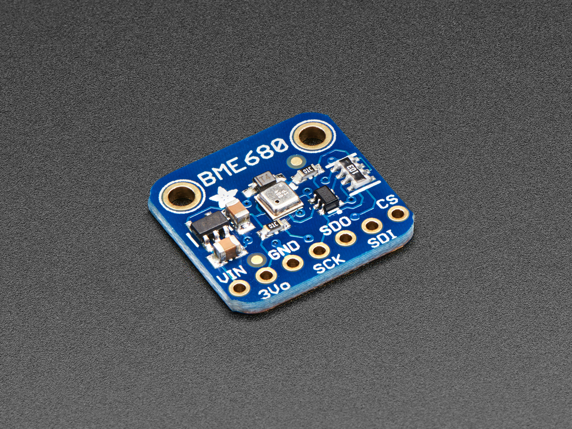

# Adafruit BME680 Library 

The long awaited BME680 from Bosch gives you all the environmental sensing you want in one small package. This little sensor contains temperature, humidity, barometric pressure, and VOC gas sensing capabilities. All over SPI or I2C at a great price!

Like the BME280 & BMP280, this precision sensor from Bosch can measure humidity with ±3% accuracy, barometric pressure with ±1 hPa absolute accuracy, and temperature with ±1.0°C accuracy. Because pressure changes with altitude, and the pressure measurements are so good, you can also use it as an altimeter with  ±1 meter or better accuracy!

The BME680 takes those sensors to the next step in that it contains a small MOX sensor. The heated metal oxide changes resistance based on the volatile organic compounds (VOC) in the air, so it can be used to detect gasses & alcohols such as Ethanol, Alcohol and Carbon Monoxide, and perform air quality measurements. Note it will give you one resistance value, with overall VOC content, but it cannot differentiate gasses or alcohols.

Designed specifically to work with the Adafruit BME680 Breakout 
 * http://www.adafruit.com/products/3660

These sensors use I2C or SPI to communicate, up to 4 pins are required to interface

Adafruit invests time and resources providing this open source code, 
please support Adafruit and open-source hardware by purchasing 
products from Adafruit!

Check out the links above for our tutorials and wiring diagrams

On-line documention for the APIs is available, too:
  * https://adafruit.github.io/Adafruit_BME680/html/index.html

Requires installation of the Adafruit Unified Sensor library:
  * https://github.com/adafruit/Adafruit_Sensor

Written by Limor Fried/Ladyada for Adafruit Industries.
BSD license, all text above must be included in any redistribution
