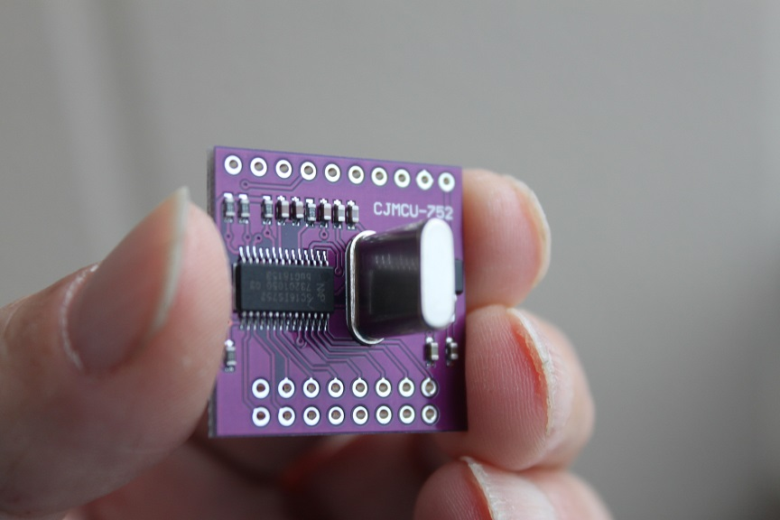

# SC16IS752
SC16IS752 Driver for ATmega328/ESP8266   

I forked from [here](https://github.com/SandboxElectronics/UART_Bridge)   

If you have SC16IS750, use [this](https://github.com/SandboxElectronics/UART_Bridge).

__The maximum transfer speed of SC16IS752 is 115,200bps__

---

# for i2c

|SC16IS750/752||ATmega328/ESP8266|RPi|
|:-:|:-:|:-:|:-:|
|VCC|--|5V|5V|
|GND|--|GND|GND|
|RESET|--|N/C|N/C|
|A0/CS|--|5V(*1)|5V(*1)|
|A1/SI|--|5V(*1)|5V(*1)|
|NC/SO|--|N/C|N/C|
|IRQ|--|N/C|N/C|
|I2C/SPI|--|5V|5V|
|SCL/SCLK|--|SCL(*2)|SCL(*3)|
|SDA/VSS|--|SDA(*2)|SDA(*3)|

(*1)i2c address selection   
(*2)Requires PullUp   
(*3)No Requires PullUp

---

# for SPI

|SC16IS750/752||ATmega328/ESP8266/Rpi|
|:-:|:-:|:-:|
|VCC|--|5V|
|GND|--|GND|
|RESET|--|N/C|
|A0/CS|--|CS|
|A1/SI|--|MOSI|
|NC/SO|--|MISO|
|IRQ|--|N/C|
|I2C/SPI|--|GND|
|SCL/SCLK|--|SCK|
|SDA/VSS|--|GND|

