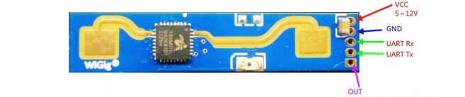
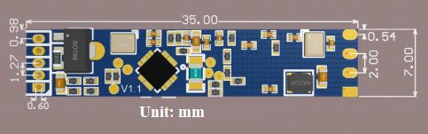

# LD2410
## Introduction

An Arduino library for the Hi-Link LD2410 24Ghz FMCW radar sensor. This sensor is a Frequency Modulated Continuous Wave radar, which makes it good for presence detection and its sensitivity at different ranges to both static and moving targets can be configured.


The code in this library is based heavily off this [piece of work for ESPHome](https://github.com/rain931215/ESPHome-LD2410) and the manufacturer datasheet.

The LD2410, as sold for configuration with the common breakout boards shown above communicates over serial at 256000 baud by default. This library allows you to configure and use the sensor over this serial connection. As the LD2410 is a device that uses a high baud rate, a microcontroller with a spare hardware UART for this communication is preferable to bit-banged software serial.

The modules also provide an 'active high' output on the 'OUT' pin which can be used to signal presence, based off the settings configured. Once the modules are configured it is not necessary to use their UART, but it provides much more information.

## Connections

The module must be powered by 5V or higher, but does 3.3v I/O, please consider this when working with the module.



The default header pitch is 1.27mm, half the size of the usual 0.1" hobbyist pin headers so you may need to buy some, or carefully de-solder the existing pins to use the module.



If you have the breakout board, you can use the VCC, GND, TX and RX pins to work with the module.

## Reading distances

The LD2410 has a number of 'gates', each of which correspond to a distance of about 0.75m and many of the settings/measurements are calculated from this.

You set the sensitivity at each 'gate' on a scale 0-100, any object that doesn't register above this scale is not reported on. The defaults do a good job of spotting an adult person and estimating distance.

Both moving and stationary targets are detected separately, with a value for each in centimetres. The accuracy of this distance isn't amazing but given this sensor is targeted as a replacement for something like a passive infrared sensor it's a very big improvement.

The minimal sketch to read distances is in the example 'basicSensor.ino'.

## Configuring the sensor

Each 'gate' has a sensitivity value for stationary and moving targets. You can also set a maximum gate that ignores readings beyond a certain gate for both stationary and moving targets and an 'idle timeout' for how long it reports on something after moving away.

A sketch to configure the sensor is in the example 'setupSensor.ino' it's an interactive sketch that will take commands sent over the Serial monitor. It should demonstrate all the various bits of the configuration you can change.

## Methods/variables

Many of the configuration methods return a boolean value. This is because the protocol between the LD2410 and the microcontroller involves requesting the change and the LD2410 acknowledges this with success or failure. This means these methods are synchronous, they will block until the LD2410 responds with succeed/fail or the transaction times out after 100ms.

The presence/distance readings report the most recent values as the LD2410 continuously streams data, which is processed by calling *read()* as often as is practical.

```
bool ld2410::begin(Stream &radarStream, bool waitForRadar = true) - You must supply a Stream for the UART (eg. Serial1 that the LD2410 is connected to) and by default it waits for the radar to respond so it feeds back if it is connected
void debug(Stream &debugStream) - Enables debugging output of the library on a Stream you pass it (eg. Serial)
void read() - You must call this frequently in your main loop to process incoming frames from the LD2410
bool isConnected() - Is the LD2410 connected and sending data regularly
bool presenceDetected() - Is a presence detected. Nice and simple
bool stationaryTargetDetected() - Is a stationary target detected.
uint16_t stationaryTargetDistance() - Distance to the stationary target in centimetres.
uint8_t stationaryTargetEnergy() - The 'energy'of the target on a scale 0-100, which also a kind of confidence value.
bool movingTargetDetected() - Is a moving target detected.
uint16_t movingTargetDistance() -  Distance to the moving target in centimetres.
uint8_t movingTargetEnergy() -  The 'energy'of the target on a scale 0-100, which also a kind of confidence value.
bool requestFirmwareVersion() - Request the firmware version, which is then available on the values below.
uint8_t firmware_major_version
uint8_t firmware_minor_version
uint32_t firmware_bugfix_version - This is coded as HEX
bool requestCurrentConfiguration() - Request the full current configuration, which you can then read with the variable & methods below.
uint8_t max_gate - The max gate ID reported by the sensor
uint8_t max_moving_gate - The highest gate ID that will report moving targets
uint8_t max_stationary_gate - The highers gate ID that will report stationary targets
uint8_t motion_sensitivity[max_gate + 1] - One value 0-100 per gate
uint8_t stationary_sensitivity[max_gate + 1] - One value 0-100 per gate
bool setMaxValues(uint8_t moving, uint8_t stationary, uint16_t inactivityTimer) - Set furthest gates and inactivitity timer for targets
bool setGateSensitivity(uint8_t gate, uint8_t moving, uint8_t stationary) - Set gate sensitivites 0-100
bool requestRestart() - Request a restart of the LD2410. Which is needed to apply some settings.
bool requestFactoryReset() - Request a factory reset of the LD2410. You need to restart afterwards to take effect.
bool requestStartEngineeringMode() - Request engineering mode, which sends more data on targets.
bool requestEndEngineeringMode() - Request the end of engineering mode.
```

## Changelog

- v0.1.1 - Readings for stationary and moving targets were transposed, now fixed. Fixes #1 - stationaryTargetDetected() always true. Many improvements to parsing of commands/acks from the LD2410 and better debug logging.
- v0.1.0 - Initial release

## Known issues/to-do list

The code is somewhat verbose/inefficient.

No support for engineering mode data yet.

Feel free to contact me with PRs, suggestions and improvements.
